# AI 發展史<br>
<a href="http://www.youtube.com/watch?feature=player_embedded&v=rsbmsHODZ_A" target="_blank"></a>
<br>影片取自 youtube

<hr><hr>


# Github 說明連結頁面 QRCODE

<br>

# Github 說明
Github 可以說是程式的雲端硬碟或 IG。註冊帳號就可以上傳檔案，
可以自己決定要不要讓別人看到。當然也可以留言、按讚（星星）、或轉發改編。 
上傳檔案除了可以像社群一樣用網頁版直接傳之外，因為通常一個專案裡面會有很
多資料夾和檔案，所以通常會用一個叫做 git 的技術來實現同步檔案。

<details>
<summary>

# Github 註冊程序

</summary>

- Step1.註冊帳號
請先登入 https://www.github.com 如下圖，然後點擊右上角的 Sign up。


<br>

-----
- Step2.填寫註冊資訊
請填寫註冊用的Email帳號、登入密碼以及使用的名稱，最後請點選最下面的 Continue。

<br>

-----
- Step3.進入GitHub使用者介面
如下圖<br>
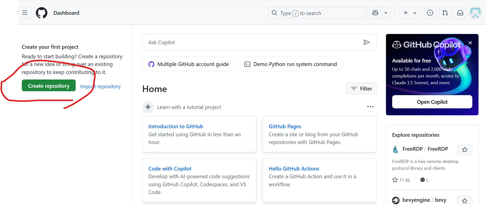

</details>


<details>
<summary>
  
# Github 新增儲存庫 (repository)

</summary>

-----
- Step1.Create repository(建立儲存庫) <br>
從使用者登入介面按下 Create repository。 <br>

<br>

-----
- Step2.填寫 repository 相關資訊 <br>
填寫資料夾名稱、選取Public屬性、勾選 "Add a Readme File"，最後再點選 "Create repository"。 <br>
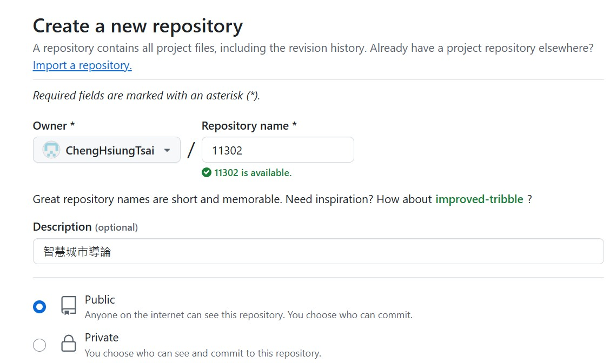
<br>
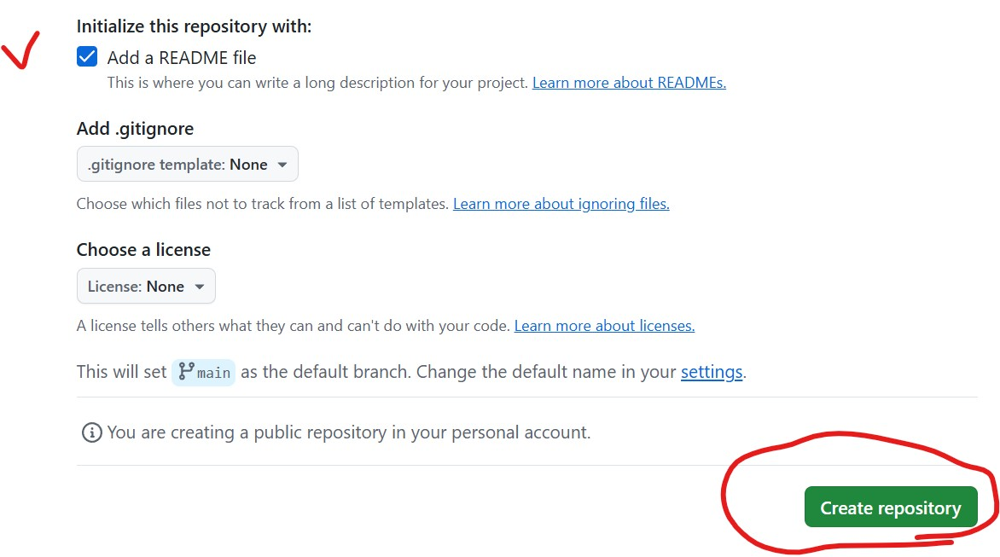
<br>

-----
- Step3.顯示 Readme.md，預設說明頁面。 <br>
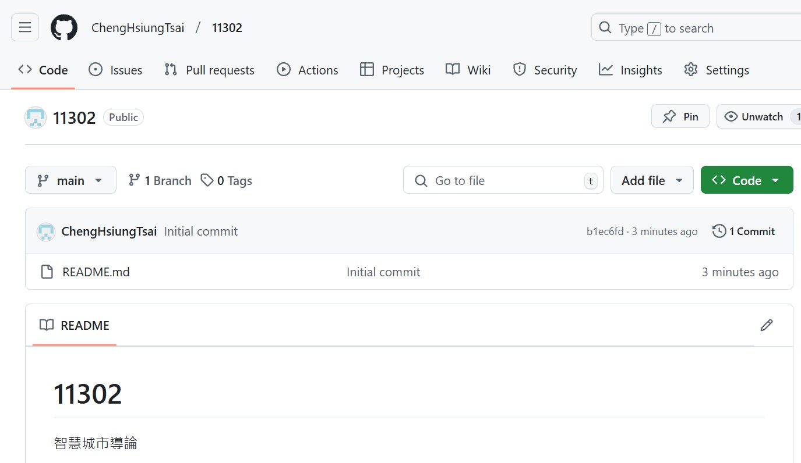
<br>

</details>

<details>
<summary>
  
# Github 編輯方式說明

</summary>

-----
- Step1.進入編輯頁面 <br>
請點選右上角的"筆"圖形，就可以進入編輯模式。<br>
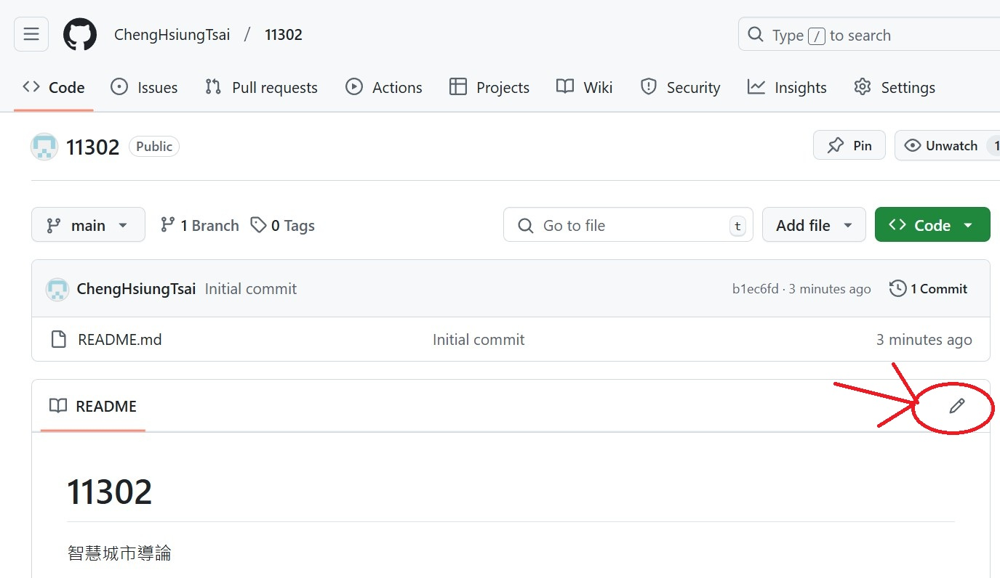

-----
- Step2.編輯字型大小 <br>
h1 的字型最大，h2 次之，以此類推。 <br>
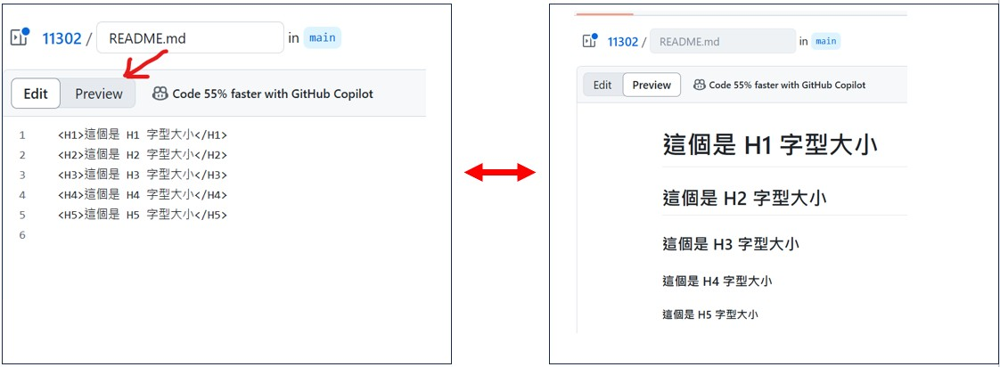

-----
- Step3.編輯分項類型 <br>
有以下三種分項方式 <br>
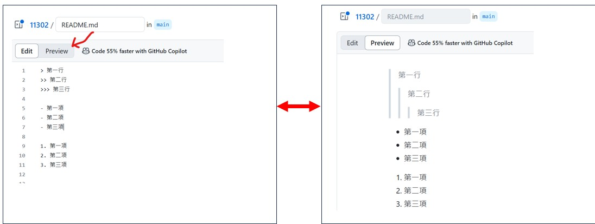

-----
- Step4.建立網址連結 <br>
可以參考以下兩種方式 <br>


</details>


<details>
<summary>
  
# Github 建立表格方式

</summary>

-----
## 建立 Chrome 擴充程式 QRCode。
-----
Step1.開啟 Chrome瀏覽器 <br>
開啟 Chrome 瀏覽器，點選到擴充功能的"前往Chrome的線上應用程式商店"。如下圖。<br>
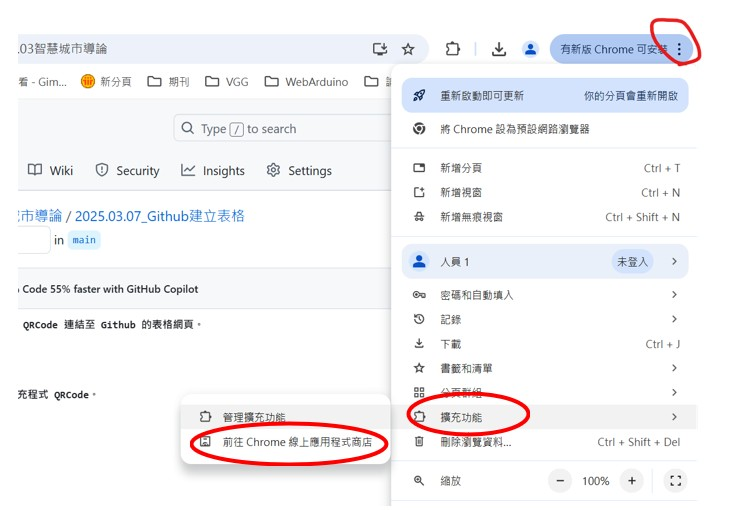
<br>

-----
Step2.下載QRCode軟體 <br>
在搜尋列輸入 QRCode並且按下搜尋，找到 "QR Code Generator" 軟體並安裝。<br>
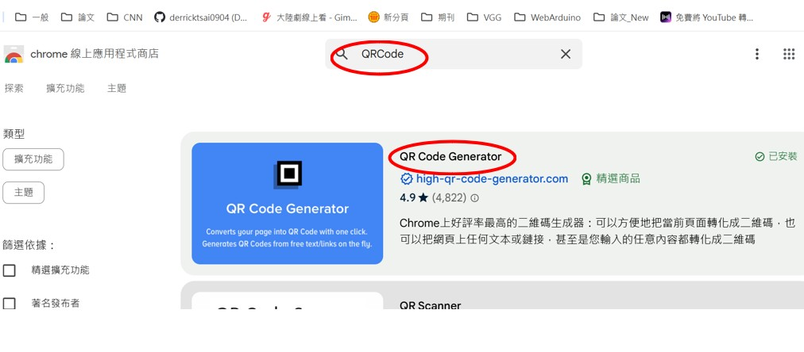
<br>

-----

## 上傳圖片
在頁面右上角點選 Add File > Upload files。 <br>
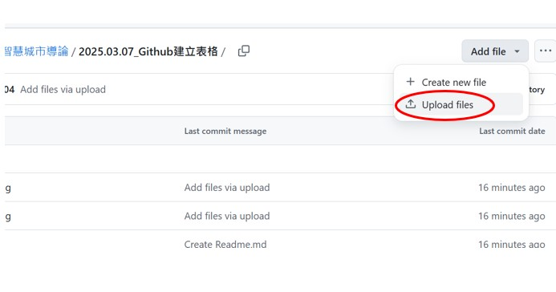
<br>

然後點選 Choose your files，出現檔案對話框之後，選取要上傳的圖片檔案上傳。 <br>
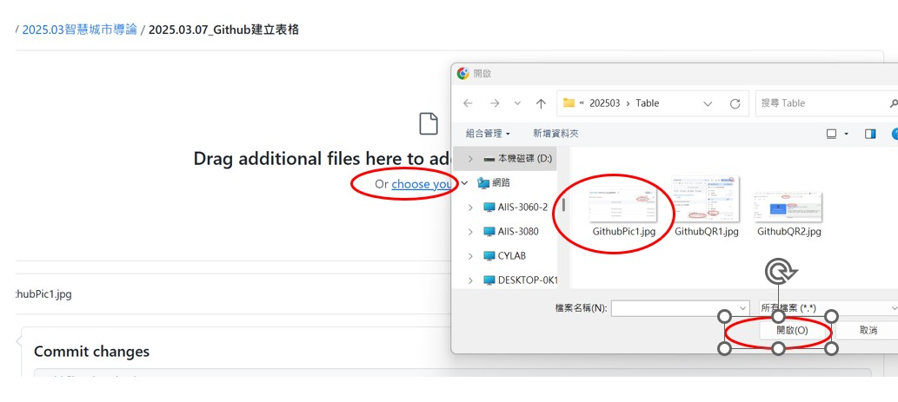
<br>

## 建立表格
如下圖說明
### 範例語法說明
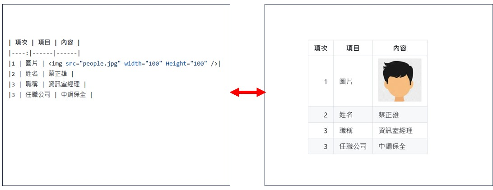

### 範例內容
| 項次 | 項目 | 內容 |
|----:|------|------|
|1 | 圖片 | |
|2 | 姓名 | 蔡正雄 |
|3 | 職稱 | 資訊室經理 |
|3 | 任職公司 | 中鋼保全 |


## 製作 Github 網頁連結的QRCode
### 執行 QR Code Generator 軟體
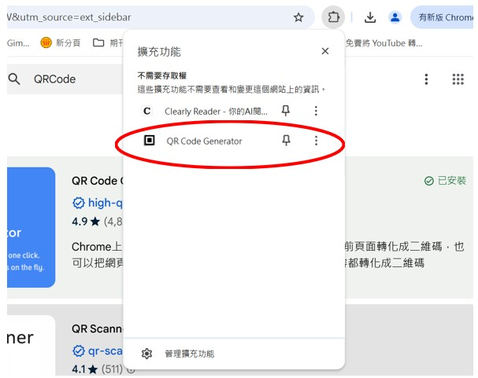<br>

<br><br>
## 請製作如下的表格範例

| A 組 | 姓名 | Github連結 |
|----:|------|------|
|組長 | 王組長 | [王組長 github](https://github.com/derricktsai0904/Arduino)|
|組員 | 組員一 | [組員一 github](https://github.com/derricktsai0904/Arduino)|
|組員 | 組員二 | [組員二 github](https://github.com/derricktsai0904/Arduino)|
|組員 | 組員三 | [組員三 github](https://github.com/derricktsai0904/Arduino)|

## 參考以下語法 <br>
``` MarkDown 語法
| A 組 | 姓名 | Github連結 |
|----:|------|------|
|組長 | 王組長 | [王組長 github](https://github.com/derricktsai0904/Arduino)|
|組員 | 組員一 | [組員一 github](https://github.com/derricktsai0904/Arduino)|
|組員 | 組員二 | [組員二 github](https://github.com/derricktsai0904/Arduino)|
|組員 | 組員三 | [組員三 github](https://github.com/derricktsai0904/Arduino)|
```
</detail>


