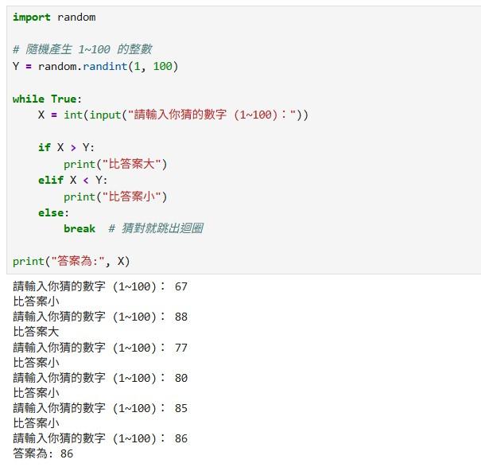

### 以猜數字為例，先撰寫虛擬碼，描述遊戲功能，

### 虛擬碼內容

```
BEGIN
隨機產生一個1~100之間的正整數Y
Do
 輸入X
 If X > Y 則提示 比答案大
 If X < Y 則提示 比答案小
While X=Y

列印答案為 X 值
END
```
<br><br>

### 將虛擬碼輸入 Chatgpt 詢問 Python 的程式碼如下

``` Python
import random

# 隨機產生 1~100 的整數
Y = random.randint(1, 100)

while True:
    X = int(input("請輸入你猜的數字 (1~100)："))

    if X > Y:
        print("比答案大")
    elif X < Y:
        print("比答案小")
    else:
        break  # 猜對就跳出迴圈

print("答案為:", X)
```

<br><br>

### 執行結果如下圖




