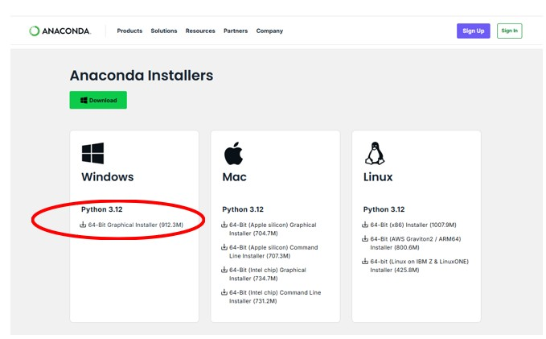
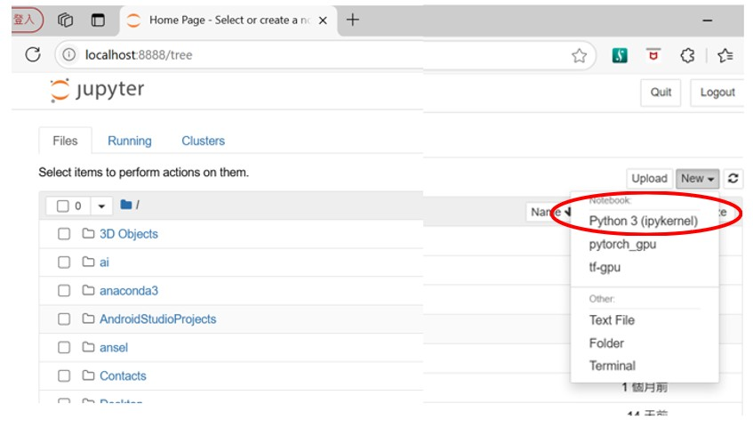
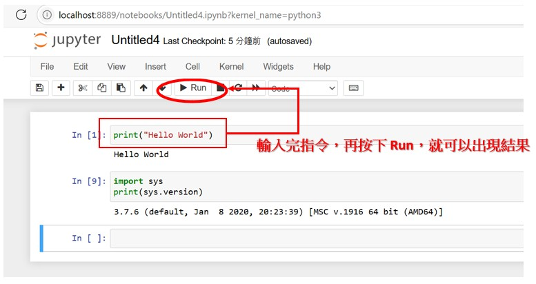

-----
- Step1. 開啟瀏覽器 輸入網址 https://www.anaconda.com/download  

 

-----
- Step2. 安裝如圖中的Windows 64bit + Python 3.12版本的 AnaConda軟體  

 

-----
- Step3. 測試是否成功  
安裝完成後，請啟動 Anaconda軟體，如下圖請點選 HOME，然後執行 Jupyter。  
(如果是出現 Install 不是 Launch，請先執行 Install，就會出現 Launch。)   
 

如下圖，請新增一個 Python版本的NoteBook檔案。
 

如下圖，請試著新增兩個測試指令。 
測試一，輸入 print("Hello World")，然後按下 Run 按鈕，看看顯示結果。  
測試二，輸入 import Sys 以及 print(Sys.version)，然後按下 Run 按鈕，看看顯示結果。  
 

