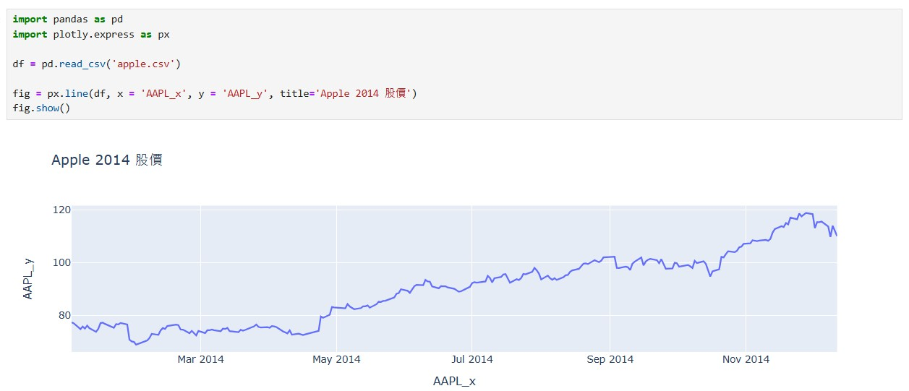

Python 語法 使用 DataFrame 來顯示資料表格

DataFrame 特點
二維結構： DataFrame 是一個二維表格，可以被看作是一個 Excel 試算表或 SQL 表，具有行和列。可以將其視為多個 Series 物件組成的字典。

---

練習 (使用字典來建立df)
```python
import pandas as pd
 
grades = {
    "name": ["Mike", "Sherry", "Cindy", "John"],
    "math": [80, 75, 93, 86],
    "chinese": [63, 90, 85, 70]
}
 
df = pd.DataFrame(grades)
 
print("使用字典來建立df：")
print(df)
```

執行結果
```
使用字典來建立df：
     name  math  chinese
0    Mike    80       63
1  Sherry    75       90
2   Cindy    93       85
3    John    86       70
```

---

練習 (置換 df 的表頭)
```python
import pandas as pd
 
grades = {
    "name": ["Mike", "Sherry", "Cindy", "John"],
    "math": [80, 75, 93, 86],
    "chinese": [63, 90, 85, 70]
}
 
df = pd.DataFrame(grades)
df.columns = ["人員", "數學", "國文"]

print("使用字典來建立df：")
print(df)
```

執行結果
```
使用字典來建立df：
       人員  數學  國文
0    Mike  80  63
1  Sherry  75  90
2   Cindy  93  85
3    John  86  70
```

---

練習 (刪除 df 的某一欄資料)
```python
import pandas as pd
 
grades = {
    "name": ["Mike", "Sherry", "Cindy", "John"],
    "math": [80, 75, 93, 86],
    "chinese": [63, 90, 85, 70]
}
 
df = pd.DataFrame(grades)
del df['math']
 
print("使用字典來建立df：")
print(df)
```

執行結果
```
     name  chinese
0    Mike       63
1  Sherry       90
2   Cindy       85
3    John       70
```

---

練習 Plot，請注意 plt.rc
```
import matplotlib.pyplot as plt
import pandas as pd

grades = {
    "name": ["Mike", "Sherry", "Cindy", "John"],
    "math": [80, 75, 93, 86],
    "chinese": [63, 90, 85, 70]
}
 
df = pd.DataFrame(grades)
del df['math']

# 顯示中文
# plt.rc('font', family='Microsoft JhengHei')

plt.title('一年甲班國文成績')
plt.bar(df['name'],df['chinese'],color='#faebd7',edgecolor='#fa8072',linewidth=2)
plt.ylabel('國文分數')
plt.show()
```

顯示結果
<br><hr>


---


練習雙資料長餅圖
```
import numpy as np
import matplotlib.pyplot as plt
import pandas as pd

grades = {
    "name": ["Mike", "Sherry", "Cindy", "John"],
    "math": [80, 75, 93, 86],
    "chinese": [63, 90, 85, 70]
}
 
df = pd.DataFrame(grades)

plt.rc('font', family='Microsoft JhengHei')

x_indices = np.arange(len(df['name']))
plt.title('一年甲班各科成績')

#plt.bar(df['name'],df['math'],color='#faebd7',edgecolor='#fa8072',linewidth=2)
#plt.bar(df['name'],df['chinese'],color='#faebd7',edgecolor='#fa8072',linewidth=2)

bar_width = 0.2
plt.bar(x_indices - 0.2,df['math'],color='red',edgecolor='#fa8072',linewidth=0.2,width=bar_width,label='math')
plt.bar(x_indices + 0.2,df['chinese'],color='blue',edgecolor='#fa8072',linewidth=0.2,width=bar_width,label='chinese')

#width=0.4
plt.xticks(x_indices, df['name'])

plt.ylabel('分數')
plt.legend()
plt.show()
```


---

安裝股票相關套件 <br>
```
pip install -U quandl numpy pandas matplotlib pystan pytrends plotly yfinance
```

其中 yfinance 安裝會失敗，請一下面指令執行一次
```
python3 -m pip install yfinance
```

再來用 conda 安裝 fbprophet
```
conda install -c conda-forge fbprophet
```

---

練習，抓取股票 2330.TW 台積電股票
```
import pandas as pd
import yfinance as yf

#股票代號
stockno = "2330.TW"

#開始日期 2025-01-01 迄今
start_date = '2025-01-01'
start_date = '2025-01-10'

# 下載股票資訊
df = yf.download(stockno,start=start_date,end=end_date)

# 重置 dataframe 資訊索引
df = df.reset_index()

# 列印股價資訊
print(df)
```

顯示結果
```
Price        Date   Close    High     Low    Open    Volume
Ticker            2330.TW 2330.TW 2330.TW 2330.TW   2330.TW
0      2025-01-02  1065.0  1075.0  1055.0  1070.0  43177098
1      2025-01-03  1075.0  1085.0  1075.0  1080.0  30415096
2      2025-01-06  1125.0  1125.0  1095.0  1100.0  69289786
3      2025-01-07  1130.0  1160.0  1130.0  1150.0  48758688
4      2025-01-08  1105.0  1130.0  1105.0  1110.0  45211419
5      2025-01-09  1100.0  1115.0  1100.0  1100.0  27263215
```


將產生結果匯出成 CSV 檔案
```
 df.to_csv("2330TW.csv")
```

---


直接抓取網頁表格 (以台灣銀行匯率為例)
```
url = "https://rate.bot.com.tw/xrt?Lang=zh-TW"

tables = pd.read_html(url)
df = tables[0]
#選取想要的欄位
df = df[[df.columns[0], df.columns[1],df.columns[2]]]
df.columns = ["幣別", "本行買入", "本行賣出"]
display(df)
```


抓取開獎資料
```
url = "https://happylottery.tw/threeStar.html"

tables = pd.read_html(url,encoding='utf-8')
df = tables[0]

display(df)
```

## 讀取本地端 csv 檔案
```
import pandas as pd
df = pd.read_csv('apple.csv')
df.head()
```
### 顯示結果
<br>

<br><hr>
----

## 讀取本地端 csv 檔案，並畫出圖形
```
import pandas as pd
import plotly.express as px

df = pd.read_csv('apple.csv')

fig = px.line(df, x = 'AAPL_x', y = 'AAPL_y', title='Apple 2014 股價')
fig.show()
```

### 顯示結果
<br>

<br><hr>
