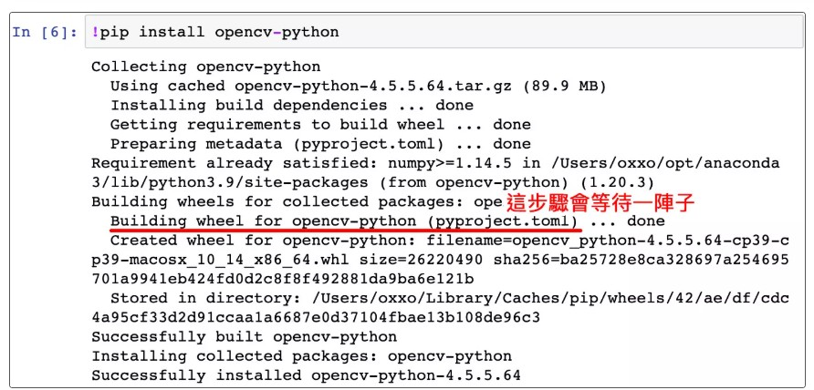
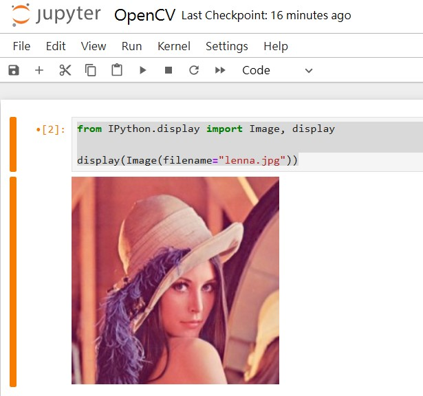
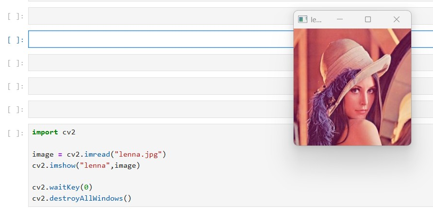
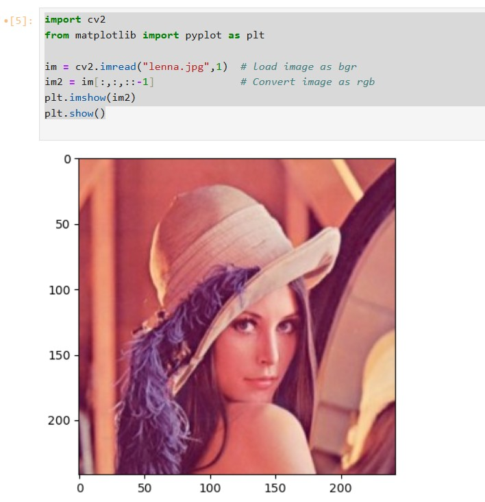
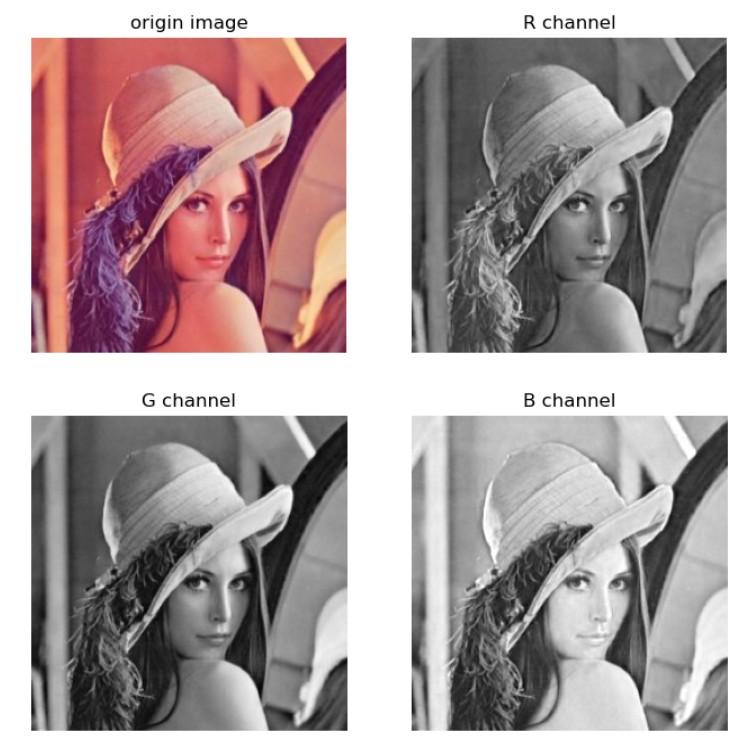
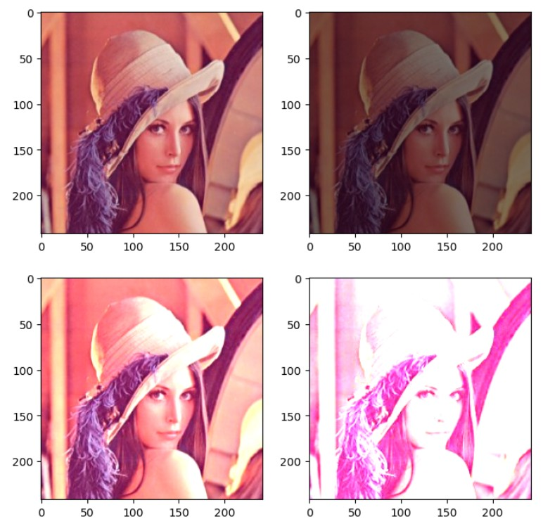
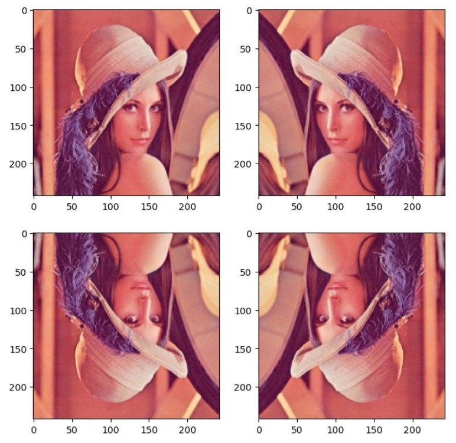
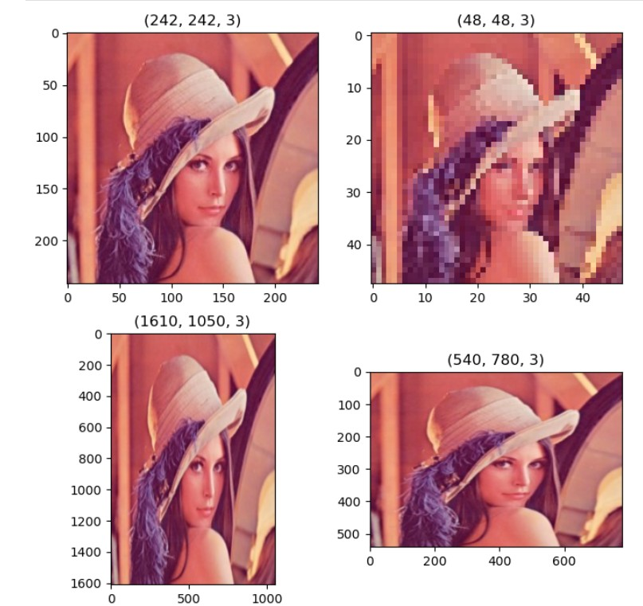
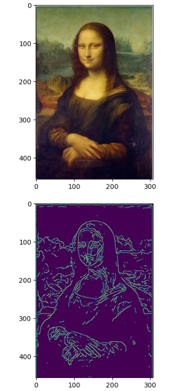

# OpenCV 是什麼？
OpenCV 全名是 Open Source Computer Vision Library ( 開源計算機視覺函式庫 )，OpenCV 由 Intel 發起並開發，以 BSD 授權條款授權發行，可以在商業和研究領域中免費使用，是目前發展最完整的電腦視覺開源資源。

OpenCV 常應用於擴增實境、臉部辨識、手勢辨識、動作辨識、運動跟蹤、物體辨識或圖像分割...等領域，能使用各種不同語言 ( Java、Python、C/C++...等 ) 進行開發，由於 OpenCV 的高執行效率，甚至可用來開發 Real-time 的應用程式。

---

首先安裝 oepncv 套件，如下指令
```
pip install opencv-python
```

安裝畫面如下<br>

<br>

如果安裝出現 defaulting to user installation because normal site-packages is not writeable
請到 \anaconda3\Lib\site-packages 將 site-packages 資料夾屬性設為 可允許修改
然後 再重新安裝一次就可以


---
# 讀取圖片練習
請照以下程式碼執行

## 讀圖方式一
```
from IPython.display import Image, display

display(Image(filename="lenna.jpg"))
```

### 顯示結果
<hr>

<hr>

## 讀圖方式二
彈出 Windows 視窗
```
import cv2

image = cv2.imread("lenna.jpg")
cv2.imshow("lenna",image)

cv2.waitKey(0)
cv2.destroyAllWindows()
```
### 顯示結果
<br>

<br>
<hr>

## 讀圖方式三
使用 matplotlib 顯示圖形
```
import cv2
from matplotlib import pyplot as plt

im = cv2.imread("lenna.jpg",1)  # load image as bgr
im2 = im[:,:,::-1]              # Convert image as rgb
plt.imshow(im2)
plt.show()
```
### 顯示結果
<br>

<br><hr>


## 練習 同時顯示多張子圖，以不同RGB色系呈現
```
import cv2
from matplotlib import pyplot as plt

img = cv2.imread("lenna.jpg",1)

plt.figure(num='astronaut',figsize=(8,8))  #創建一個名為astronaut的視窗,並設置大小 

plt.subplot(2,2,1)     #將窗口分為兩行兩列四個子圖，則可顯示四幅圖片
plt.title('origin image')   #第一幅圖片標題
plt.imshow(img[:,:,::-1])      #繪製第一幅圖片
plt.axis('off')     #不顯示座標尺寸

plt.subplot(2,2,2)     #第二個子圖
plt.title('R channel')   #第二幅圖片標題
plt.imshow(img[:,:,0],plt.cm.gray)      #繪製第二幅圖片,且為灰度圖
plt.axis('off')     #不顯示座標尺寸

plt.subplot(2,2,3)     #第三個子圖
plt.title('G channel')   #第三幅圖片標題
plt.imshow(img[:,:,1],plt.cm.gray)      #繪製第三幅圖片,且為灰度圖
plt.axis('off')     #不顯示座標尺寸

plt.subplot(2,2,4)     #第四個子圖
plt.title('B channel')   #第四幅圖片標題
plt.imshow(img[:,:,2],plt.cm.gray)      #繪製第四幅圖片,且為灰度圖
plt.axis('off')     #不顯示座標尺寸
```
### 顯示結果
<br>

<br><hr>


## 練習 同時顯示多張子圖，以不同 "亮度" 呈現
```
import matplotlib.pyplot as plt
import matplotlib.image as img
from PIL import Image, ImageEnhance

plt.figure(figsize=(8,8))

img = Image.open("lenna.jpg")              # 開啟圖片
enhancer = ImageEnhance.Brightness(img)   # 建立調整亮度的方法

plt.subplot(221)
plt.imshow(img)               # 顯示原圖

plt.subplot(222)
img2 = enhancer.enhance(0.5)  # 顯示亮度 x0.5 的圖片
plt.imshow(img2)

plt.subplot(223)
img3 = enhancer.enhance(1.5)  # 顯示亮度 x1.5 的圖片
plt.imshow(img3)

plt.subplot(224)
img4 = enhancer.enhance(3)    # 顯示亮度 x3 的圖片
plt.imshow(img4)

plt.show()
```
### 顯示結果
<br>

<br><hr>


## 練習 同時顯示多張子圖，以水平及垂直翻轉呈現
```
import cv2
import matplotlib.pyplot as plt
import matplotlib.image as img

from PIL import Image, ImageEnhance

plt.figure(figsize=(8,8))

im = cv2.imread("lenna.jpg")            # 開啟圖片
img = im[:,:,::-1]

plt.subplot(221)
plt.imshow(img)               # 顯示原圖

plt.subplot(222)
img2 = cv2.flip(img,1)
plt.imshow(img2)

plt.subplot(223)
img3 = cv2.flip(img,0)
plt.imshow(img3)

plt.subplot(224)
img4 = cv2.flip(img2,0)
plt.imshow(img4)

plt.show()
```
### 顯示結果
<br>

<br><hr>


## 練習圖片的放大縮小 ( Resize )
```
import cv2
import matplotlib.pyplot as plt
import matplotlib.image as img

from PIL import Image, ImageEnhance

plt.figure(figsize=(8,8))

im = cv2.imread("lenna.jpg")            # 開啟圖片
img = im[:,:,::-1]

plt.subplot(221)
plt.imshow(img)               # 顯示原圖
plt.title(img.shape)

scale_percent = 50       # percent of original size
width = int(img.shape[1] * scale_percent / 100)
height = int(img.shape[0] * scale_percent / 100)
dim = (width, height)
# resize image
#img2 = cv2.resize(img, dim, interpolation = cv2.INTER_AREA)
#img2 = cv2.resize(img, dim)
img2 = cv2.resize(img, (0, 0), fx = 0.2, fy = 0.2)

plt.subplot(222)
plt.imshow(img2)
plt.title(img2.shape)

scale_percent = 150       # percent of original size
width = int(img.shape[1] * scale_percent / 100)
height = int(img.shape[0] * scale_percent / 100)
dim = (width, height)
# resize image
#img3 = cv2.resize(img, dim, interpolation = cv2.INTER_AREA)
#img3 = cv2.resize(img, dim)
img3 = cv2.resize(img, (1050, 1610))

plt.subplot(223)
plt.imshow(img3)
plt.title(img3.shape)

scale_percent = 200       # percent of original size
width = int(img.shape[1] * scale_percent / 100)
height = int(img.shape[0] * scale_percent / 100)
dim = (width, height)
# resize image
#img4 = cv2.resize(img, dim, interpolation = cv2.INTER_AREA)
img4 = cv2.resize(img, (780, 540),interpolation = cv2.INTER_LINEAR)

plt.subplot(224)
plt.imshow(img4)
plt.title(img4.shape)

plt.show()
```
### 顯示結果
<br>

<br><hr>


## 練習邊緣運算
```
import cv2
from matplotlib import pyplot as plt

img = cv2.imread('mona.jpg')
im2 = img[:,:,::-1]              # Convert image as rgb
plt.imshow(im2)
plt.show()

im3 = cv2.cvtColor(img, cv2.COLOR_BGR2GRAY)  # 轉成灰階
im3 = cv2.medianBlur(im3, 7)                 # 模糊化，去除雜訊
output = cv2.Canny(im3, 36, 36)              # 偵測邊緣

plt.imshow(output)
plt.show()
```
### 顯示結果
<br>

<br><hr>

