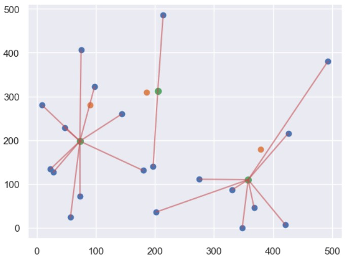

# SKlearn
SKlearn在python中提供大量常見的機器學習演算法和許多實用的資料集合，像是Iris以及手寫辨識數字的資料(之後的程式舉例會用到)。
而演算法的部分，可以在SKlearn官網中看到，他將功能分為6個部分：Classification、Regression、Clustering、Model selection、
Preprocessing、Dimensionality reduction，各個適合的演算法，在SKlearn中也有做相當清楚的圖表，呈現該演算法資料輸出的型態，相當方便。

# 安裝說明
```
pip install -U scikit-learn
```

# 執行步驟

### 在python中可以用seaborn來下載iris數據集合，這個數據集合主要紀錄三種鳶尾的型態。
```
import sklearn
import seaborn as sns
iris = sns.load_dataset('iris')
iris.head()
```
### 顯示結果
<br>

### 由上方output資料表來看，可以知道iris這個資料集合主要是紀錄花的種類、花萼及花瓣的長寬。
```
import sklearn
import seaborn as sns
iris = sns.load_dataset('iris')
sns.set()
sns.pairplot(iris, hue='species', height=3)
```
### 顯示結果
<br>

### 將 iris 數據以 KMeans 分為三類
可以分出了三大群出來。此外根據此結果，可以明確解釋：「當花瓣的長度介於1～2公分，且寬度小於1公分時，可以獨自被分類為一品種。
若花瓣長度介於3～5公分左右，且寬度介於1～2公分左右，也可以被定義為一品種。
最後當花瓣長度介於約5~7公分內，且寬度介於約1.5～2.5之間，則可另外被定義成一品種。」。

```
import numpy as np
import pandas as pd
import matplotlib.pyplot as plt
from sklearn.datasets import load_iris

RawData = load_iris()
df = pd.DataFrame(RawData['data'],columns= RawData['feature_names'])

from sklearn.cluster import KMeans
x = df.iloc[:,0:4] #x為所有特徵資料
model = KMeans(n_clusters=3, n_init='auto',random_state=1) #預計分為三群，迭代次數由模型自行定義
model.fit(x) #建立模型
plt.scatter(df['petal length (cm)'],df['petal width (cm)'], c=model.labels_) #根據花瓣的長度、寬度，來畫出之間關係。c=model.labels_:代表資料點的顏色，由模型分類出來的結果，來進行分類和定義。 
plt.xlabel('petal length')
plt.ylabel('petal width')
plt.show()
```

### 顯示結果
<br>


### 尋找最佳 KMeans 分類數量
透過Elbow法找出最佳K值(資料群數)。上面的介紹例子，之所以很明確的定義三群資料，原因在於我們找就知道結果了。然而實務分析上，到底能夠分出幾群資料，我們可能毫無依據，所以這時候就會陷入，不知道n_clusters要設多少的窘境。因此我們就可以透過此方法，來找出最佳的n_clusters數量：

```
import numpy as np
import pandas as pd
import matplotlib.pyplot as plt
from sklearn.datasets import load_iris

RawData = load_iris()
df = pd.DataFrame(RawData['data'],columns= RawData['feature_names'])

from sklearn.cluster import KMeans

DistanceList = []
for i in range(1,11): #測試將資料分為1~10群
    KM = KMeans(n_clusters=i, n_init='auto', random_state=1)
    KM.fit(x)
    DistanceList.append(KM.inertia_) #求出每個Cluster內的資料與其中心點之平方距離和，並用List記錄起來
plt.plot(range(1,11), DistanceList)
plt.show()
```
<hr>
下圖中的y軸，就是每個Cluster內的資料，與其群內中心點的平方距離總和。x軸則是分群數量。
所以根據 K-means 的特性，y軸的值應當是越低越好。不過此時又有個問題，那就是有可能為了求最低的y，
而耗費大量時間，且效果也不會很顯著的提升，那這樣反而本末倒置。所以Elbow Method的核心概念，
就是「剛剛好就好」的概念。
因此看到下圖，發現將資料分為1~3群時候，y軸的值都有很大幅度的下降，但當分到3群之後，
可以發現其y軸下降的幅度就沒那麼大，甚至趨於平緩，因此我們就會判定，3是最佳的分群數量。

### 顯示結果

<br>


### K-Means 演算法
分群就是對所有數據進行分組，將相似的數據歸類為一起，每一筆數據的能有一個分組，每一組稱作為群集 (Cluster)。那分類根據什麼來定義，常用距離來做運算。

K-means 分群 (K-means Clustering)，其實就有點像是以前學數學時，找重心的概念。
概念是這樣的：
我們先決定要分k組，並隨機選k個點做群集中心。
將每一個點分類到離自己最近的群集中心(可用直線距離)。
重新計算各組的群集中心(常用平均值)。
反覆 2、3 動作，直到群集不變，群集中心不動為止。

而k-means分群的時間複雜度為 O(NKT) ， N 是數據數量， K 是群集數量， T 是重複次數。我們無法預先得知群集數量、重複次數。數據分布情況、群集中心的初始位置，都會影響重複次數，運氣成份很大。

```
import numpy as np
import matplotlib.pyplot as plt

# 群集中心和元素的數量
seed_num = 3
dot_num = 20

# 初始元素
x = np.random.randint(0, 500, dot_num)
y = np.random.randint(0, 500, dot_num)
# 初始群集中心
kx = np.random.randint(0, 500, seed_num)
ky = np.random.randint(0, 500, seed_num)


# 兩點之間的距離
def dis(x, y, kx, ky):
    return int(((kx-x)**2 + (ky-y)**2)**0.5)

# 對每筆元素進行分群
def cluster(x, y, kx, ky):
    team = []
    for i in range(3):
        team.append([])
    mid_dis = 99999999
    for i in range(dot_num):
        for j in range(seed_num):
            distant = dis(x[i], y[i], kx[j], ky[j])
            if distant < mid_dis:
                mid_dis = distant
                flag = j
        team[flag].append([x[i], y[i]])
        mid_dis = 99999999
    return team

# 對分群完的元素找出新的群集中心
def re_seed(team, kx, ky):
    sumx = 0
    sumy = 0
    new_seed = []
    for index, nodes in enumerate(team):
        if nodes == []:
            new_seed.append([kx[index], ky[index]])
        for node in nodes:
            sumx += node[0]
            sumy += node[1]
        new_seed.append([int(sumx/len(nodes)), int(sumy/len(nodes))])
        sumx = 0
        sumy = 0
    nkx = []
    nky = []
    for i in new_seed:
        nkx.append(i[0])
        nky.append(i[1])
    return nkx, nky

# k-means 分群
def kmeans(x, y, kx, ky, fig):
    team = cluster(x, y, kx, ky)
    nkx, nky = re_seed(team, kx, ky)
    
    # plot: nodes connect to seeds
    cx = []
    cy = []
    line = plt.gca()
    for index, nodes in enumerate(team):
        for node in nodes:
            cx.append([node[0], nkx[index]])
            cy.append([node[1], nky[index]])
        for i in range(len(cx)):
            line.plot(cx[i], cy[i], color='r', alpha=0.6)
        cx = []
        cy = []
    
    # 繪圖
    feature = plt.scatter(x, y)
    k_feature = plt.scatter(kx, ky)
    nk_feaure = plt.scatter(np.array(nkx), np.array(nky), s=50)
    plt.savefig('kmeans_%s.png' % fig)
    plt.show()

    # 判斷群集中心是否不再更動
    if nkx == list(kx) and nky == (ky):
        return
    else:
        fig += 1
        kmeans(x, y, nkx, nky, fig)

kmeans(x, y, kx, ky, fig=0)
```
### 顯示結果

<br>
<br>
<br>

### MNIST 手寫辨識
MNIST數據庫是一組由美國高中生和人口調查員手寫的70000個數字的圖片。每張圖片都用其代表的數字標記。這個數據集被廣為使用，因此也被稱為機器學習領域的"Hello World"，但凡有人想到一個新的分類算法，都會想看看在MNIST上的執行結果。
因此只要學習機器學習的人都會面對MNIST數據集。

```
from sklearn.datasets import load_digits
import pandas as pd
import matplotlib.pyplot as plt
%matplotlib inline

mnist = load_digits()
pd.DataFrame(mnist.data).head()
```
### 顯示結果

<br>


