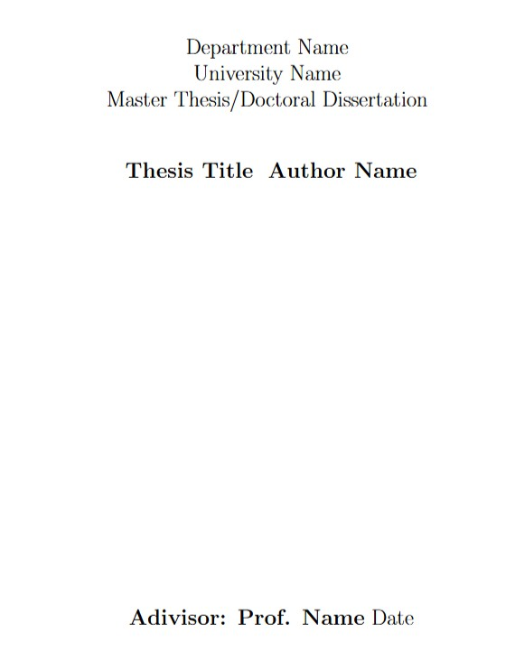
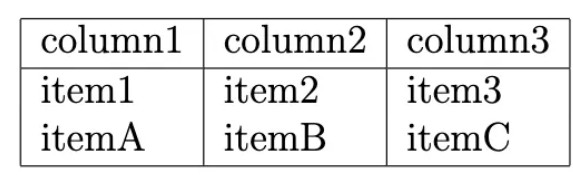
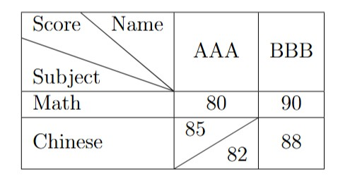
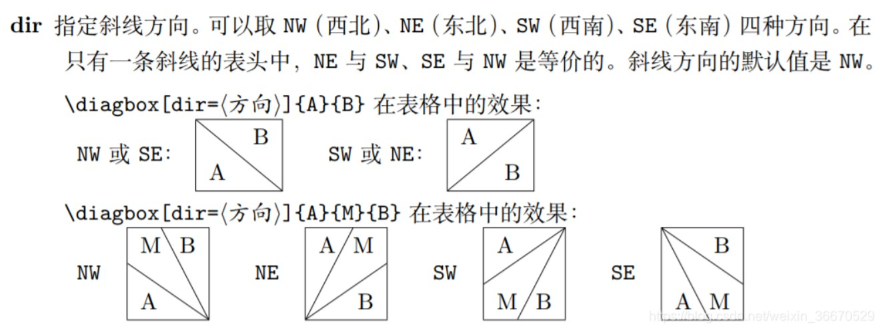
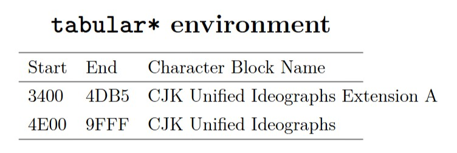
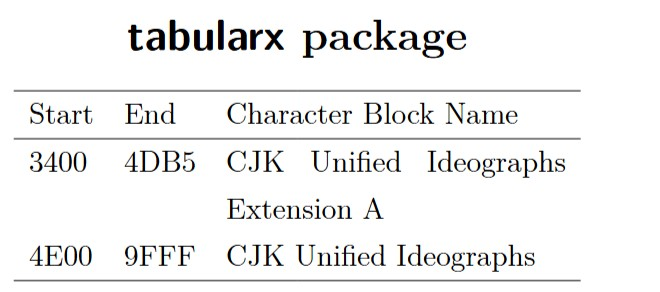

Latex 是一種論文的撰寫格式，有自己的一套語法，本課程使用 Overleaf 作為 Latex 語法撰寫的工具。


<details>
<Summary>
  版面排版
</Summary>

## 程式碼

```
\documentclass[a4paper,12pt,twoside]{book}
\usepackage{xeCJK}
\begin{document}
\begin{titlepage}
\begin{center}        % 版面置中
\vspace{0.5cm}        % 文字間距 
\LARGE               
Department Name\\       % // -> 跳行
University Name\\
Master Thesis/Doctoral Dissertation\\
\vspace{1.5cm}
\textbf{ Thesis Title}   % 文字加粗
\vspace{1.5cm}
\textbf{ Author Name}
\vfill
\textbf{ Adivisor: Prof. Name}
\vspace{0.8cm}
Date
\end{center}
\end{titlepage}
\end{document}
```

## 顯示結果


</details>

<details>
<Summary>
表格說明  
</Summary>

## 程式碼

```
\begin{tabular}[t]{|l|l|l|}
\hline
column1 & column2 & column3 \\
\hline
   item1 & item2 & item3 \\
   itemA & itemB & itemC \\
\hline
\end{tabular} 
```
## 顯示結果


## 程式說明
\begin{tabular}[t]{|l|l|l|} ：首先 [t] 代表top，|l|:靠左，|c|:置中，|r|:靠右。

<hr>
<hr>

## 程式碼

```
\begin{tabular}{|l|c|c|}
\hline
\diagbox{Subject}{Score}{Name} & AAA & BBB \\
\hline
   Math & 80 & 90 \\
\hline
   Chinese & \diagbox[dir=SW]{85}{82} & 88 \\
\hline
\end{tabular} 
```
## 顯示結果


## 程式說明


</details>


<details>
<Summary>
中文表格問題
</Summary>

## 程式碼

```
\begin{tabular}{|l|c|c|}
\hline
\diagbox{學科}{成績}{姓名} & 張小名 & 王大華 \\
\hline
   數學 & 80 & 90 \\
\hline
   國文 & \diagbox[dir=SW]{期中:85}{期末:82} & 88 \\
\hline
\end{tabular}
```

## 顯示結果
應該會出現亂碼，或是空白內容

## 解決方式
增加以下指令 <br><br>
\usepackage{ctex} <br><br>
Compiler 設定為 XeLaTex 模式 <br><br>
就可以解決中文顯示的問題 <br>

</details>

<details>
<Summary>
表格換行問題
</Summary>
  
## 程式碼
以下表格內容過長不換行

```
\centering
\section*{\texttt{tabular*} environment}
\begin{tabular*}{8cm}{lll}
\hline
Start & End & Character Block Name \\
\hline
3400 & 4DB5 & CJK Unified Ideographs Extension A \\
4E00 & 9FFF & CJK Unified Ideographs \\
\hline
\end{tabular*}
```

## 顯示結果


## 程式碼
以下表格內容過長自動換行

```
\centering
\section*{\textsf{tabularx} package}
\begin{tabularx}{8cm}{llX} % 8cm 減去前兩個欄位寬度後，剩下的通通給
\hline % 第三欄位使用，文字超出的部份會自動折行
Start & End & Character Block Name \\
\hline
3400 & 4DB5 & CJK Unified Ideographs Extension A \\
4E00 & 9FFF & CJK Unified Ideographs \\
\hline
\end{tabularx}
```
## 顯示結果


## 使用說明
編輯以上程式碼會出現錯誤，請加上以下指令 <br><br>
\usepackage{tabularx}

</details>


