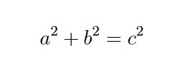
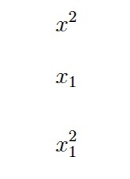
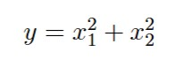

## 1、基本公式 

行內公式（Inline Math）

使用 $...$ 或 \( ... \) 包住公式，例如：  
這是一個行內公式：$a^2 + b^2 = c^2$  

或是以下  

這是一個行內公式：\( a^2 + b^2 = c^2 \) 

顯示結果

## 2、上標與下標 
Latex 語法  
x^2    &nbsp;&nbsp;&nbsp;&nbsp;&nbsp;&nbsp;&nbsp;&nbsp; % 上標：x 的平方   
x_1    &nbsp;&nbsp;&nbsp;&nbsp;&nbsp;&nbsp;&nbsp;&nbsp; % 下標：x 下標 1   
x_1^2  &nbsp;&nbsp;&nbsp;&nbsp;&nbsp;&nbsp;&nbsp;&nbsp; % 同時使用下標與上標   

顯示結果

顯示的公式範例

對應的 Latex 語法

$ y = x_1^2 + x_2^2 $

