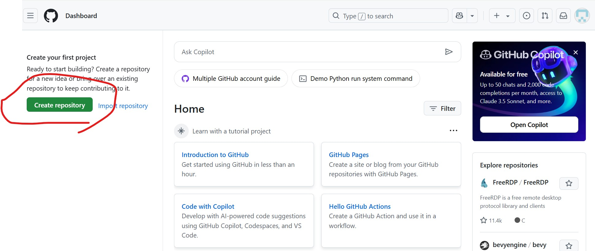
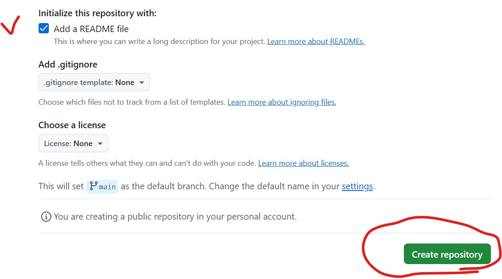

# Github 說明
Github 可以說是程式的雲端硬碟或 IG。註冊帳號就可以上傳檔案，
可以自己決定要不要讓別人看到。當然也可以留言、按讚（星星）、或轉發改編。 
上傳檔案除了可以像社群一樣用網頁版直接傳之外，因為通常一個專案裡面會有很
多資料夾和檔案，所以通常會用一個叫做 git 的技術來實現同步檔案。

# Github 註冊程序

Step1.註冊帳號
請先登入 https://www.github.com 如下圖，然後點擊右上角的 Sign up。

 

-----
Step2.填寫註冊資訊
請填寫註冊用的Email帳號、登入密碼以及使用的名稱，最後請點選最下面的 Continue。

 

-----
Step3.進入GitHub使用者介面
如下圖 

  
# Github 新增儲存庫 (repository)

-----
Step1.Create repository(建立儲存庫)  
從使用者登入介面按下 Create repository。  

 

-----
Step2.填寫 repository 相關資訊  
填寫資料夾名稱、選取Public屬性、勾選 "Add a Readme File"，最後再點選 "Create repository"。  

 

 

-----

