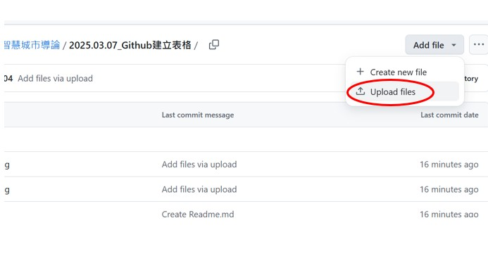
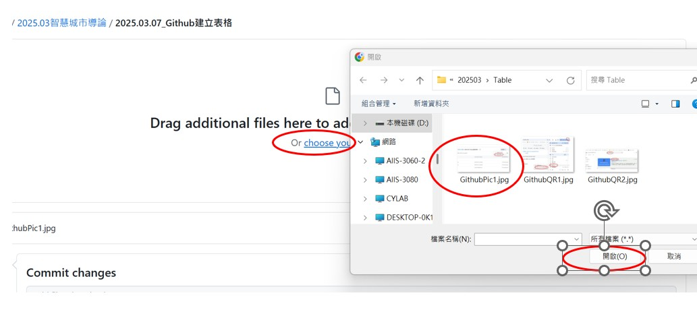

# 本文介紹如何使用 QRCode 連結至 Github 的表格網頁。

-----
## 建立 Chrome 擴充程式 QRCode。
-----
Step1.開啟 Chrome瀏覽器  
開啟 Chrome 瀏覽器，點選到擴充功能的"前往Chrome的線上應用程式商店"。如下圖。 

 

-----
Step2.下載QRCode軟體  
在搜尋列輸入 QRCode並且按下搜尋，找到 "QR Code Generator" 軟體並安裝。 

 

-----

## 上傳圖片
在頁面右上角點選 Add File > Upload files。  

 

然後點選 Choose your files，出現檔案對話框之後，選取要上傳的圖片檔案上傳。  

 

