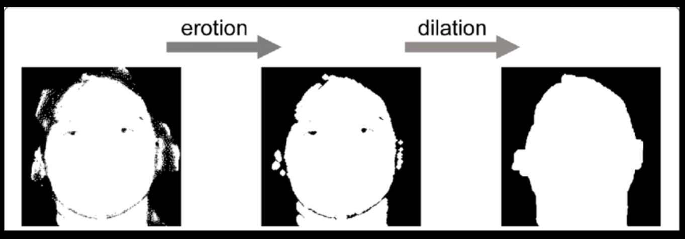
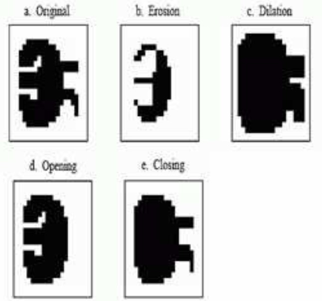
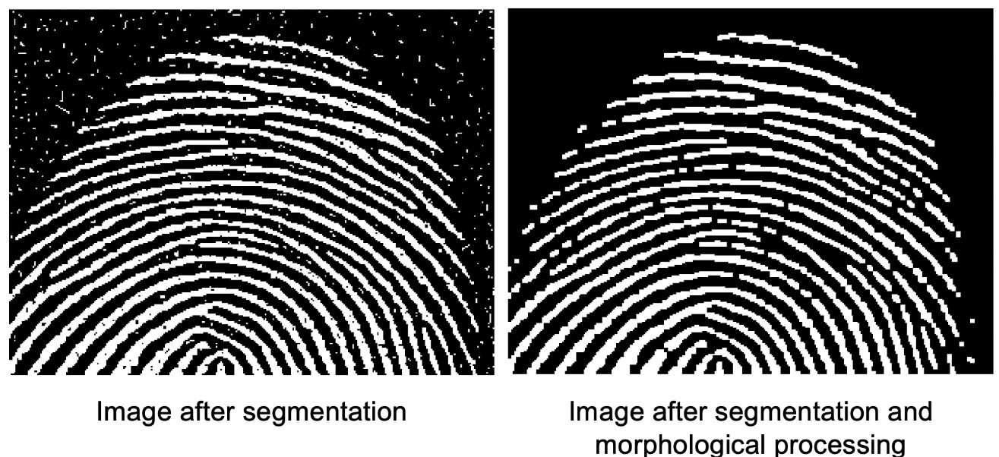
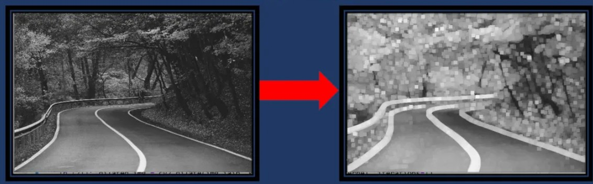
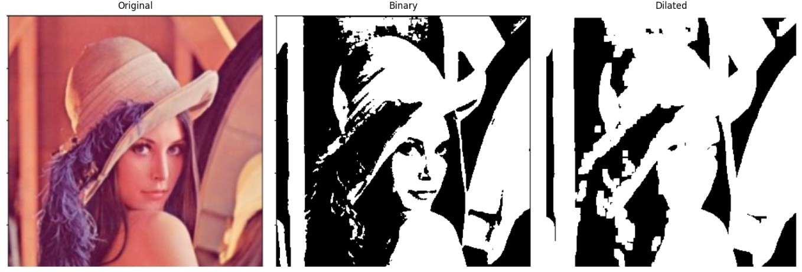
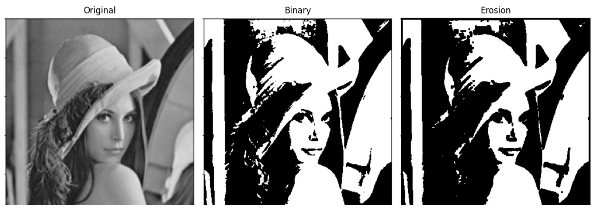
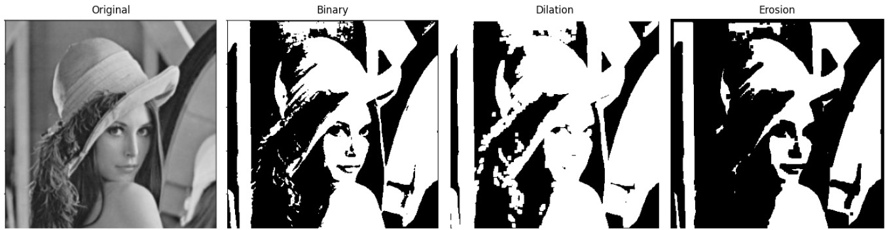
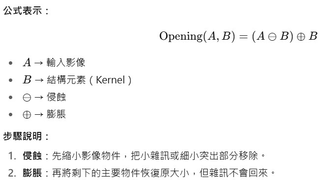
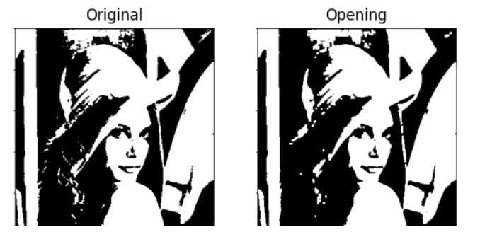
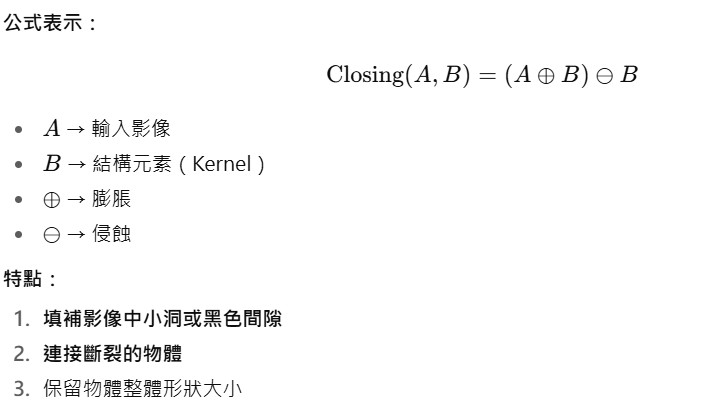

### 「影像形態學」是影像處理中的重要技術，主要用於分析與處理二值化影像的形狀結構，藉由對影像中的物件進行「膨脹」、「侵蝕」、「開運算」與「閉運算」等操作，達到去除雜訊、填補空洞、強化結構與物件分割的目的。
這些操作以「結構元素（structuring element）」為基礎，模擬對影像區域的幾何處理，廣泛應用於工業檢測、生物醫學影像、OCR 前處理、智慧交通等領域。

<hr>

## 下圖為先侵蝕，後膨脹的例子 <br>

<br>

<hr>

## 下圖為原圖、侵蝕、膨脹、開運算、閉運算的例子 <br>

<br>

<hr>

<br>

<hr><hr>

### ◎ 膨脹的用法

<hr>

概念
膨脹是將影像中「白色物件（前景）」往外擴張的形態學運算。

直覺理解：<br>
👉 把影像中的白色區塊「長大」，邊界會向外延伸。<br>
👉 小洞、細縫會被填補，孤立的小區塊可能會連接起來。<br>

#### 範例說明
假設我們有一張簡單的二值化影像（0=黑色，1=白色）

```
原始影像：
0 0 0 0 0
0 0 1 0 0
0 1 1 1 0
0 0 1 0 0
0 0 0 0 0
```

#### 選擇一個 3×3 的十字形結構元素：
```
結構元素：
0 1 0
1 1 1
0 1 0
```

#### 經過膨脹運算後：
```
膨脹後影像：
0 0 1 0 0
0 1 1 1 0
1 1 1 1 1
0 1 1 1 0
0 0 1 0 0
```

#### 以下為實圖的例子：<br>
左：原始影像（有細縫或雜訊） ，  右：膨脹後影像（白色區塊變大、連接起來）
<br>

#### 應用情境<br>

🔹 車牌辨識：填補字母或數字中的細縫，方便辨識 <br>
🔹 OCR前處理：連接破碎的字元筆劃 <br>
🔹 影像遮罩處理：擴張標記區域方便後續分析 <br>
🔹 去除小洞或縫隙：強化目標區塊結構 <br>

👉 總結：<br>
「膨脹」是一種讓白色物件變大的運算，適合用來連接斷裂區域、填補空洞，是影像形態學中最基本也最常用的技術之一。

<hr>

### 膨脹的 Python 實際執行程式範例

```
import cv2
import numpy as np
import matplotlib.pyplot as plt

# === 1. 讀取影像 ===
# 將 'your_image.jpg' 改成你要處理的圖檔名稱
img = cv2.imread('lenna.jpg')

# === 2. 轉為灰階影像 ===
gray = cv2.cvtColor(img, cv2.COLOR_BGR2GRAY)

# === 3. 二值化處理 ===
# 這會將影像轉為黑白，方便做膨脹
_, binary = cv2.threshold(gray, 127, 255, cv2.THRESH_BINARY)

# === 4. 建立結構元素 (Kernel) ===
kernel = cv2.getStructuringElement(cv2.MORPH_RECT, (7, 7))

# === 5. 執行膨脹運算 ===
dilated = cv2.dilate(binary, kernel, iterations=1)

# === 6. 顯示結果 ===
# OpenCV 使用 BGR，Matplotlib 使用 RGB，因此要轉換
img_rgb = cv2.cvtColor(img, cv2.COLOR_BGR2RGB)

plt.figure(figsize=(15,5))

plt.subplot(1,3,1)
plt.title('Original')
plt.imshow(img_rgb)
plt.axis('off')

plt.subplot(1,3,2)
plt.title('Binary')
plt.imshow(binary, cmap='gray')
plt.axis('off')

plt.subplot(1,3,3)
plt.title('Dilated')
plt.imshow(dilated, cmap='gray')
plt.axis('off')

plt.tight_layout()
plt.show()
```
<br>
<hr>
===========
執行結果
===========

<br>

<hr><hr>

### ◎ 侵蝕的用法 <br>

<hr>

概念 <br>
在 影像形態學（Mathematical Morphology） 中，「侵蝕」（Erosion）是一種與「膨脹」相反的運算方式。<br>
##### 使用一個 結構元素（Kernel） 在影像上滑動。
##### 當結構元素覆蓋的區域內，所有對應的前景像素（白色）都存在，該位置才會保留白色。
##### 若有任何一個覆蓋位置不是白色（或前景），該點就會變成黑色（背景）。

這樣的結果就是：
物體的邊緣會被「吃掉」，形狀變得更小、更細。
可用來去除雜訊、斷開細小連接等。

#### 舉例說明

假設我們有這樣的二值圖形（白色 = 1，黑色 = 0）：

```
原始圖形：
0 0 1 1 1 0 0
0 1 1 1 1 1 0
1 1 1 1 1 1 1
0 1 1 1 1 1 0
0 0 1 1 1 0 0
```

```
使用 3×3 結構元素侵蝕後：
0 0 0 1 0 0 0
0 0 1 1 1 0 0
0 1 1 1 1 1 0
0 0 1 1 1 0 0
0 0 0 1 0 0 0
```

結果可以看到邊緣的白色部分被「縮小」了。<br>

#### 應用場景<br>

移除小的白色雜訊點。<br>
讓物體邊緣收縮，用於特徵提取。<br>
在「膨脹」前進行侵蝕，可組合成「開運算」，用於影像平滑處理。<br>

### 侵蝕的 Python 實際執行程式範例

```
import cv2
import numpy as np
import matplotlib.pyplot as plt

# === 1. 讀取固定圖檔 ===
# 將 'your_image.jpg' 改成你要處理的圖檔路徑
img = cv2.imread('lenna.jpg', cv2.IMREAD_GRAYSCALE)

# === 2. 二值化影像 ===
_, binary = cv2.threshold(img, 127, 255, cv2.THRESH_BINARY)

# === 3. 建立結構元素 (Kernel) ===
kernel = np.ones((3,3), np.uint8)

# === 4. 執行侵蝕 ===
erosion = cv2.erode(binary, kernel, iterations=1)

# === 5. 顯示結果 ===
plt.figure(figsize=(12,5))

plt.subplot(1,3,1)
plt.title('Original')
plt.imshow(img, cmap='gray')
plt.axis('off')

plt.subplot(1,3,2)
plt.title('Binary')
plt.imshow(binary, cmap='gray')
plt.axis('off')

plt.subplot(1,3,3)
plt.title('Erosion')
plt.imshow(erosion, cmap='gray')
plt.axis('off')

plt.tight_layout()
plt.show()
```
<br>
<hr>
===========
執行結果
===========

<br>

<hr><hr>

### 將膨脹跟侵蝕的影像並列比較的 Python 程式範例<br>

```
import cv2
import numpy as np
import matplotlib.pyplot as plt

# === 1. 讀取固定圖檔 ===
# 將 'your_image.jpg' 改成你要處理的圖檔路徑
img = cv2.imread('lenna.jpg', cv2.IMREAD_GRAYSCALE)

# === 2. 二值化影像 ===
_, binary = cv2.threshold(img, 127, 255, cv2.THRESH_BINARY)

# === 3. 建立結構元素 (Kernel) ===
kernel = np.ones((5,5), np.uint8)  # 可以調整大小查看效果差異

# === 4. 執行膨脹 (Dilation) ===
dilated = cv2.dilate(binary, kernel, iterations=1)

# === 5. 執行侵蝕 (Erosion) ===
eroded = cv2.erode(binary, kernel, iterations=1)

# === 6. 顯示結果並列比較 ===
plt.figure(figsize=(15,5))

plt.subplot(1,4,1)
plt.title('Original')
plt.imshow(img, cmap='gray')
plt.axis('off')

plt.subplot(1,4,2)
plt.title('Binary')
plt.imshow(binary, cmap='gray')
plt.axis('off')

plt.subplot(1,4,3)
plt.title('Dilation')
plt.imshow(dilated, cmap='gray')
plt.axis('off')

plt.subplot(1,4,4)
plt.title('Erosion')
plt.imshow(eroded, cmap='gray')
plt.axis('off')

plt.tight_layout()
plt.show()
```
<br>
<hr>
===========
執行結果
===========

<br>

<hr><hr>

### ◎ 開運算的用法 <br>

<hr>

#### 在 影像形態學（Morphological Image Processing） 中，開運算（Opening） 是一種**先侵蝕（Erosion）再膨脹（Dilation）**的組合運算。
它的主要作用是：<br>
去除影像中的小型雜訊（白色小點）<br>
保持較大物體的形狀不變<br>
常用於二值化影像的前處理<br>

#### 概念
<br>

#### 舉例說明

假設我們有這樣的二值圖形（白色 = 1，黑色 = 0）：

```
原始影像：
0 0 0 0 0 0 0
0 1 1 0 0 1 0
0 1 1 0 1 1 0
0 0 0 0 0 0 0
```

右邊的小白點是雜訊<br>
中間大的白塊是主要物件<br>

使用 3×3 Kernel 開運算 後：
```
開運算結果：
0 0 0 0 0 0 0
0 1 1 0 0 0 0
0 1 1 0 0 0 0
0 0 0 0 0 0 0
```

觀察效果：<br>
小白點雜訊被去掉<br>
大白塊基本形狀保留<br>

#### 應用場景

。 去除二值化影像的小白點雜訊 <br>
。 分離物件間的小連接 <br>
。 OCR 前處理 → 清除破碎筆劃 <br>
。 工業檢測 → 去掉小型瑕疵或灰塵 <br>

#### 總結：

開運算就是「先吃掉雜訊，再恢復物體大小」，非常適合清理影像中的小白點或細小干擾。

### 開運算的 Python 實際執行程式範例

```
import cv2
import numpy as np
from matplotlib import pyplot as plt

# 讀取灰階圖
img = cv2.imread('input.jpg', cv2.IMREAD_GRAYSCALE)

# 二值化
_, binary = cv2.threshold(img, 127, 255, cv2.THRESH_BINARY)

# 建立 3x3 結構元素
kernel = np.ones((3,3), np.uint8)

# 開運算：先侵蝕再膨脹
opening = cv2.morphologyEx(binary, cv2.MORPH_OPEN, kernel)

# 顯示結果
plt.figure(figsize=(10,5))
plt.subplot(1,3,1)
plt.title('Original')
plt.imshow(binary, cmap='gray')
plt.axis('off')

plt.subplot(1,3,2)
plt.title('Opening')
plt.imshow(opening, cmap='gray')
plt.axis('off')

plt.show()
```
<br>
<hr>
===========
執行結果
===========

<br>

<hr><hr>

### ◎ 閉運算的用法 <br>

<hr>

影像形態學（Morphological Image Processing） 中，閉運算（Closing） 是一種**先膨脹（Dilation）再侵蝕（Erosion）**的組合運算。

概念<br>
<br>


#### 範例說明

假設我們有這張二值化影像（1=白色，0=黑色）：

```
原始影像：
0 0 0 0 0 0 0
0 1 1 0 0 1 0
0 1 1 0 1 1 0
0 0 0 0 0 0 0
```

中間的黑色小洞 → 物件缺口 <br>
左右的白塊是物件<br>

使用 3×3 Kernel 閉運算 後：<br>

```
閉運算結果：
0 0 0 0 0 0 0
0 1 1 1 0 1 0
0 1 1 1 1 1 0
0 0 0 0 0 0 0
```

觀察效果：<br>

小黑洞被填補<br>
斷裂的物件連接起來<br>
物件大小基本保持不變<br>


