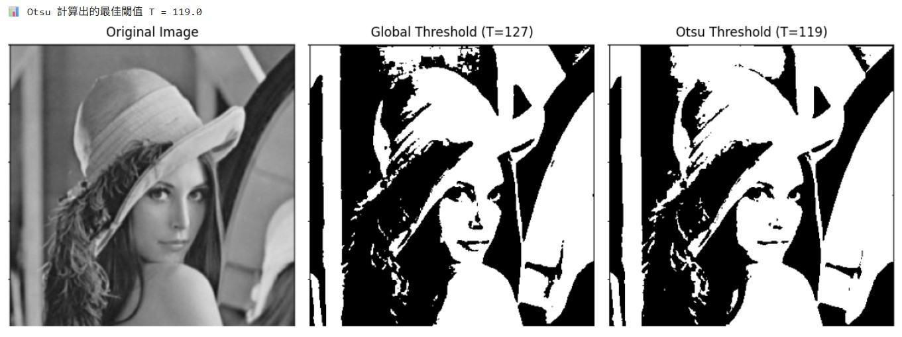
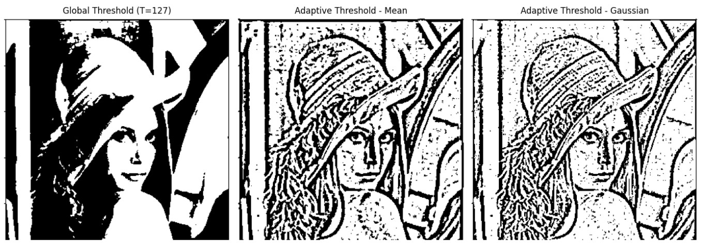
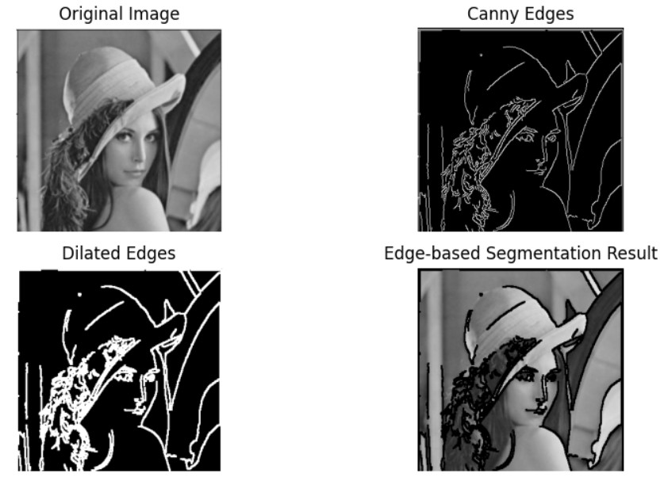
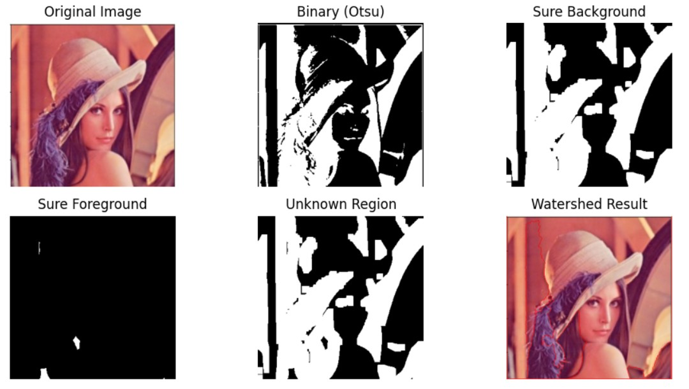

## 電腦視覺中的區域分割與輪廓是影像分析的重要步驟
區域分割（Region Segmentation）是將影像依照像素特徵，如灰階、顏色或紋理，劃分為具相似性的區域，讓同一物體內部像素相似而與背景或其他物體區分。透過分割可獲得前景與背景的遮罩，用於物體辨識、面積統計或目標追蹤。

輪廓（Contour）則是描述物體邊界形狀的線條資訊，通常從區域分割後的二值影像中擷取。利用 OpenCV 的 findContours() 函式，可取得物體外框並計算面積、周長、外接矩形及形狀特徵等。輪廓偵測常搭配邊緣偵測（如 Canny 演算法）或形態學運算，以強化邊界品質。

簡而言之，區域分割著重於「找出整個物體」，輪廓則強調「描出物體的邊界」。兩者相輔相成，廣泛應用於醫學影像分析、工業檢測及自動駕駛等領域，為電腦理解與分析影像結構的重要基礎。

<hr>

## 區域分割

### 1. 什麼是區域分割（Segmentation）？ 

#### 定義：將影像依據「像素的灰階值、顏色或紋理」分成有意義的區域。
#### 目的：
#### 萃取目標物件
#### 移除背景
#### 為後續辨識或分析做準備

<hr>

### 2. 常見分割方法：
#### . 全域閾值分割（Global Thresholding）
#### . 自動閾值（例如 Otsu 閾值法）
#### . 自適應閾值（Adaptive Thresholding）
#### . 區域成長法（Region Growing）
#### . 邊緣導向分割（Edge-based Segmentation）
#### . 分水嶺演算法（Watershed 演算法）

<hr>

#### (1). 全域閾值
#### 將影像灰階值與設定的閾值 T 比較
#### > 若像素值 > T → 設為白色 (1)
#### > 否則 → 設為黑色 (0)

====================================================<br>
#### 全域閾值程式，實作全域閥值的練習 (T 可以設定 0-255)。
====================================================<br>
```python
import cv2
import matplotlib.pyplot as plt

# 讀取影像（灰階模式）
# 👉 請將 'sample.jpg' 換成你本地的圖片檔名
img = cv2.imread('lenna.jpg', cv2.IMREAD_GRAYSCALE)

# 設定全域閾值 T = 127
T1 = 100
_, th1 = cv2.threshold(img, T1, 255, cv2.THRESH_BINARY)

T2 = 127
_, th2 = cv2.threshold(img, T2, 255, cv2.THRESH_BINARY)

T3 = 150
_, th3 = cv2.threshold(img, T3, 255, cv2.THRESH_BINARY)

# 顯示原圖與閾值化結果
plt.figure(figsize=(16,5))

plt.subplot(1,4,1)
plt.imshow(img, cmap='gray')
plt.title('Original Image')
plt.axis('off')

plt.subplot(1,4,2)
plt.imshow(th1, cmap='gray')
plt.title(f'Global Threshold T={T1}')
plt.axis('off')

plt.subplot(1,4,3)
plt.imshow(th2, cmap='gray')
plt.title(f'Global Threshold T={T2}')
plt.axis('off')

plt.subplot(1,4,4)
plt.imshow(th3, cmap='gray')
plt.title(f'Global Threshold T={T3}')
plt.axis('off')

plt.show()
```
<br>
<hr>
===========
執行結果
===========

<br>

<hr><hr>

#### (2). Otsu 閾值法
#### > 自動計算最佳閾值，最大化類間變異數。
#### > 不需人工設定 T。

====================================================<br>
#### Otsu 閾值法程式，實作全域閥值的練習。
====================================================<br>
```python
# 匯入套件
import cv2
import matplotlib.pyplot as plt

# 讀取影像（灰階）
# 👉 請將 'sample.jpg' 換成你的圖片檔名
img = cv2.imread('lenna.jpg', cv2.IMREAD_GRAYSCALE)

# 一般全域閾值 (T = 127)
_, th_global = cv2.threshold(img, 127, 255, cv2.THRESH_BINARY)

# Otsu 閾值法 (自動計算最佳 T)
otsu_T, th_otsu = cv2.threshold(img, 0, 255, cv2.THRESH_BINARY + cv2.THRESH_OTSU)

# 顯示 Otsu 計算出來的閾值
print(f"📊 Otsu 計算出的最佳閾值 T = {otsu_T}")

# 顯示結果
plt.figure(figsize=(12,5))

plt.subplot(1,3,1)
plt.imshow(img, cmap='gray')
plt.title('Original Image')
plt.axis('off')

plt.subplot(1,3,2)
plt.imshow(th_global, cmap='gray')
plt.title('Global Threshold (T=127)')
plt.axis('off')

plt.subplot(1,3,3)
plt.imshow(th_otsu, cmap='gray')
plt.title(f'Otsu Threshold (T={otsu_T:.0f})')
plt.axis('off')

plt.tight_layout()
plt.show()
```
<br>
<hr>
===========
執行結果
===========

<br>

<hr><hr>

#### (3). 自適應閾值
#### > 適合光線不均的影像。
#### > 閾值依據像素區域的平均值計算。

====================================================<br>
#### 自適應閾值程式，實作全域閥值的練習 。
====================================================<br>
```python
import cv2
import matplotlib.pyplot as plt

# 讀取影像（灰階）
# 👉 請將 'sample.jpg' 換成你的圖片檔名
img = cv2.imread('lenna.jpg', cv2.IMREAD_GRAYSCALE)

# 一般全域閾值 (T = 127)
_, th_global = cv2.threshold(img, 127, 255, cv2.THRESH_BINARY)

# 自適應閾值 - Mean 方法
th_mean = cv2.adaptiveThreshold(
    img, 255, 
    cv2.ADAPTIVE_THRESH_MEAN_C,   # 區域平均
    cv2.THRESH_BINARY, 
    11, 2)   # blockSize=11, C=2

# 自適應閾值 - Gaussian 方法
th_gaussian = cv2.adaptiveThreshold(
    img, 255, 
    cv2.ADAPTIVE_THRESH_GAUSSIAN_C,   # 區域高斯加權
    cv2.THRESH_BINARY, 
    11, 2)

# 顯示結果
plt.figure(figsize=(14,5))

plt.subplot(1,3,1)
plt.imshow(th_global, cmap='gray')
plt.title('Global Threshold (T=127)')
plt.axis('off')

plt.subplot(1,3,2)
plt.imshow(th_mean, cmap='gray')
plt.title('Adaptive Threshold - Mean')
plt.axis('off')

plt.subplot(1,3,3)
plt.imshow(th_gaussian, cmap='gray')
plt.title('Adaptive Threshold - Gaussian')
plt.axis('off')

plt.tight_layout()
plt.show()
```
<br>
<hr>
===========
執行結果
===========

<br>

<hr><hr>

#### (4). 區域成長法 (Region Growing)
#### > 由一個或多個「種子點（seed）」開始
#### > 將相似像素（灰階值或顏色差異小於門檻）合併為同一區域
#### > 常用於醫學影像、工業檢測

====================================================<br>
#### 自適應閾值程式，實作全域閥值的練習 。
====================================================<br>
```python
import cv2
import numpy as np
import matplotlib.pyplot as plt

# 讀取影像 (灰階)
# 👉 將 'sample.jpg' 換成你的圖片
img = cv2.imread('lenna.jpg', cv2.IMREAD_GRAYSCALE)

# 複製一份影像當作區域標記
seg = np.zeros_like(img, dtype=np.uint8)

# 設定種子點 (y, x) 位置 — 你可以依圖片調整
seed_point = (100, 100)

# 設定成長的閾值
threshold = 15

# 建立堆疊（用來擴張）
stack = [seed_point]

# 種子點灰階值
seed_value = int(img[seed_point])

# 八鄰域方向
neighbors = [(-1, 0), (1, 0), (0, -1), (0, 1), (-1,-1),(1,1),(-1,1),(1,-1)]

# 區域成長演算法
while stack:
    y, x = stack.pop()
    if seg[y, x] == 0:
        seg[y, x] = 255
        for dy, dx in neighbors:
            ny, nx = y + dy, x + dx
            if 0 <= ny < img.shape[0] and 0 <= nx < img.shape[1]:
                if seg[ny, nx] == 0:
                    if abs(int(img[ny, nx]) - seed_value) < threshold:
                        stack.append((ny, nx))

# 顯示結果
plt.figure(figsize=(12,5))

plt.subplot(1,2,1)
plt.imshow(img, cmap='gray')
plt.title('Original Image')
plt.axis('off')

plt.subplot(1,2,2)
plt.imshow(seg, cmap='gray')
plt.title(f'Region Growing (seed={seed_point}, T={threshold})')
plt.axis('off')

plt.tight_layout()
plt.show()
```
<br>
<hr>
===========
執行結果
===========

<br>

<hr><hr>

## 邊緣導向分割原理
#### 邊緣導向分割的核心步驟：
#### > 使用邊緣偵測（例如 Canny 邊緣偵測）找出影像中的邊界。
#### > 將邊緣結果視為區域的邊界，協助影像分割。
#### > 可搭配形態學操作修補破碎邊緣，形成封閉區域。

====================================================<br>
#### 邊緣導向分割程式，實作全域閥值的練習 。
====================================================<br>
```python
import cv2
import numpy as np
import matplotlib.pyplot as plt

# 讀取影像（灰階）
# 👉 請將 'sample.jpg' 換成你的影像檔名
img = cv2.imread('lenna.jpg', cv2.IMREAD_GRAYSCALE)

# Step 1: Canny 邊緣偵測
edges = cv2.Canny(img, 100, 200)

# Step 2: 形態學膨脹，讓邊緣連續
kernel = np.ones((3,3), np.uint8)
dilated = cv2.dilate(edges, kernel, iterations=1)

# Step 3: 反轉邊緣區域，準備做遮罩
mask = cv2.bitwise_not(dilated)

# Step 4: 分割 — 使用遮罩將目標與背景分離
segmented = cv2.bitwise_and(img, img, mask=mask)

# Step 5: 顯示結果
plt.figure(figsize=(10,5))

plt.subplot(2,2,1)
plt.imshow(img, cmap='gray')
plt.title('Original Image')
plt.axis('off')

plt.subplot(2,2,2)
plt.imshow(edges, cmap='gray')
plt.title('Canny Edges')
plt.axis('off')

plt.subplot(2,2,3)
plt.imshow(dilated, cmap='gray')
plt.title('Dilated Edges')
plt.axis('off')

plt.subplot(2,2,4)
plt.imshow(segmented, cmap='gray')
plt.title('Edge-based Segmentation Result')
plt.axis('off')

plt.tight_layout()
plt.show()
```
<br>
<hr>
===========
執行結果
===========

<br>

<hr><hr>


分水嶺演算法（Watershed Algorithm）」是一種非常經典且實用的影像分割技術。
它尤其適合處理「物件邊緣清楚但相互接近或接觸」的影像，例如硬幣、膠囊、細胞等。

## 分水嶺演算法基本流程
#### > 影像前處理（灰階、高斯模糊等）
#### > 二值化（如 Otsu 閾值法）
#### > 形態學操作（去除雜訊、獲取背景/前景）
#### > 標記（Marker）區域（確定前景與背景）
#### > 套用分水嶺演算法
#### > 顯示結果（通常用顏色標出邊界）

====================================================<br>
#### 分水嶺演算法程式，實作練習 。
====================================================<br>
```python
import cv2
import numpy as np
import matplotlib.pyplot as plt

# Step 1: 讀取影像
# 👉 請將 'coins.jpg' 換成你的影像檔名
img = cv2.imread('lenna.jpg')
gray = cv2.cvtColor(img, cv2.COLOR_BGR2GRAY)

# Step 2: Otsu 閾值二值化（反白）
_, thresh = cv2.threshold(gray, 0, 255, cv2.THRESH_BINARY_INV + cv2.THRESH_OTSU)

# Step 3: 形態學操作 - 去除雜訊
kernel = np.ones((3,3), np.uint8)
opening = cv2.morphologyEx(thresh, cv2.MORPH_OPEN, kernel, iterations=2)

# Step 4: 確定背景區域
sure_bg = cv2.dilate(opening, kernel, iterations=3)

# Step 5: 確定前景區域
dist_transform = cv2.distanceTransform(opening, cv2.DIST_L2, 5)
_, sure_fg = cv2.threshold(dist_transform, 0.7*dist_transform.max(), 255, 0)
sure_fg = np.uint8(sure_fg)

# Step 6: 找出未知區域
unknown = cv2.subtract(sure_bg, sure_fg)

# Step 7: 標記 Marker
_, markers = cv2.connectedComponents(sure_fg)
markers = markers + 1
markers[unknown == 255] = 0

# Step 8: 套用分水嶺演算法
img_mark = img.copy()
cv2.watershed(img_mark, markers)
img_mark[markers == -1] = [0, 0, 255]  # 邊界標紅

# Step 9: 顯示結果
plt.figure(figsize=(10,5))

plt.subplot(2,3,1)
plt.imshow(cv2.cvtColor(img, cv2.COLOR_BGR2RGB))
plt.title('Original Image')
plt.axis('off')

plt.subplot(2,3,2)
plt.imshow(thresh, cmap='gray')
plt.title('Binary (Otsu)')
plt.axis('off')

plt.subplot(2,3,3)
plt.imshow(sure_bg, cmap='gray')
plt.title('Sure Background')
plt.axis('off')

plt.subplot(2,3,4)
plt.imshow(sure_fg, cmap='gray')
plt.title('Sure Foreground')
plt.axis('off')

plt.subplot(2,3,5)
plt.imshow(unknown, cmap='gray')
plt.title('Unknown Region')
plt.axis('off')

plt.subplot(2,3,6)
plt.imshow(cv2.cvtColor(img_mark, cv2.COLOR_BGR2RGB))
plt.title('Watershed Result')
plt.axis('off')

plt.tight_layout()
plt.show()
```
<br>
<hr>
===========
執行結果
===========

<br>

<hr><hr>


