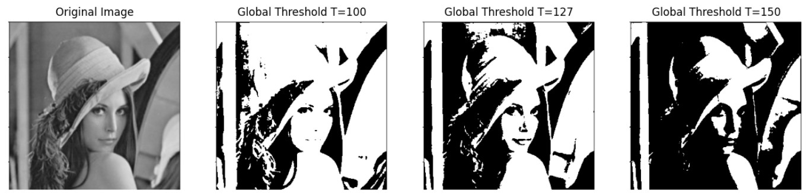

## 區域分割與輪廓

### 1. 什麼是區域分割（Segmentation）？ 

#### 定義：將影像依據「像素的灰階值、顏色或紋理」分成有意義的區域。
#### 目的：
#### 萃取目標物件
#### 移除背景
#### 為後續辨識或分析做準備

### 2. 常見分割方法：
#### . 全域閾值分割（Global Thresholding）
#### . 自動閾值（例如 Otsu 閾值法）
#### . 自適應閾值（Adaptive Thresholding）
#### . 區域成長法（Region Growing）
#### . 邊緣導向分割（Edge-based Segmentation）
#### . 分水嶺演算法（Watershed 演算法）

#### (1). 全域閾值
#### 將影像灰階值與設定的閾值 T 比較
#### > 若像素值 > T → 設為白色 (1)
#### > 否則 → 設為黑色 (0)

#### 請參考以下程式，實作全域閥值的練習。
```
import cv2
import matplotlib.pyplot as plt

# 讀取影像（灰階模式）
# 👉 請將 'sample.jpg' 換成你本地的圖片檔名
img = cv2.imread('lenna.jpg', cv2.IMREAD_GRAYSCALE)

# 設定全域閾值 T = 127
T1 = 100
_, th1 = cv2.threshold(img, T1, 255, cv2.THRESH_BINARY)

T2 = 127
_, th2 = cv2.threshold(img, T2, 255, cv2.THRESH_BINARY)

T3 = 150
_, th3 = cv2.threshold(img, T3, 255, cv2.THRESH_BINARY)

# 顯示原圖與閾值化結果
plt.figure(figsize=(16,5))

plt.subplot(1,4,1)
plt.imshow(img, cmap='gray')
plt.title('Original Image')
plt.axis('off')

plt.subplot(1,4,2)
plt.imshow(th1, cmap='gray')
plt.title(f'Global Threshold T={T1}')
plt.axis('off')

plt.subplot(1,4,3)
plt.imshow(th2, cmap='gray')
plt.title(f'Global Threshold T={T2}')
plt.axis('off')

plt.subplot(1,4,4)
plt.imshow(th3, cmap='gray')
plt.title(f'Global Threshold T={T3}')
plt.axis('off')

plt.show()
```
<br>
<hr>
===========
執行結果
===========

<br>

<hr><hr>


#### (2). Otsu 閾值法
#### > 自動計算最佳閾值，最大化類間變異數。
#### > 不需人工設定 T。

#### (3). 自適應閾值
#### > 適合光線不均的影像。
#### > 閾值依據像素區域的平均值計算。

#### (4). 區域成長法 (Region Growing)
#### > 由一個或多個「種子點（seed）」開始
#### > 將相似像素（灰階值或顏色差異小於門檻）合併為同一區域
#### > 常用於醫學影像、工業檢測


