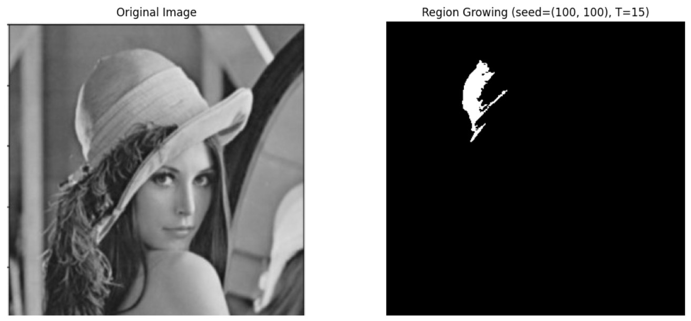

## 區域分割與輪廓

### 1. 什麼是區域分割（Segmentation）？ 

#### 定義：將影像依據「像素的灰階值、顏色或紋理」分成有意義的區域。
#### 目的：
#### 萃取目標物件
#### 移除背景
#### 為後續辨識或分析做準備

<hr>

### 2. 常見分割方法：
#### . 全域閾值分割（Global Thresholding）
#### . 自動閾值（例如 Otsu 閾值法）
#### . 自適應閾值（Adaptive Thresholding）
#### . 區域成長法（Region Growing）
#### . 邊緣導向分割（Edge-based Segmentation）
#### . 分水嶺演算法（Watershed 演算法）

<hr>

#### (1). 全域閾值
#### 將影像灰階值與設定的閾值 T 比較
#### > 若像素值 > T → 設為白色 (1)
#### > 否則 → 設為黑色 (0)

====================================================<br>
#### 全域閾值程式，實作全域閥值的練習 (T 可以設定 0-255)。
====================================================<br>
```python
import cv2
import matplotlib.pyplot as plt

# 讀取影像（灰階模式）
# 👉 請將 'sample.jpg' 換成你本地的圖片檔名
img = cv2.imread('lenna.jpg', cv2.IMREAD_GRAYSCALE)

# 設定全域閾值 T = 127
T1 = 100
_, th1 = cv2.threshold(img, T1, 255, cv2.THRESH_BINARY)

T2 = 127
_, th2 = cv2.threshold(img, T2, 255, cv2.THRESH_BINARY)

T3 = 150
_, th3 = cv2.threshold(img, T3, 255, cv2.THRESH_BINARY)

# 顯示原圖與閾值化結果
plt.figure(figsize=(16,5))

plt.subplot(1,4,1)
plt.imshow(img, cmap='gray')
plt.title('Original Image')
plt.axis('off')

plt.subplot(1,4,2)
plt.imshow(th1, cmap='gray')
plt.title(f'Global Threshold T={T1}')
plt.axis('off')

plt.subplot(1,4,3)
plt.imshow(th2, cmap='gray')
plt.title(f'Global Threshold T={T2}')
plt.axis('off')

plt.subplot(1,4,4)
plt.imshow(th3, cmap='gray')
plt.title(f'Global Threshold T={T3}')
plt.axis('off')

plt.show()
```
<br>
<hr>
===========
執行結果
===========

<br>

<hr><hr>

#### (2). Otsu 閾值法
#### > 自動計算最佳閾值，最大化類間變異數。
#### > 不需人工設定 T。

====================================================<br>
#### Otsu 閾值法程式，實作全域閥值的練習。
====================================================<br>
```python
# 匯入套件
import cv2
import matplotlib.pyplot as plt

# 讀取影像（灰階）
# 👉 請將 'sample.jpg' 換成你的圖片檔名
img = cv2.imread('lenna.jpg', cv2.IMREAD_GRAYSCALE)

# 一般全域閾值 (T = 127)
_, th_global = cv2.threshold(img, 127, 255, cv2.THRESH_BINARY)

# Otsu 閾值法 (自動計算最佳 T)
otsu_T, th_otsu = cv2.threshold(img, 0, 255, cv2.THRESH_BINARY + cv2.THRESH_OTSU)

# 顯示 Otsu 計算出來的閾值
print(f"📊 Otsu 計算出的最佳閾值 T = {otsu_T}")

# 顯示結果
plt.figure(figsize=(12,5))

plt.subplot(1,3,1)
plt.imshow(img, cmap='gray')
plt.title('Original Image')
plt.axis('off')

plt.subplot(1,3,2)
plt.imshow(th_global, cmap='gray')
plt.title('Global Threshold (T=127)')
plt.axis('off')

plt.subplot(1,3,3)
plt.imshow(th_otsu, cmap='gray')
plt.title(f'Otsu Threshold (T={otsu_T:.0f})')
plt.axis('off')

plt.tight_layout()
plt.show()
```
<br>
<hr>
===========
執行結果
===========

<br>

<hr><hr>

#### (3). 自適應閾值
#### > 適合光線不均的影像。
#### > 閾值依據像素區域的平均值計算。

====================================================<br>
#### 自適應閾值程式，實作全域閥值的練習 。
====================================================<br>
```python
import cv2
import matplotlib.pyplot as plt

# 讀取影像（灰階）
# 👉 請將 'sample.jpg' 換成你的圖片檔名
img = cv2.imread('lenna.jpg', cv2.IMREAD_GRAYSCALE)

# 一般全域閾值 (T = 127)
_, th_global = cv2.threshold(img, 127, 255, cv2.THRESH_BINARY)

# 自適應閾值 - Mean 方法
th_mean = cv2.adaptiveThreshold(
    img, 255, 
    cv2.ADAPTIVE_THRESH_MEAN_C,   # 區域平均
    cv2.THRESH_BINARY, 
    11, 2)   # blockSize=11, C=2

# 自適應閾值 - Gaussian 方法
th_gaussian = cv2.adaptiveThreshold(
    img, 255, 
    cv2.ADAPTIVE_THRESH_GAUSSIAN_C,   # 區域高斯加權
    cv2.THRESH_BINARY, 
    11, 2)

# 顯示結果
plt.figure(figsize=(14,5))

plt.subplot(1,3,1)
plt.imshow(th_global, cmap='gray')
plt.title('Global Threshold (T=127)')
plt.axis('off')

plt.subplot(1,3,2)
plt.imshow(th_mean, cmap='gray')
plt.title('Adaptive Threshold - Mean')
plt.axis('off')

plt.subplot(1,3,3)
plt.imshow(th_gaussian, cmap='gray')
plt.title('Adaptive Threshold - Gaussian')
plt.axis('off')

plt.tight_layout()
plt.show()
```
<br>
<hr>
===========
執行結果
===========

<br>

<hr><hr>

#### (4). 區域成長法 (Region Growing)
#### > 由一個或多個「種子點（seed）」開始
#### > 將相似像素（灰階值或顏色差異小於門檻）合併為同一區域
#### > 常用於醫學影像、工業檢測

====================================================<br>
#### 自適應閾值程式，實作全域閥值的練習 。
====================================================<br>
```python
import cv2
import numpy as np
import matplotlib.pyplot as plt

# 讀取影像 (灰階)
# 👉 將 'sample.jpg' 換成你的圖片
img = cv2.imread('lenna.jpg', cv2.IMREAD_GRAYSCALE)

# 複製一份影像當作區域標記
seg = np.zeros_like(img, dtype=np.uint8)

# 設定種子點 (y, x) 位置 — 你可以依圖片調整
seed_point = (100, 100)

# 設定成長的閾值
threshold = 15

# 建立堆疊（用來擴張）
stack = [seed_point]

# 種子點灰階值
seed_value = int(img[seed_point])

# 八鄰域方向
neighbors = [(-1, 0), (1, 0), (0, -1), (0, 1), (-1,-1),(1,1),(-1,1),(1,-1)]

# 區域成長演算法
while stack:
    y, x = stack.pop()
    if seg[y, x] == 0:
        seg[y, x] = 255
        for dy, dx in neighbors:
            ny, nx = y + dy, x + dx
            if 0 <= ny < img.shape[0] and 0 <= nx < img.shape[1]:
                if seg[ny, nx] == 0:
                    if abs(int(img[ny, nx]) - seed_value) < threshold:
                        stack.append((ny, nx))

# 顯示結果
plt.figure(figsize=(12,5))

plt.subplot(1,2,1)
plt.imshow(img, cmap='gray')
plt.title('Original Image')
plt.axis('off')

plt.subplot(1,2,2)
plt.imshow(seg, cmap='gray')
plt.title(f'Region Growing (seed={seed_point}, T={threshold})')
plt.axis('off')

plt.tight_layout()
plt.show()
```
<br>
<hr>
===========
執行結果
===========

<br>

<hr><hr>


