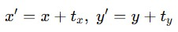
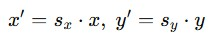
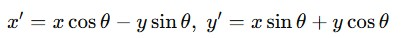
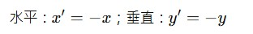
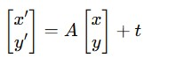
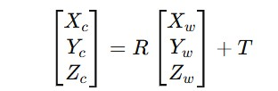
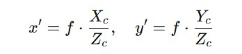
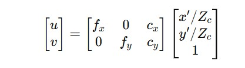

## 當我們在電腦視覺（Computer Vision）中處理影像時，「幾何轉換（Geometric Transformation）」與「座標變換（Coordinate Transformation）」是非常重要的基礎概念。以下是詳細說明：

🧩 一、幾何轉換（Geometric Transformation）

幾何轉換是指對影像中的像素位置進行數學運算，讓影像能夠進行旋轉、縮放、平移、翻轉、透視等空間上的變化，而不一定改變影像的內容。

| 類型                                                | 說明             | 數學形式                                                             |
| ------------------------------------------------- | -------------- | ---------------------------------------------------------------------- |
| **平移（Translation）**                               | 影像在x、y方向上移動    |                                         |
| **縮放（Scaling）**                                   | 放大或縮小影像        |                                           |
| **旋轉（Rotation）**                                  | 以原點或特定中心旋轉     |                                         |
| **翻轉（Reflection）**                                | 水平或垂直鏡像        |                                           |
| **仿射變換（Affine Transformation）**                   | 維持平行線但可改變角度與比例 |                                    |
| **透視變換（Perspective / Projective Transformation）** | 模擬相機視角、透視效果    | 使用3×3矩陣進行齊次座標轉換                                 |

<br>

🧭 二、座標變換（Coordinate Transformation）

座標變換是針對不同座標系統之間的轉換，例如：
影像座標系（pixel coordinates）
世界座標系（world coordinates）
相機座標系（camera coordinates）

它描述了影像中某個像素對應到現實世界中實際位置的方式，這是相機校正、3D重建、深度估測的重要步驟。

🎯 座標系轉換流程

1.世界座標 (World Coordinates)<br>
表示物體在現實空間的真實位置（Xw, Yw, Zw）。<br>

2.相機座標 (Camera Coordinates)<br>
經過相機外部參數（旋轉矩陣 R、平移向量 T）轉換：<br>
<br>

3.影像座標 (Image Coordinates)<br>
經過透視投影，將三維點投影到二維平面：<br>
<br>

4.像素座標 (Pixel Coordinates)<br>
經過相機內部參數（焦距、主點偏移、像素尺寸）得到實際像素位置：<>
<br>

🧠 三、應用實例
影像對齊與拼接（Panorama Stitching）
校正傾斜的文件影像
攝影機視角矯正（如道路標線視角轉正）
機器人定位與3D視覺

====================================================<br>
#### 影像平移、旋轉、縮放、仿射變換、透視變換 練習
====================================================<br>
```python
import cv2
import numpy as np
from matplotlib import pyplot as plt

# 讀取影像
img = cv2.imread('lenna.jpg')  # 可改成自己的影像路徑
img = cv2.cvtColor(img, cv2.COLOR_BGR2RGB)  # 轉成RGB方便顯示

h, w = img.shape[:2]

# ====== 1️⃣ 平移 (Translation) ======
tx, ty = 100, 50  # x向右移100, y向下移50
M_translate = np.float32([[1, 0, tx],
                          [0, 1, ty]])
translated = cv2.warpAffine(img, M_translate, (w, h))

# ====== 2️⃣ 旋轉 (Rotation) ======
angle = 45
scale = 1.0
M_rotate = cv2.getRotationMatrix2D((w//2, h//2), angle, scale)
rotated = cv2.warpAffine(img, M_rotate, (w, h))

# ====== 3️⃣ 縮放 (Scaling) ======
scaled = cv2.resize(img, None, fx=0.5, fy=0.5)

# ====== 4️⃣ 仿射變換 (Affine Transform) ======
# 三組對應點
pts1 = np.float32([[50, 50], [200, 50], [50, 200]])
pts2 = np.float32([[10, 100], [200, 50], [100, 250]])
M_affine = cv2.getAffineTransform(pts1, pts2)
affined = cv2.warpAffine(img, M_affine, (w, h))

# ====== 5️⃣ 透視變換 (Perspective Transform) ======
# 四組對應點
pts1 = np.float32([[50, 50], [450, 50], [50, 300], [450, 300]])
pts2 = np.float32([[10, 100], [480, 50], [100, 350], [400, 300]])
M_perspective = cv2.getPerspectiveTransform(pts1, pts2)
perspective = cv2.warpPerspective(img, M_perspective, (w, h))

# ====== 顯示結果 ======
titles = ['Original', 'Translated', 'Rotated', 'Scaled', 'Affine', 'Perspective']
images = [img, translated, rotated, scaled, affined, perspective]

plt.figure(figsize=(12,8))
for i in range(6):
    plt.subplot(2,3,i+1)
    plt.imshow(images[i])
    plt.title(titles[i])
    plt.axis('off')
plt.tight_layout()
plt.show()
```

