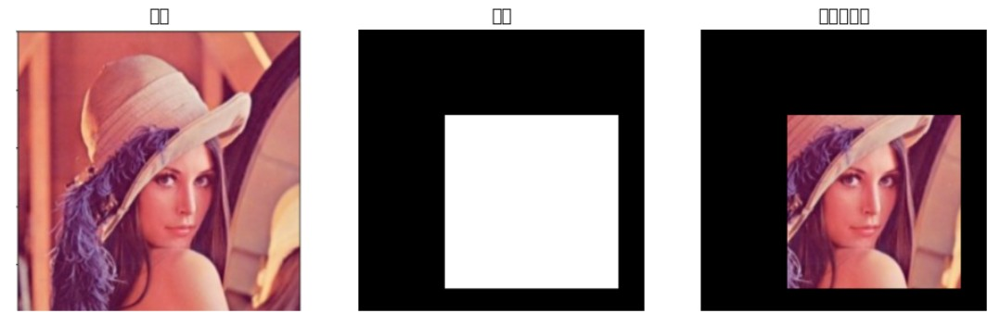
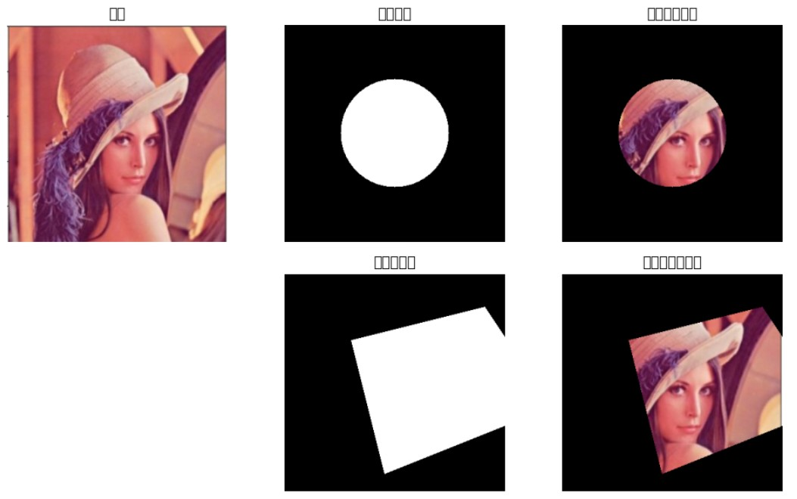
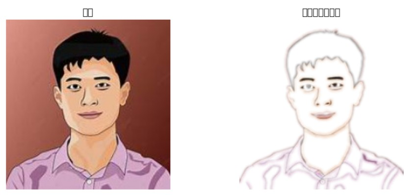

1️⃣ 什麼是遮罩 (Mask)？

電腦視覺中的 遮罩（Mask） 是一種二值或多值影像，用於標示圖像中感興趣的區域或物件。遮罩通常與原圖同尺寸，其中前景區域用 1（或 255）表示，背景用 0 表示。它的主要功能是 選取特定區域進行處理，例如去背、圖像分割、特效套用或物件追蹤。透過遮罩，演算法能專注於目標區域，忽略不相關背景，提高處理效率和精度。在去背應用中，遮罩可以把人物或物件保留下來，而將背景設為透明或其他顏色，方便後續編輯與整合。遮罩是電腦視覺中重要的區域控制工具。

應用範例：
只對物體進行顏色處理
對人臉或手部進行辨識
去背景 / 抠圖


====================================================<br>
#### 遮罩基本練習
====================================================<br>
```python
import cv2
import numpy as np
import matplotlib.pyplot as plt

# 讀取影像
img = cv2.imread('lenna.jpg')  # 改成你的影像路徑
img_rgb = cv2.cvtColor(img, cv2.COLOR_BGR2RGB)

# 建立與影像相同大小的遮罩 (全部黑色)
mask = np.zeros(img.shape[:2], dtype=np.uint8)

# 在遮罩上畫一個白色矩形 (表示保留區域)
cv2.rectangle(mask, (100, 100), (300, 300), 255, -1)  # -1 代表填滿

# 套用遮罩
masked_img = cv2.bitwise_and(img_rgb, img_rgb, mask=mask)

# 顯示結果
plt.figure(figsize=(12,4))
plt.subplot(1,3,1)
plt.title('原圖')
plt.imshow(img_rgb)
plt.axis('off')

plt.subplot(1,3,2)
plt.title('遮罩')
plt.imshow(mask, cmap='gray')
plt.axis('off')

plt.subplot(1,3,3)
plt.title('套用遮罩後')
plt.imshow(masked_img)
plt.axis('off')

plt.show()

```
<br>
<hr>
===========
執行結果
===========

<br>

<hr><hr>


====================================================<br>
#### 圓形遮罩、多邊形遮罩基本練習
====================================================<br>
```python
import cv2
import numpy as np
import matplotlib.pyplot as plt

# 讀取影像
img = cv2.imread('lenna.jpg')  # 改成你的影像路徑
img_rgb = cv2.cvtColor(img, cv2.COLOR_BGR2RGB)

# ===== 1️⃣ 圓形遮罩 =====
mask_circle = np.zeros(img.shape[:2], dtype=np.uint8)
center = (img.shape[1]//2, img.shape[0]//2)
radius = min(img.shape[0], img.shape[1])//4
cv2.circle(mask_circle, center, radius, 255, -1)
circle_result = cv2.bitwise_and(img_rgb, img_rgb, mask=mask_circle)

# ===== 3️⃣ 多邊形遮罩 =====
mask_poly = np.zeros(img.shape[:2], dtype=np.uint8)
pts = np.array([[100,100], [300,50], [400,200], [150,300]], np.int32)
pts = pts.reshape((-1,1,2))
cv2.fillPoly(mask_poly, [pts], 255)
poly_result = cv2.bitwise_and(img_rgb, img_rgb, mask=mask_poly)

# ===== 顯示結果 =====
plt.figure(figsize=(10,6))

plt.subplot(2,3,1)
plt.title('原圖')
plt.imshow(img_rgb)
plt.axis('off')

plt.subplot(2,3,2)
plt.title('圓形遮罩')
plt.imshow(mask_circle, cmap='gray')
plt.axis('off')

plt.subplot(2,3,3)
plt.title('套用圓形遮罩')
plt.imshow(circle_result)
plt.axis('off')

plt.subplot(2,3,5)
plt.title('多邊形遮罩')
plt.imshow(mask_poly, cmap='gray')
plt.axis('off')

plt.subplot(2,3,6)
plt.title('套用多邊形遮罩')
plt.imshow(poly_result)
plt.axis('off')

plt.tight_layout()
plt.show()
```
<br>
<hr>
===========
執行結果
===========

<br>

<hr><hr>

====================================================<br>
#### 偵測人形去背 基本練習
====================================================<br>
```python
import cv2
import numpy as np
import matplotlib.pyplot as plt

# ===== 讀取影像 =====
img_path = "p.jpg"  # 改成你的影像路徑
img = cv2.imread(img_path)
img_rgb = cv2.cvtColor(img, cv2.COLOR_BGR2RGB)

# ===== 灰階 + 高斯模糊 =====
gray = cv2.cvtColor(img_rgb, cv2.COLOR_RGB2GRAY)
blur = cv2.GaussianBlur(gray, (5,5), 0)

# ===== 邊緣偵測 =====
edges = cv2.Canny(blur, threshold1=50, threshold2=150)

# ===== 找所有外部輪廓 =====
contours, _ = cv2.findContours(edges, cv2.RETR_EXTERNAL, cv2.CHAIN_APPROX_SIMPLE)

# ===== 過濾小面積輪廓 (噪點) =====
min_area = 2  # 可依影像大小調整
filtered_contours = [cnt for cnt in contours if cv2.contourArea(cnt) > min_area]

if len(filtered_contours) == 0:
    raise ValueError("未偵測到符合面積的人形輪廓，請檢查影像！")

# ===== 建立遮罩 =====
mask = np.zeros_like(gray)
for cnt in filtered_contours:
    cv2.drawContours(mask, [cnt], -1, color=255, thickness=-1)

# 平滑遮罩邊緣
mask = cv2.GaussianBlur(mask, (7,7), 0)
mask = mask / 255.0  # 轉為 0~1

# ===== 建立透明背景影像 =====
h, w = img_rgb.shape[:2]
transparent_img = np.zeros((h, w, 4), dtype=np.uint8)
transparent_img[..., :3] = img_rgb  # RGB
transparent_img[..., 3] = (mask * 255).astype(np.uint8)  # Alpha 通道

# ===== 顯示結果 =====
plt.figure(figsize=(12,6))
plt.subplot(1,2,1)
plt.title("原圖")
plt.imshow(img_rgb)
plt.axis('off')

plt.subplot(1,2,2)
plt.title("多人物背景透明")
plt.imshow(transparent_img)
plt.axis('off')

plt.show()
```
<br>
<hr>
===========
執行結果
===========

<br>

<hr><hr>


```

