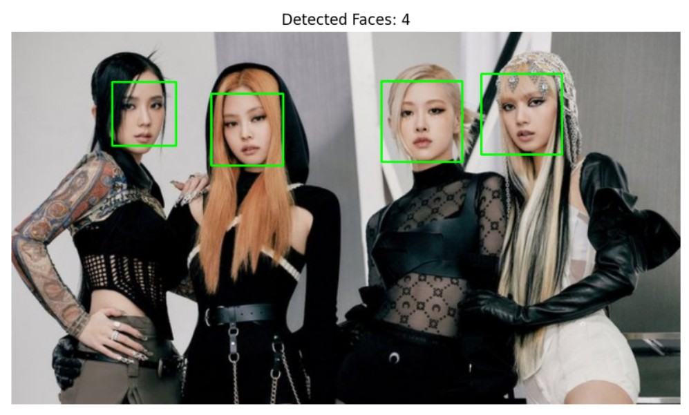

<hr>

# 人臉辨識及車牌辨識

<hr><hr>

## 註冊 Kaggle 網站帳號 <br>
請登入 https://www.kaggle.com <br>

<hr>

如下圖請點選 Register <br>
 <br>

<hr>

如下圖請選擇 Register with Google <br>
 <br>

<hr>

## Haar Cascade 人臉辨識（偵測）說明

<hr>

Haar Cascade 是 OpenCV 中最早、最常見的 人臉偵測模型。 <br>
它屬於 傳統電腦視覺方法（非深度學習），由 Paul Viola 與 Michael Jones 在 2001 年提出。 <br>
其核心目標是：從影像中找到可能是人臉的區域。<br>

<br><br><br><br>

## 1.Haar Cascade 的核心概念 <br>
### ✔ (1) Haar-like Features （Haar 特徵） <br>
##### 模型會使用許多矩形特徵來分析影像明暗差異，如： <br>
>| 眼睛區域通常較暗 <br>
>| 鼻樑區較亮 <br>
>| 這些特徵不像深度學習那麼複雜，而是數個簡單的矩形亮度差值。<br><br>

### ✔ (2) Integral Image （積分影像）<br>
>| 為加速計算，每個特徵的像素加總由積分影像快速取得，使運算大量加速，從原本需 ms 等級降到 μs。

<hr>

### ✔ (3) AdaBoost 特徵挑選 <br>
>| 有數萬個 Haar 特徵，但並不是每個都重要。 <br>
>| AdaBoost 用來挑出「最能區分人臉的特徵」，組合成最終分類器。 <br>

<hr>

### ✔ (4) Cascade Classifier（層級式分類器）<br>
>| 模型不是一次判斷是不是人臉，而是分多階段： <br>
>| 第一層極快，只檢查最粗略的特徵 <br>
>| → 很快刪除 90% 不是人臉的區域 <br>
>| 後面層級越來越嚴格、越精確 <br>
>| 這種設計讓 Haar Cascade 能在低效能設備（如樹莓派）也能即時運作。 <br>

<hr>

## 🚀 2. Haar Cascade 人臉偵測流程<br>
>| 載入 Haar 模型（如 haarcascade_frontalface_default.xml）<br>
>| 將影像轉成灰階 <br>
>| 使用 detectMultiScale() 掃描影像不同大小的區域 <br>
>| 若某區域通過所有 cascade 層→視為人臉 <br>
>| 回傳人臉框框位置 (x, y, w, h) <br>

<hr>

## 📈 3. Haar Cascade 的優缺點 <br>
### 👍 優點 <br>
>| 速度非常快（適合即時偵測） <br>
>| 對硬體需求低（樹莓派、舊筆電也能跑） <br>
>| 不需 GPU、不需深度學習框架 <br>
>| OpenCV 內建、容易使用 <br>

<hr>

### 👎 缺點 <br>
>| 對光線、角度敏感 <br>
>| 偵測效果不如深度學習（如 DNN、MTCNN） <br>
>| 側臉、表情變化大時精準度下降
>| 偶爾會出現誤判（false positive）

<hr>

## 📌 總結 <br>
#### Haar Cascade 是一種：傳統的機器視覺人臉偵測方法 <br>
#### 使用 Haar 特徵 + AdaBoost + 層級分類器 <br>
#### 速度快、資源需求低 <br>
#### 但準確度比不上深度學習方法 <br>
### 因此，它仍然非常適合在教學環境、嵌入式裝置、基礎人臉偵測應用中使用。 <br>

<hr>

====================================================<br>
#### 人臉辨識範例 <br>
====================================================<br>
```python

import cv2
import matplotlib.pyplot as plt

# 讀取影像
img = cv2.imread("/kaggle/input/person4/other/default/1/p4.jpg")  # ★☆★☆★☆ 請改為您的圖檔路徑
img_rgb = cv2.cvtColor(img, cv2.COLOR_BGR2RGB)
gray = cv2.cvtColor(img, cv2.COLOR_BGR2GRAY)

# 載入人臉 Haar Cascade
face_cascade = cv2.CascadeClassifier(cv2.data.haarcascades + 'haarcascade_frontalface_default.xml')

# 偵測人臉
faces = face_cascade.detectMultiScale(gray, scaleFactor=1.1, minNeighbors=5, minSize=(30,30))

# 繪製人臉框
img_faces = img_rgb.copy()
for (x, y, w, h) in faces:
    cv2.rectangle(img_faces, (x, y), (x+w, y+h), (0, 255, 0), 2)

# 顯示結果
plt.figure(figsize=(10,8))
plt.imshow(img_faces)
plt.title(f"Detected Faces: {len(faces)}")
plt.axis("off")
plt.show()

```
<br>
<hr>
===========
執行結果
===========

<br>

<hr><hr>


