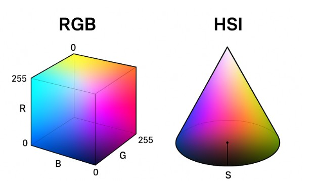

# 電腦視覺

# ★ 像素
#### 定義：Pixel（Picture Element）是數位影像中最小的單位。
#### 特性：每個像素存放顏色或亮度的數值。
#### 灰階影像：像素只儲存單一亮度值，常見範圍是 0（黑）～255（白）。
#### 彩色影像：每個像素通常由三個顏色通道組成（RGB），共同決定顏色。

<hr><br><br>

# ★ 解析度 (Resolution)
#### 空間解析度：影像的寬度 × 高度像素數，例如 1920×1080 (Full HD)，數字越大代表影像越細緻。
#### 時間解析度：在影片中，通常用 幀率 (fps) 表示，如 30fps、60fps，幀率越高，影片越流暢。
#### 色彩解析度：指每個像素所能表示的顏色數量，與位元深度 (Bit Depth) 有關。
#### 8 位元灰階：256 階亮度
#### 24 位元彩色 (8 位元 × 3 通道)：約 1677 萬色

<hr><br><br>

# RGB (Red, Green, Blue)
#### 定義：一種常用的顏色模型，利用紅 (Red)、綠 (Green)、藍 (Blue) 三個通道的強度組合表示顏色。
#### 像素表示：每個像素由三個數值 (R, G, B) 組成。
#### (255, 0, 0) → 紅色
#### (0, 255, 0) → 綠色
#### (0, 0, 255) → 藍色
#### (255, 255, 255) → 白色
#### (0, 0, 0) → 黑色

應用：廣泛使用於電腦顯示器、相機感光元件、數位影像處理。

<hr><br><br>

# RGB 與 HSI 顏色模型比較
### 1.RGB (Red、Green、Blue) 
#### 定義：利用紅 (R)、綠 (G)、藍 (B) 三個通道的組合來表現顏色。
#### 特點：
與硬體（螢幕、相機感光元件）關聯最緊密。
適合電腦處理與顯示。
不直觀，因為顏色的表現需要三個強度值來同時解釋。
#### 缺點：
亮度與色彩混在一起，不容易單獨調整。
在人類視覺上，不直觀表現「色相」與「亮度」。

### 2. HSI (Hue, Saturation, Intensity)
#### 定義：用三個屬性來描述顏色：
#### H (色相 Hue)：顏色的種類，例如紅、綠、藍。
#### S (飽和度 Saturation)：顏色的純度，數值越高顏色越鮮豔。
#### I (亮度 Intensity)：顏色的明暗程度。

#### 特點：
與人類感知顏色的方式更接近。
適合影像分析與辨識，因為可以單獨操作「亮度」或「顏色」。
#### 缺點：
計算上比 RGB 複雜，需要轉換公式。
在硬體顯示與輸入上不直接使用。

| 模型 | 組成 | 優點 | 缺點 | 常見應用 |
|-----|------|------|------|----------|
|RGB	|R、G、B 三個通道 |與硬體相容，運算簡單 | 不直觀，亮度與顏色混雜 | 螢幕顯示、相機成像 |
|HSI	|H (色相)、S (飽和度)、I (亮度) | 更符合人類感知，可獨立分析亮度與顏色 |轉換計算較複雜 | 影像分析、人臉辨識、醫學影像|


### 簡單理解：
#### RGB = 電腦用來「顯示」顏色的方式。
#### HSI = 人類用來「理解」顏色的方式。

### RGB、HSI 圖形表示 <br>



# jupyter notebook 網址:
https://jupyter.org/try-jupyter/lab/

## 課堂練習一
```

```

## 課堂練習一
```

```

## 課堂練習一
```

```
