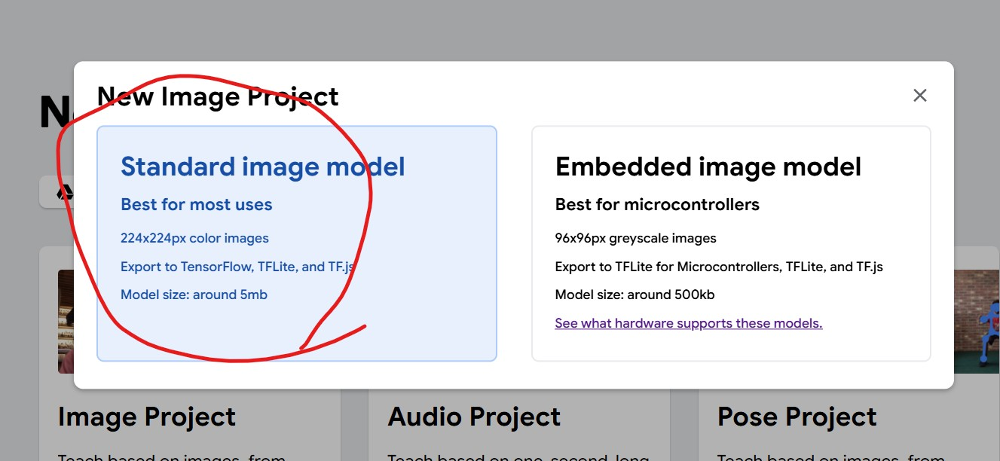
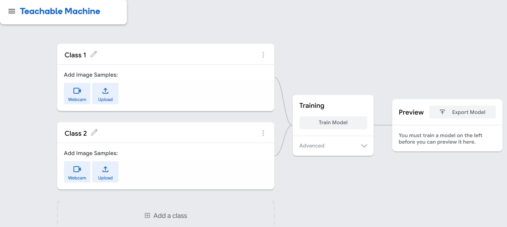
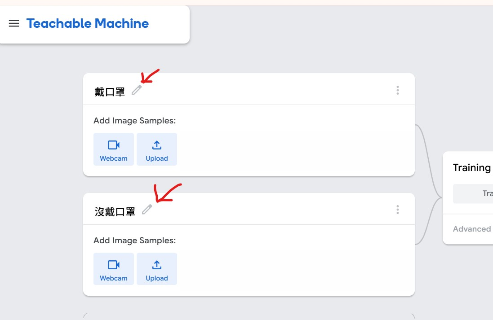
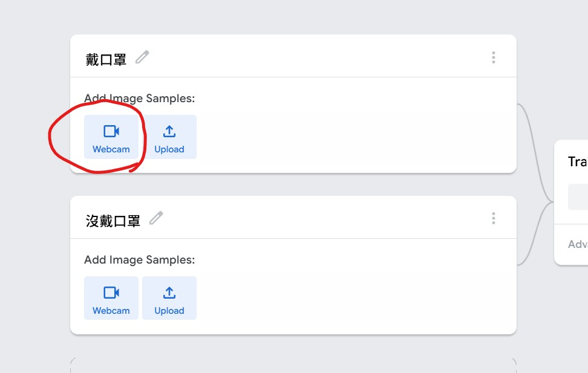
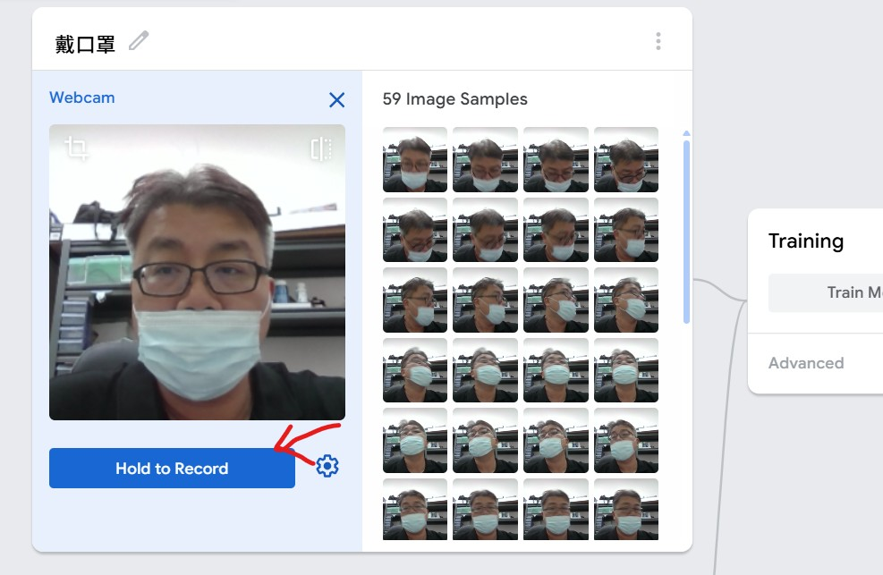
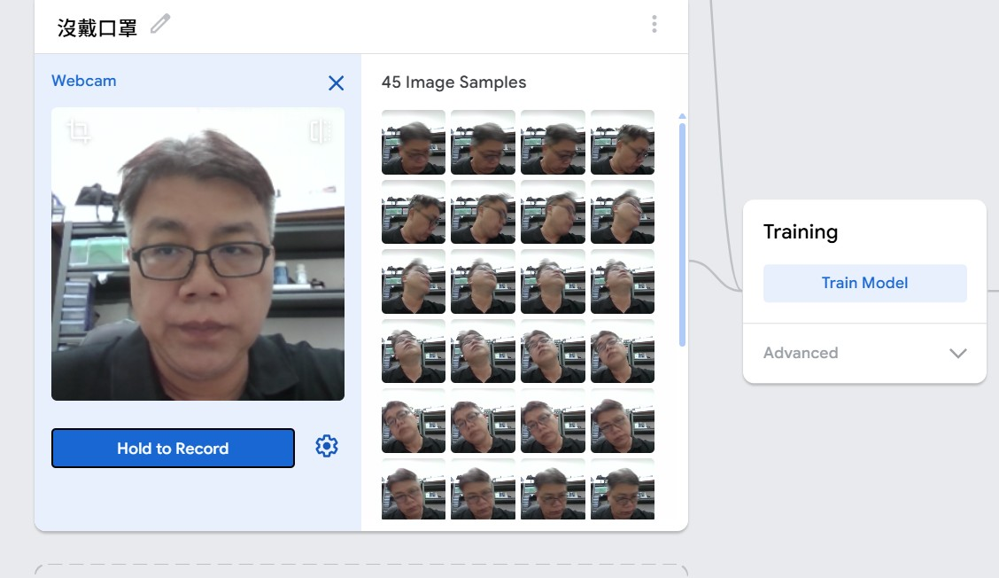
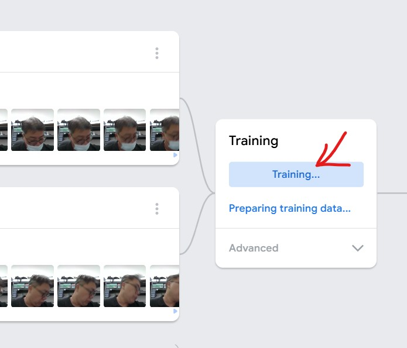
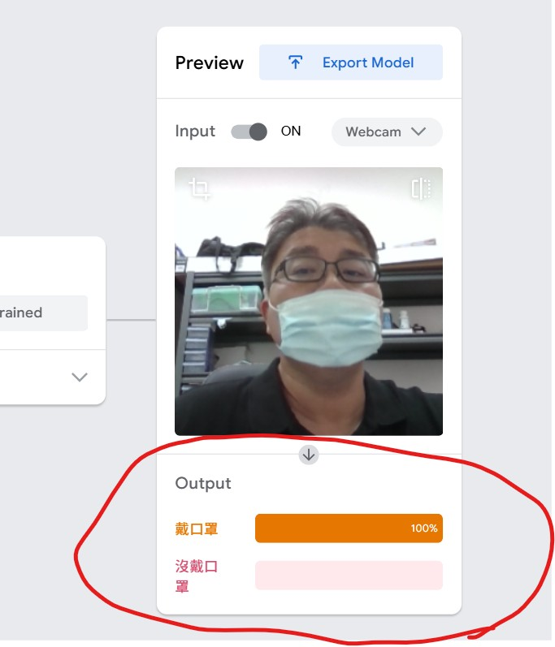

### 何謂人工智慧
「人工智慧」（Artificial Intelligence，簡稱 AI）是指讓機器具備類似人類智慧的能力，能夠思考、學習、推理、理解與解決問題的一種技術與科學。

#### 一、人工智慧的定義  
人工智慧是電腦科學的一個分支，目標是讓電腦能執行需要人類智慧才能完成的工作，例如： 
> 語音辨識（例如 Siri、Google 助理）  
> 圖像辨識（例如 臉部辨識、醫學影像診斷）  
> 自然語言理解（例如 ChatGPT、翻譯系統） 
> 自主決策（例如 自駕車、推薦系統）   
 

#### 二、人工智慧的演進歷史  
 
(圖片來自 https://blog.tibame.com/ )
  

#### 三、人工智慧、機器學習以及深度學習  
下圖為三種方式的比較圖 

 
(圖片來自 https://mile.cloud/)
  

下圖為三種方式的神經網路模型架構 

  

#### 四、人工智慧的核心技術  
> 機器學習（Machine Learning）：AI 透過大量資料學習規律。  
> 深度學習（Deep Learning）：使用神經網路模仿人腦運作，進行更複雜的判斷。  
> 自然語言處理（NLP）：讓電腦能理解與生成人類語言。  
> 電腦視覺（Computer Vision）：讓電腦能看懂圖像與影片。  
> 專家系統（Expert System）：模擬人類專家的推理過程。    

#### 五、人工智慧的應用範疇
| 領域	| 應用實例 |
|--------------------|-----------------------------------------------------|
|醫療	| 疾病診斷、影像判讀、藥物開發 |
|教育	| 智慧輔助教學、自動批改作業 |
|交通	| 自駕車、智慧交通號誌 |
|產業	| 智慧製造、預測維修 |
|金融	| 信用評估、詐欺偵測、投資分析|
|日常生活	|智慧音箱、推薦系統、語音助理

   

#### 六、 CNN 是什麼？卷積神經網路概念介紹
卷積神經網路（Convolutional Neural Network, CNN）是深度學習領域中最具代表性的模型之一，主要用於處理視覺相關的任務，例如圖像辨識、物體檢測和影像分類。CNN 神經網路模仿人類視覺系統對圖像的處理方式，能夠自動從圖像中提取出不同層次的特徵，並用於對圖像進行分類或其他任務。

CNN 應用領域如下說明
|應用領域|說明|範例|
|-----|-----------------------|--------------------------------------------|
|🖼️ 影像分類 (Image Classification)	| 辨識影像屬於哪個類別 | 貓狗辨識、人臉性別判定 |
|🎯 目標偵測 (Object Detection)	| 在影像中找到物體位置與類別 | 自駕車偵測行人、交通號誌識別|
|🧩 影像分割 (Image Segmentation)	| 將影像中的像素依所屬物體分類 | 	醫學影像腫瘤區域分割 |
|😊 人臉辨識 (Face Recognition)	| 辨識特定個體的人臉特徵	| 手機臉部解鎖、監控系統 |
|🏥 醫學影像分析 (Medical Imaging)	| 輔助醫生分析病灶或器官	| X光、MRI自動診斷 |
|📷 影像生成 (Image Generation)	| 利用生成對抗網路（GAN）延伸應用	| DeepFake、人像上色、風格轉換 |
|🚗 自駕車視覺系統 (Autonomous Driving)	| 解析車載攝影機畫面進行決策 | 偵測車道線、紅綠燈、障礙物 |
|🕹️ 電腦視覺遊戲應用	 | 視覺感知與決策結合強化學習	| 機器人視覺導航 |
|🩺 智慧安防與監控	 | 自動偵測異常行為或入侵	| 智慧攝影機自動報警 |
|🔤 文字影像辨識 (OCR)	| 從圖片中識別文字	| 車牌辨識、手寫字辨識 |

  

#### 七、 CNN 捲機神經網路 實作練習  
請使用具有筆記型電腦(含WebCam鏡頭) 或是 使用一般 PC 電腦另外接上 USB WebCam。  

##### 步驟一 : 請開啟以下網址  
https://teachablemachine.withgoogle.com/  

##### 步驟二 : 點選 Get Started  
  

##### 步驟三 : 選取 Image Project  
  

##### 步驟四 : 選取 Standard Image Model  
  

##### 步驟五: 進入到 CNN 實作主畫面  
  

##### 步驟六: 請修改 Class1 改成 戴口罩，另外修改 Class2 改成 沒戴口罩  
  

##### 步驟七: 請在 "戴口罩"區點選 WebCam  
  

##### 步驟八: 請你先戴口罩面對 WebCam 鏡頭，然後點選 Hold to Record，點選當下請隨意微擺動你的頭部，讓鏡頭可以接收到不同角度的影像  
  

##### 步驟九: 重複步驟七、八，請在"沒戴口罩"區點選 WebCam，除掉口罩後面對WebCam鏡頭，再點選 Hold to Record 錄製不同角度的影像  
  

##### 步驟十: 拍好兩種類別照片後，請點選 Training 按鈕，進行影像辨識訓練，如果有出現 "Don't switch tabs !" 訊息，請點選 OK 即可  
  

##### 步驟十一: 訓練完畢以後，請面對鏡頭進行戴口罩或是不戴口罩的測試，看看系統判斷的機率有多少 ?  
  

