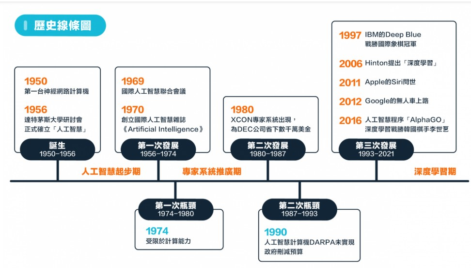
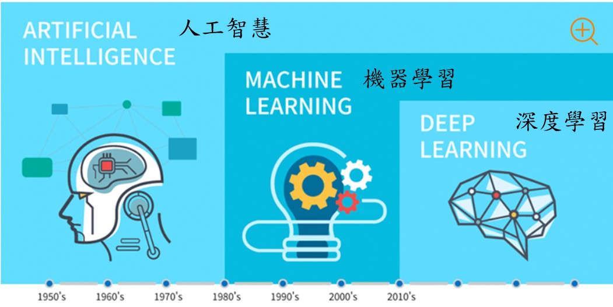
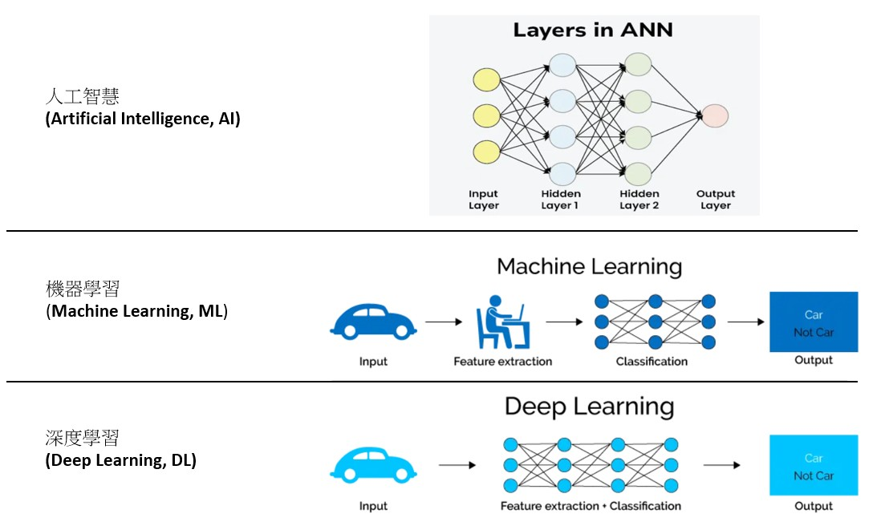
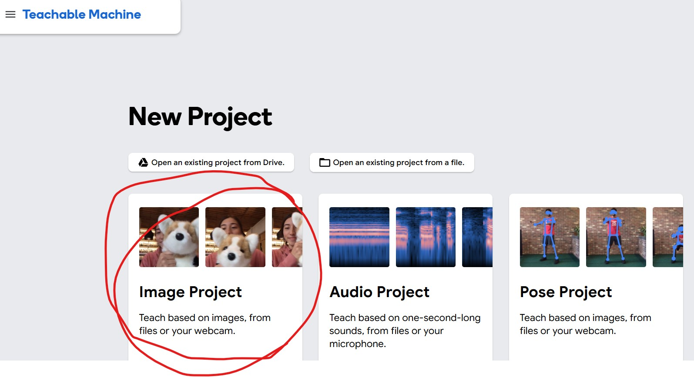

### 何謂人工智慧
「人工智慧」（Artificial Intelligence，簡稱 AI）是指讓機器具備類似人類智慧的能力，能夠思考、學習、推理、理解與解決問題的一種技術與科學。

#### 一、人工智慧的定義  
人工智慧是電腦科學的一個分支，目標是讓電腦能執行需要人類智慧才能完成的工作，例如： 
> 語音辨識（例如 Siri、Google 助理）  
> 圖像辨識（例如 臉部辨識、醫學影像診斷）  
> 自然語言理解（例如 ChatGPT、翻譯系統） 
> 自主決策（例如 自駕車、推薦系統） 
 

#### 二、人工智慧的演進歷史  
 

#### 三、人工智慧、機器學習以及深度學習  
下圖為三種方式的比較圖 

 

下圖為三種方式的神經網路模型架構 

#### 四、人工智慧的核心技術  
> 機器學習（Machine Learning）：AI 透過大量資料學習規律。  
> 深度學習（Deep Learning）：使用神經網路模仿人腦運作，進行更複雜的判斷。  
> 自然語言處理（NLP）：讓電腦能理解與生成人類語言。  
> 電腦視覺（Computer Vision）：讓電腦能看懂圖像與影片。  
> 專家系統（Expert System）：模擬人類專家的推理過程。  

#### 五、人工智慧的應用範疇
| 領域	| 應用實例 |
|-------|----------|
|醫療	| 疾病診斷、影像判讀、藥物開發 |
|教育	| 智慧輔助教學、自動批改作業 |
|交通	| 自駕車、智慧交通號誌 |
|產業	| 智慧製造、預測維修 |
|金融	| 信用評估、詐欺偵測、投資分析|
|日常生活	|智慧音箱、推薦系統、語音助理|

#### 七、 CNN 捲機神經網路 實作練習  
請使用具有筆記型電腦(含WebCam鏡頭) 或是 使用一般 PC 電腦另外接上 USB WebCam。  

##### 步驟一 : 請開啟以下網址  
https://teachablemachine.withgoogle.com/  

##### 步驟二 : 點選 Get Started  
  

##### 步驟三 : 選取 Image Project  
  

