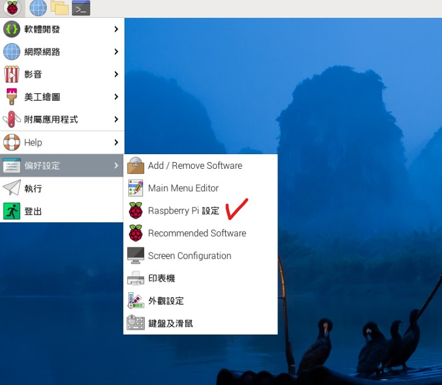
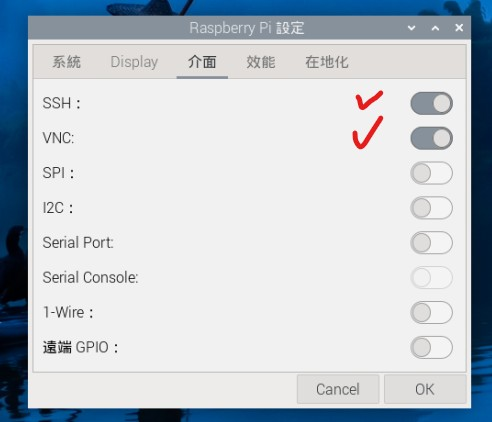
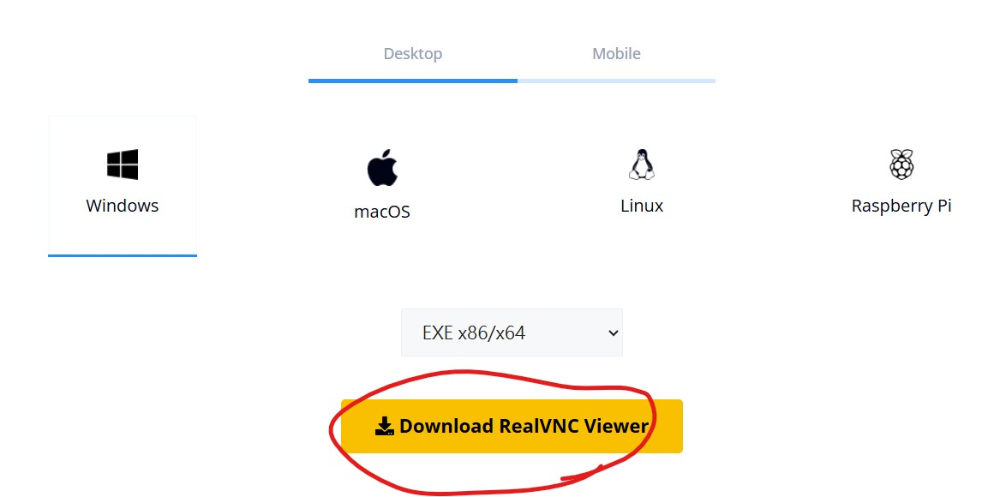
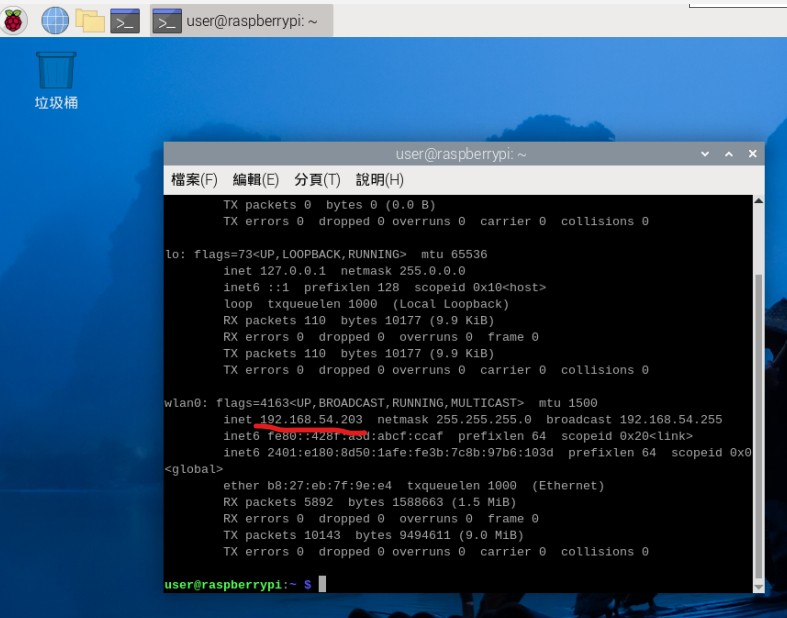
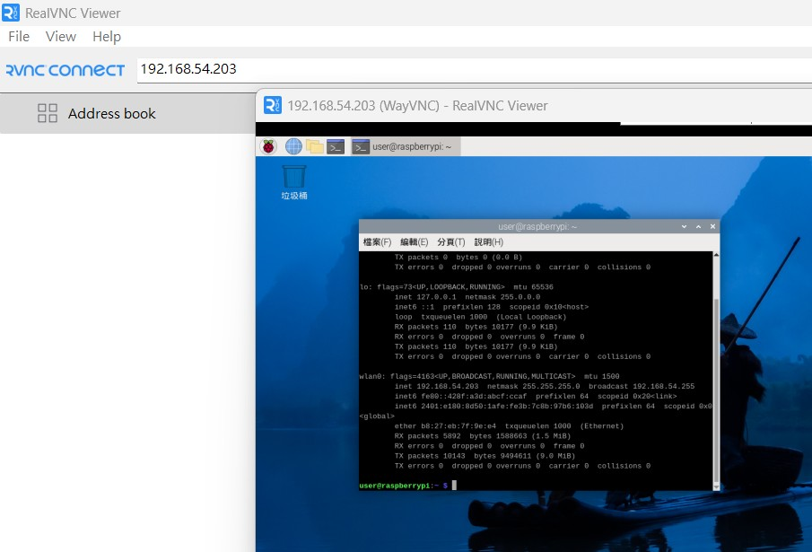

# 樹梅派設定遠端連線

## 步驟一 設定開啟 SSH 以及 VNC 連結

首先到 Raspberry pi 設定

將 SSH 以及 VNC 進行開啟

## 步驟二 下載 RealVNC Viewer 軟體

首先到網址 : https://www.realvnc.com/en/connect/download/viewer/windows/

請選擇您要連線的來源作業系統 (通常為 Windows )，然後按下 Download RealVNC Viewer ，並且進行安裝。

## 步驟三 取得 樹梅派 的 IP 位址。 (請注意連線的來源電腦 與 樹梅派 要在同一個網段，簡單來說 兩者都是連同一個 Wifi 是最簡單的)
請先開啟 Terminal 連線視窗。然後輸入 ifconfig 指令後按 Enter，就會出現以下畫面。
請參閱畫面中紅線標示的位置，就是樹梅派的 ip 位址 (下圖為 192.168.54.203)。

## 步驟四 使用 Realvnc Viewer 連線到樹梅派
首先開啟 Realvnc 軟體，然後在網址列輸入樹梅派的 ip 位址，如下圖所示。

