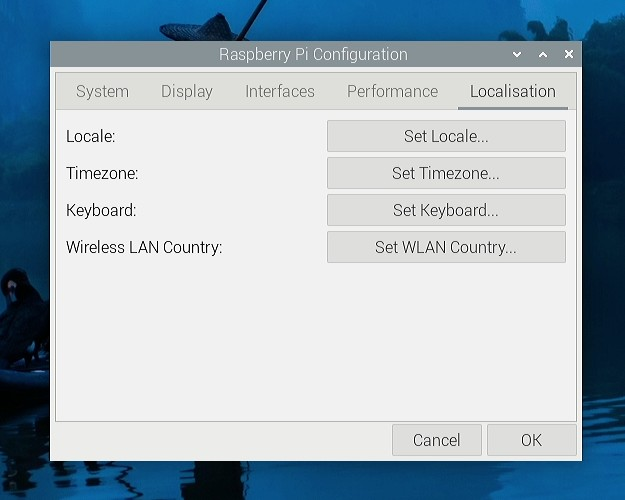
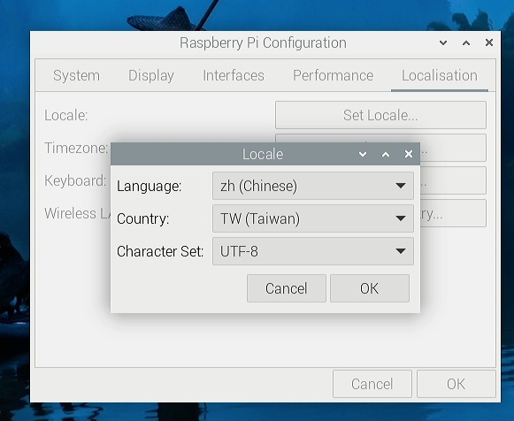
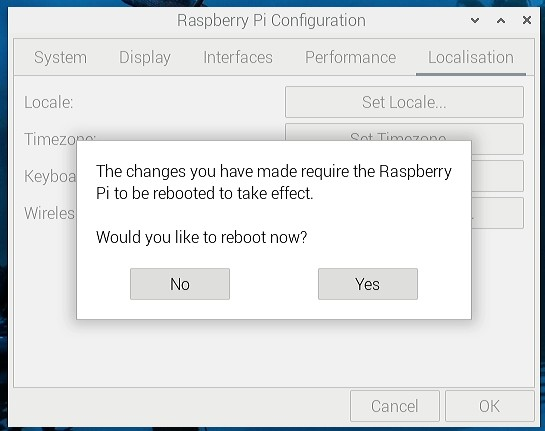
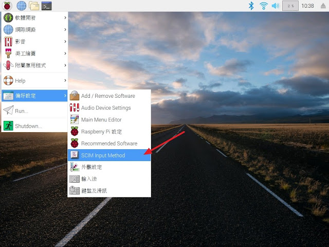
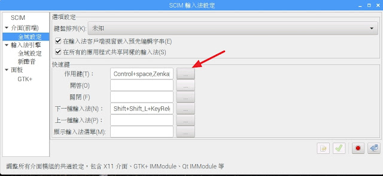
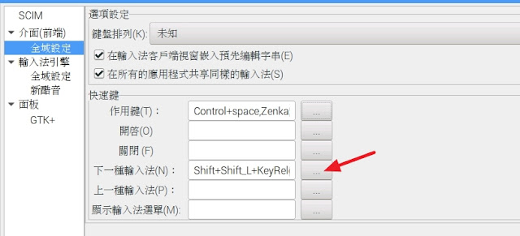
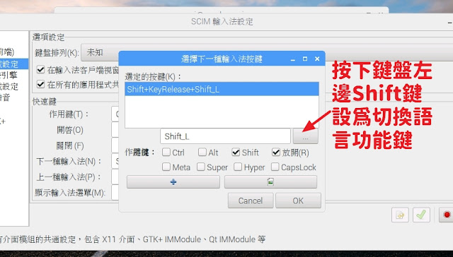
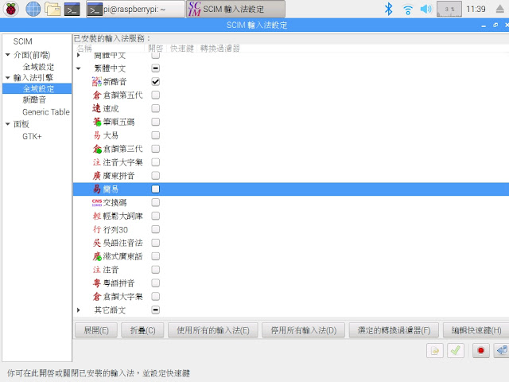
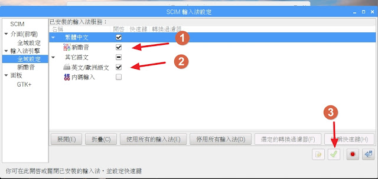
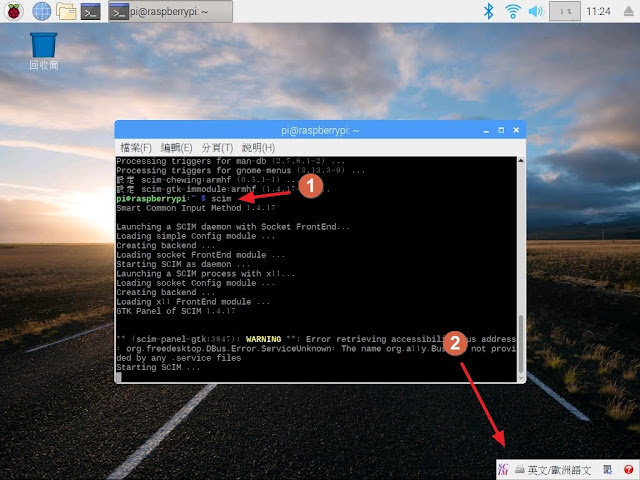

# 設定中文介面

### 首先到 Raspberry Pi 設定
<hr>






<br><br><hr>

# 安裝中文輸入法

### 首先安裝SCIM輸入法
```
sudo apt-get install scim scim-tables-zh
```
<br>

### 安裝SCIM輸入法中的新酷音(類似新注音)
```
sudo apt-get install scim-chewing
```
<br>

## 請先重開機($ sudo reboot)，再到目錄下找到SCIM <br>
<br>

## 到介面全域設定，預設的輸入法啟用為ctrl+space(空白鍵)，這邊只設定下一種輸入法為左邊shift為切換語言鍵。
<br>

## 設定下一種輸入法為左邊shift為切換語言鍵。
<br>

## 這樣就能使用shift鍵切換語言
<br>

## 到輸入法引擎全域設定中，設定所需的中文輸入法。
<br>

## 只有安裝新酷音，只安裝新酷音的設定。
<br>

## 再次重新開機，設定才算完成
```
sudo reboot
```
###重新開機後，透過指令 $scim 就能夠開啟輸入法
<br>
