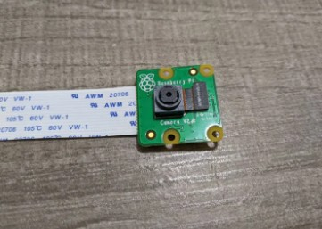
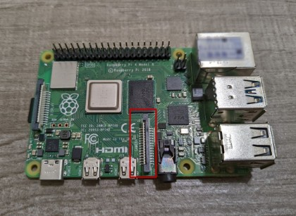
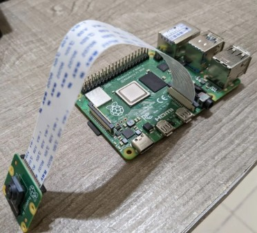
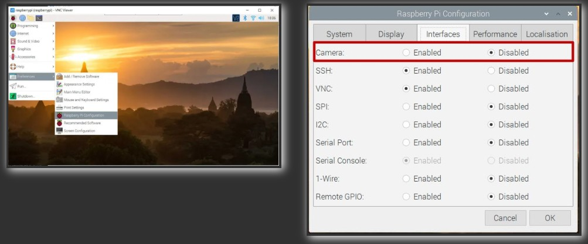

# 設定樹梅派鏡頭

## 鏡頭硬體安裝

鏡頭如下圖  
 

鏡頭安裝位置  
 

安裝完成圖片  
 

2023年之前，樹梅派可以透過 介面 > 開啟 Camera 的功能，但是新版的 64bit樹梅派已經無法從介面開啟
 

## 執行鏡頭觀看影像
#### libcamera-hello
#### 五秒預覽

#### libcamera-hello -t 0
#### 不限時間預覽

## 執行鏡頭拍照存檔
#### libcamera-jpeg -o test.jpg

#### libcamera-jpeg -o test.jpg -t 2000 --width 640 --height 480
#### 抓拍時間以及捕捉影像大小

## 錄影方式
#### libcamera-vid -t 10000 -o test.h264
#### 需要以 VLC 觀看 .h264 檔案
#### vlc test.h264

