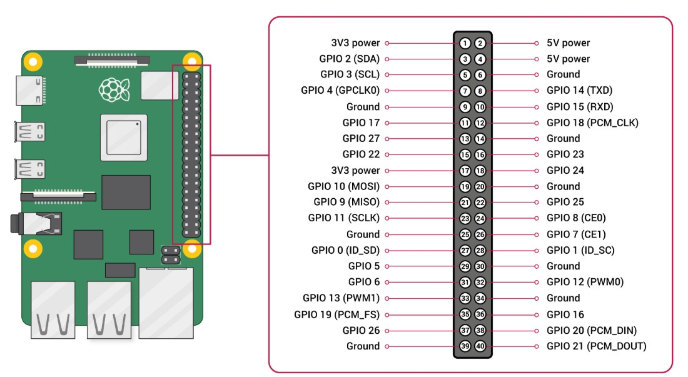
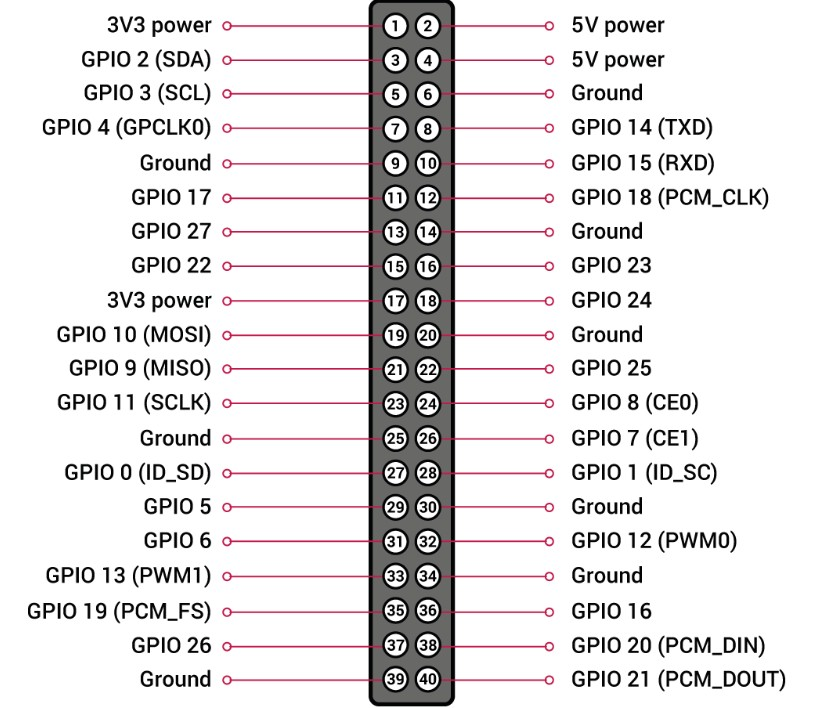
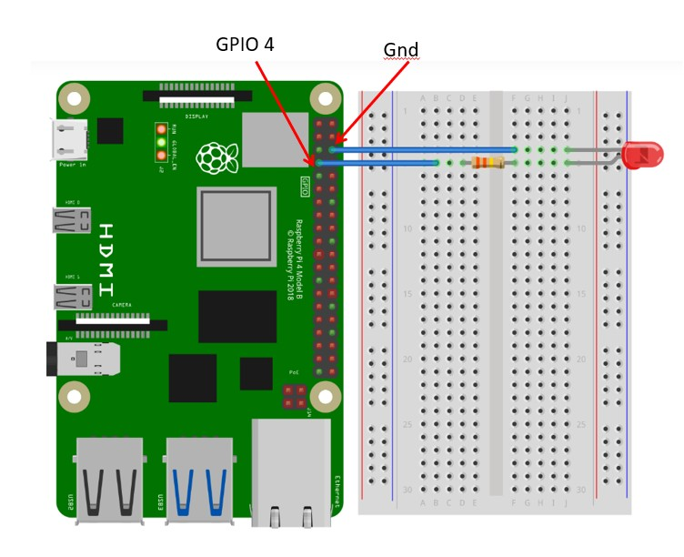
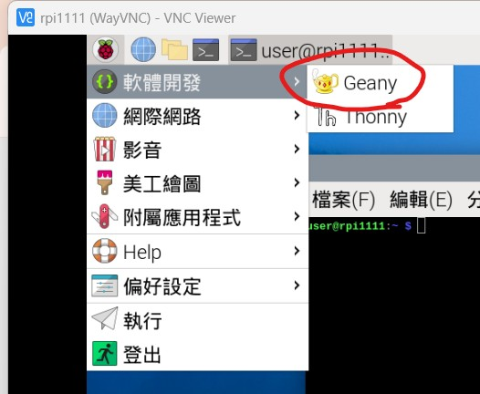
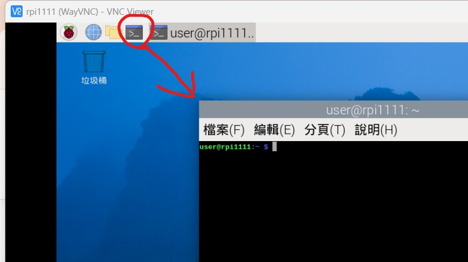

# 樹梅派腳位對照表

## 樹梅派腳位<br>


## 樹梅派腳位對照<br>


<hr>

# 樹梅派 GPIO 控制 LED 練習
## 樹梅派 GPIO 電路圖 <br>


<hr>

## 開啟 Geany 程式編輯軟體 (類似記事本的使用方式) <br>


<hr>

## 測試 Python 程式
### 開啟終端機畫面 <br>


### 測試 Python 版本
> python --version

<hr>

## 安裝 RPi.GPIO 函式庫
sudo apt-get update
sudo apt-get install python3-rpi.gpio

<hr>

# 將以下範例開啟 Geany ，存成 .py 的檔案，
## 執行方式
python first.py

<hr>

<br><br><br>
## 練習一 : GPIO python 控制 LED 燈 , 亮一秒後 就滅掉
``` python
import RPi.GPIO as GPIO 
import time

# 使用 BCM 編號
GPIO.setmode(GPIO.BCM)

# 操作 GPIO 4（Pin 7）
pin = 4

# 設定為 GPIO 為輸入模式
GPIO.setup(pin, GPIO.OUT)

# 設定 GPIO 輸出值為高電位
GPIO.output(pin, GPIO.HIGH)

# 等待一秒鐘
time.sleep(1)

# 設定 GPIO 輸出值為低電位
GPIO.output(pin, GPIO.LOW)

```

<hr>
<br><br><br>

## 練習二 : GPIO python 控制 LED 燈 , 亮一秒後 就滅掉 (無窮迴圈)
``` python
import RPi.GPIO as GPIO 
import time

# 使用 BCM 編號
GPIO.setmode(GPIO.BCM)

# 操作 GPIO 4（Pin 7）
pin = 4

# 設定為 GPIO 為輸入模式
GPIO.setup(pin, GPIO.OUT)

# 無窮迴圈，亮一秒 滅一秒
while True:
    GPIO.output(pin, GPIO.HIGH)
    time.sleep(1)
    GPIO.output(pin, GPIO.LOW)
    time.sleep(1)

```

<hr>
<br><br><br>

## 練習三 : 請應用以上的範例，製作跑馬燈
``` python
import RPi.GPIO as GPIO
import time

GPIO.setmode(GPIO.BCM)

# 控制 GPIO 2,GPIO 3,GPIO 4
pin1=2
pin2=3
pin3=4

# 設置 GPIO 2,GPIO 3,GPIO 4 為輸出腳位
GPIO.setup(pin1,GPIO.OUT)
GPIO.setup(pin2,GPIO.OUT)
GPIO.setup(pin3,GPIO.OUT)

# 控制 GPIO 2 亮, GPIO 3 滅, GPIO 4 滅
GPIO.output(pin1,GPIO.HIGH)
GPIO.output(pin2,GPIO.LOW)
GPIO.output(pin3,GPIO.LOW)
time.sleep(1)

# 控制 GPIO 2 滅, GPIO 3 亮, GPIO 4 滅
GPIO.output(pin1,GPIO.LOW)
GPIO.output(pin2,GPIO.HIGH)
GPIO.output(pin3,GPIO.LOW)
time.sleep(1)

# 控制 GPIO 2 滅, GPIO 3 滅, GPIO 4 亮
GPIO.output(pin1,GPIO.LOW)
GPIO.output(pin2,GPIO.LOW)
GPIO.output(pin3,GPIO.HIGH)
time.sleep(1)

# 控制 GPIO 2 滅, GPIO 3 滅, GPIO 4 滅
GPIO.output(pin1,GPIO.LOW)
GPIO.output(pin2,GPIO.LOW)
GPIO.output(pin3,GPIO.LOW)

```


