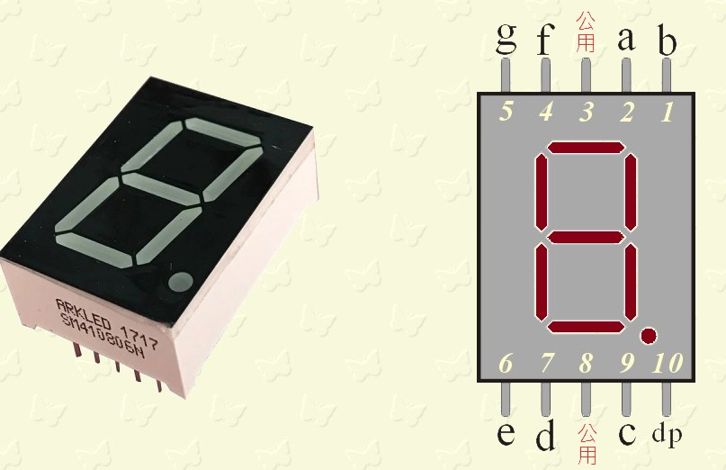
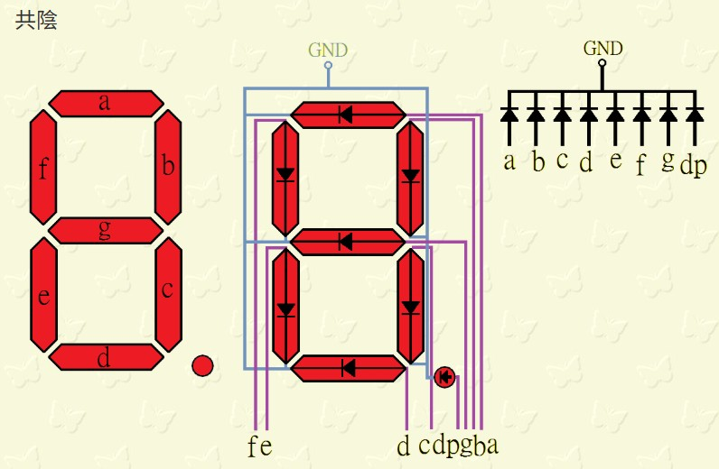
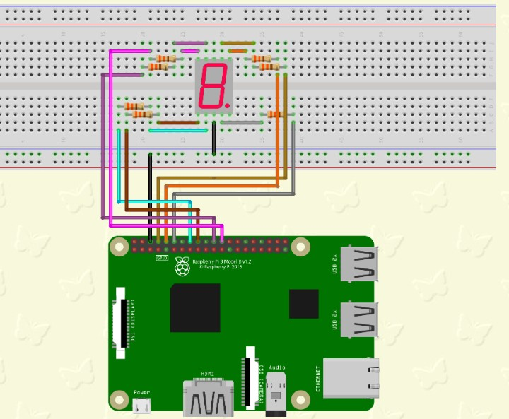
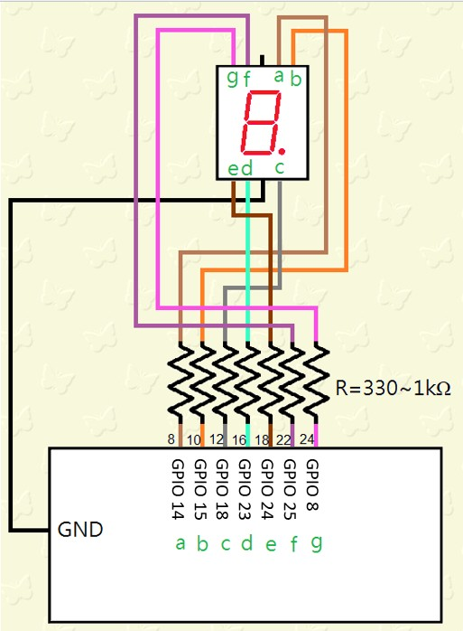
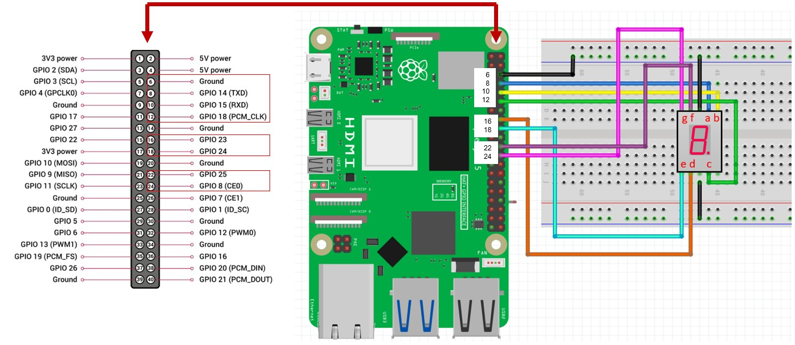
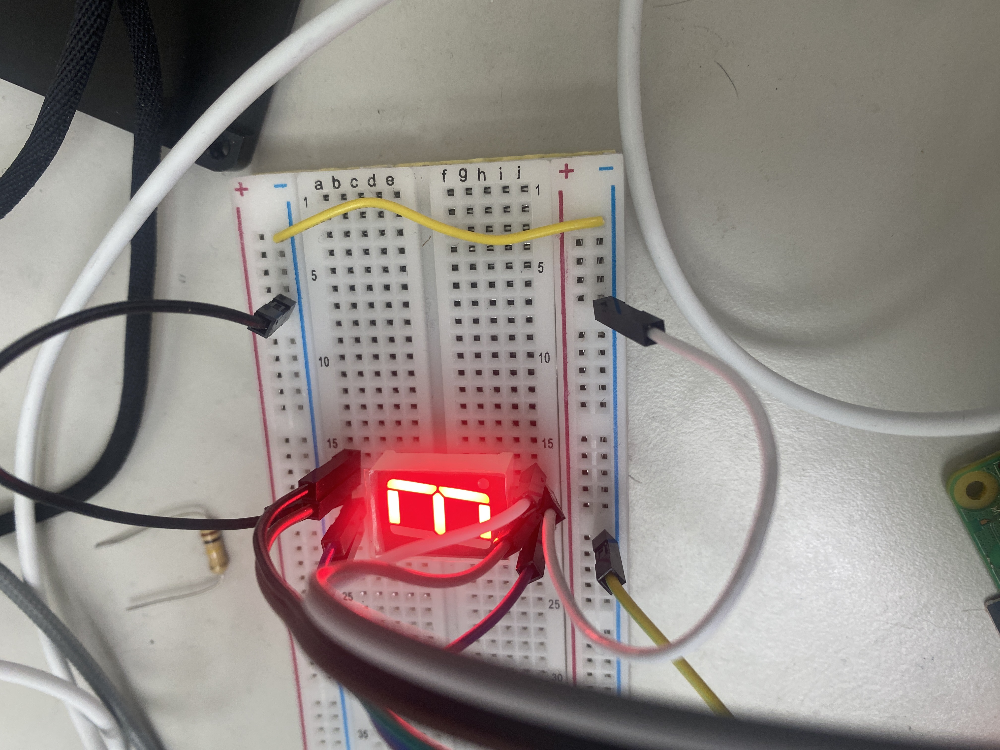

 <br>

## 七段顯示器
七段顯示器（英語：seven-segment display）為常用顯示數字的電子元件。因為藉由七個發光二極體以不同組合來顯示數字，
所以稱為「七劃管」、「七段數碼管」、「七段顯示器」，由於所有燈管全亮時所表示的是「8」，所以又稱「8字管」、「8字顯示器」。
 <br><br>

## 我們課程上是使用共陰的七段顯示器，參考腳位如下圖
 <br><br>

<hr>

樹梅派正確的接法如下圖所示，每個腳位要串接一個限流電阻，電阻越小顯示器的亮度越大。<br>
 <br>

樹梅派連結共陰七段顯示器腳位簡圖。<br>
 <br><br><br><br>

<hr>

## 此次課程的接法如下，省略電阻，直接接到七段顯示器的腳位。

<hr>
 <br>

<br>
<br>

<hr>

練習一 : 接好以上電路之後，請執行以下程式範例，是否會出現 『數字 3』。

<hr>

``` python
import RPi.GPIO as GPIO
import time

GPIO.setmode(GPIO.BOARD)    # 設定依樹梅派腳位的數字編號

pin = [8,10,12,16,18,22,24] # 樹梅派對應 a - g 的腳位

for x in range(len(pin)):
     GPIO.setup(pin[x], GPIO.OUT)

GPIO.output(8,True) #a
GPIO.output(10,True) #b
GPIO.output(12,True) #c
GPIO.output(16,True) #d
GPIO.output(18,False) #e
GPIO.output(22,False) #f
GPIO.output(24,True) #g
```

====== 顯示結果 ====== <br>

<hr>

 <br>

<hr>

練習二 : 接好以上電路之後，請執行以下程式範例，是否會出現 數字由 0 至 9 每隔一秒的變換。

<hr>

``` python
import RPi.GPIO as GPIO
import time
GPIO.setmode(GPIO.BOARD)
pin = [8,10,12,16,18,22,24]

Led7 = [
              [1,1,1,1,1,1,0],#0
              [0,1,1,0,0,0,0],#1
              [1,1,0,1,1,0,1],#2
              [1,1,1,1,0,0,1],#3
              [0,1,1,0,0,1,1],#4
              [1,0,1,1,0,1,1],#5
              [1,0,1,1,1,1,1],#6
              [1,1,1,0,0,0,0],#7
              [1,1,1,1,1,1,1],#8
              [1,1,1,1,0,1,1] #9
             ]
             
for x in range(len(pin)):
     GPIO.setup(pin[x], GPIO.OUT)
while(True):
     for x in range(10):#0~9
           for y in range(7):#a~g
                 GPIO.output(pin[y],Led7[x][y])
           time.sleep(1)

```

====== 顯示結果 ====== <br>

<hr>

<a href="https://www.youtube.com/watch?v=0RDsPNCU6DA" target="_blank">樹梅派控制七段顯示器 (0 -> 9 )</a><br>
<a href="http://www.youtube.com/watch?feature=player_embedded&v=0RDsPNCU6DA" target="_blank"></a>
<br>影片取自 youtube

<br><br>

<hr>

練習三 : 接好以上電路之後，請執行以下程式範例，是否會出現 數字由 9 至 0 每隔一秒的變換。

<hr>

``` python
import RPi.GPIO as GPIO
import time
GPIO.setmode(GPIO.BOARD)
pin = [8,10,12,16,18,22,24]

Led7 = [
              [1,1,1,1,1,1,0],#0
              [0,1,1,0,0,0,0],#1
              [1,1,0,1,1,0,1],#2
              [1,1,1,1,0,0,1],#3
              [0,1,1,0,0,1,1],#4
              [1,0,1,1,0,1,1],#5
              [1,0,1,1,1,1,1],#6
              [1,1,1,0,0,0,0],#7
              [1,1,1,1,1,1,1],#8
              [1,1,1,1,0,1,1] #9
             ]
             
for x in range(len(pin)):
     GPIO.setup(pin[x], GPIO.OUT)
while(True):
     for x in range(10):#0~9
           for y in range(7):#a~g
                 GPIO.output(pin[y],Led7[9 - x][y])
           time.sleep(1)
```

====== 顯示結果 ====== <br>

<hr>

<a href="https://www.youtube.com/watch?v=hSgho4710EA" target="_blank">樹梅派控制七段顯示器 ( 9 -> 0 )</a><br>
<a href="http://www.youtube.com/watch?feature=player_embedded&v=hSgho4710EA" target="_blank"></a>
<br>影片取自 youtube


