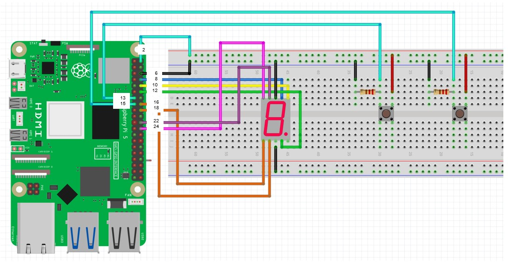
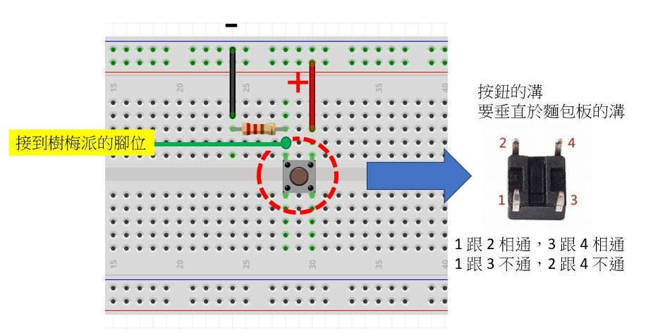

## 樹梅派 加入按鈕 控制七段顯示器運作


### 電路圖參考如下圖
<br>


### 注意事項
首先掀翻到按鈕背面，先找到按鈕的溝，插到麵包板時，必須要與麵包板中間的溝形成垂直。

<br>

### 函數介紹

#### GPIO.setup() 函數基本語法
##### 參數說明

##### pin：
##### 需要配置的 GPIO 引腳。可以使用 GPIO 引腳的編號或物理引腳編號（取決於 GPIO.setmode() 的設置）。
##### 例如：pin = 12 表示第 12 個 GPIO 引腳。

##### mode：
##### 設置引腳的工作模式。它有兩個常用的值：
##### GPIO.IN：輸入模式，表示該引腳用來接收信號。
##### GPIO.OUT：輸出模式，表示該引腳用來發送信號。
##### pull_up_down（可選）：

##### 用於設置引腳的上拉/下拉電阻。此參數只適用於輸入模式。
##### 常見的選項有：
##### GPIO.PUD_OFF：不啟用上拉或下拉電阻（預設值）。
##### GPIO.PUD_UP：啟用上拉電阻，將引腳的預設狀態設置為高電位。
##### GPIO.PUD_DOWN：啟用下拉電阻，將引腳的預設狀態設置為低電位。

##### initial（可選）：
##### 僅在設置為輸出模式時使用。它用來設置引腳的初始輸出狀態（在程式開始時的電平）。
##### 選項有：
##### GPIO.HIGH：輸出高電位（3.3V）。
##### GPIO.LOW：輸出低電位（0V）。


## 完成以上的電路之後，請練習以下的程式。

### ================================================
#### 練習一 : 設計一顆按鈕為"開始計數"功能，另一顆按鈕為"暫停計數"功能，
### ================================================

```python
import RPi.GPIO as GPIO
import time

GPIO.setmode(GPIO.BOARD)

GPIO.setwarnings(False)

pin = [8,10,12,16,18,22,24]

Led7 = [
    [1,1,1,1,1,1,0], # 0
    [0,1,1,0,0,0,0], # 1
    [1,1,0,1,1,0,1], # 2
    [1,1,1,1,0,0,1], # 3
    [0,1,1,0,0,1,1], # 4
    [1,0,1,1,0,1,1], # 5
    [1,0,1,1,1,1,1], # 6
    [1,1,1,0,0,0,0], # 7
    [1,1,1,1,1,1,1], # 8
    [1,1,1,1,0,1,1], # 9
]

for x in range(len(pin)):
    GPIO.setup(pin[x], GPIO.OUT)

btn_start = 13  # 設定樹梅派編號 13 的腳位，作為 start 按鈕的判斷
btn_pause = 15  # 設定樹梅派編號 15 的腳位，作為 pause 按鈕的判斷

GPIO.setup(btn_start, GPIO.IN, pull_up_down=GPIO.PUD_DOWN)   # 設定按鈕 Start 的腳位
GPIO.setup(btn_pause, GPIO.IN, pull_up_down=GPIO.PUD_DOWN)   # 設定按鈕 Pause 的腳位

IsRun = False  # 決定七段顯示器是否要繼續計數
count = 0      # 紀錄目前暫停的數字是哪一個

while True:
    # START
    if GPIO.input(btn_start) == GPIO.HIGH:
        IsRun = True
    
    if IsRun:  # 如果為 True，則開始計數
        for i in range(7):
            GPIO.output(pin[i], Led7[count][i])

        time.sleep(1)
        count += 1

        if count >= 10:
            count = 0
            
        # PAUSE
        if GPIO.input(btn_pause) == GPIO.HIGH:
            IsRun = False    

```


====== 顯示結果 ====== <br>

<hr>

<a href="https://www.youtube.com/watch?v=pUO4bw0ZdGg" target="_blank">樹梅派控制七段顯示器 ( 開始計屬以及暫停計數 )</a><br>
<a href="http://www.youtube.com/watch?feature=player_embedded&v=pUO4bw0ZdGg" target="_blank"></a>
<br>影片取自 youtube


### ================================================
#### 練習二 : 設計一顆按鈕為"由小到大計數"功能，另一顆按鈕為"由大到小計數"功能，
### ================================================
```python
import RPi.GPIO as GPIO
import time

GPIO.setmode(GPIO.BOARD)
GPIO.setwarnings(False)

pin = [8,10,12,16,18,22,24]

Led7 = [
    [1,1,1,1,1,1,0], # 0
    [0,1,1,0,0,0,0], # 1
    [1,1,0,1,1,0,1], # 2
    [1,1,1,1,0,0,1], # 3
    [0,1,1,0,0,1,1], # 4
    [1,0,1,1,0,1,1], # 5
    [1,0,1,1,1,1,1], # 6
    [1,1,1,0,0,0,0], # 7
    [1,1,1,1,1,1,1], # 8
    [1,1,1,1,0,1,1], # 9
]


for x in range(len(pin)):
    GPIO.setup(pin[x], GPIO.OUT)

btn_start = 13
btn_pause = 15

GPIO.setup(btn_start, GPIO.IN, pull_up_down=GPIO.PUD_DOWN)
GPIO.setup(btn_pause, GPIO.IN, pull_up_down=GPIO.PUD_DOWN)

IsRun = True
count = 0

while True:
    # START
    if GPIO.input(btn_start) == GPIO.HIGH:
        IsRun = True
        
    if GPIO.input(btn_pause) == GPIO.HIGH:
        IsRun = False 
  
    if IsRun:
        for i in range(7):
            GPIO.output(pin[i], Led7[count][i])

        time.sleep(1)
        count += 1

        if count >= 10:
            count = 0

    else:
        for i in range(7):
            GPIO.output(pin[i], Led7[count][i])

        time.sleep(1)
        count -= 1

        if count < 0:
            count = 9	

```

<hr>

====== 顯示結果 ====== <br>

<hr>

<a href="https://www.youtube.com/watch?v=UgTkScs31VI" target="_blank">樹梅派控制七段顯示器 ( 由小到大計數以及由大到小計數 )</a><br>
<a href="http://www.youtube.com/watch?feature=player_embedded&v=UgTkScs31VI" target="_blank"></a>
<br>影片取自 youtube


