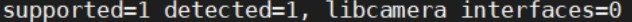
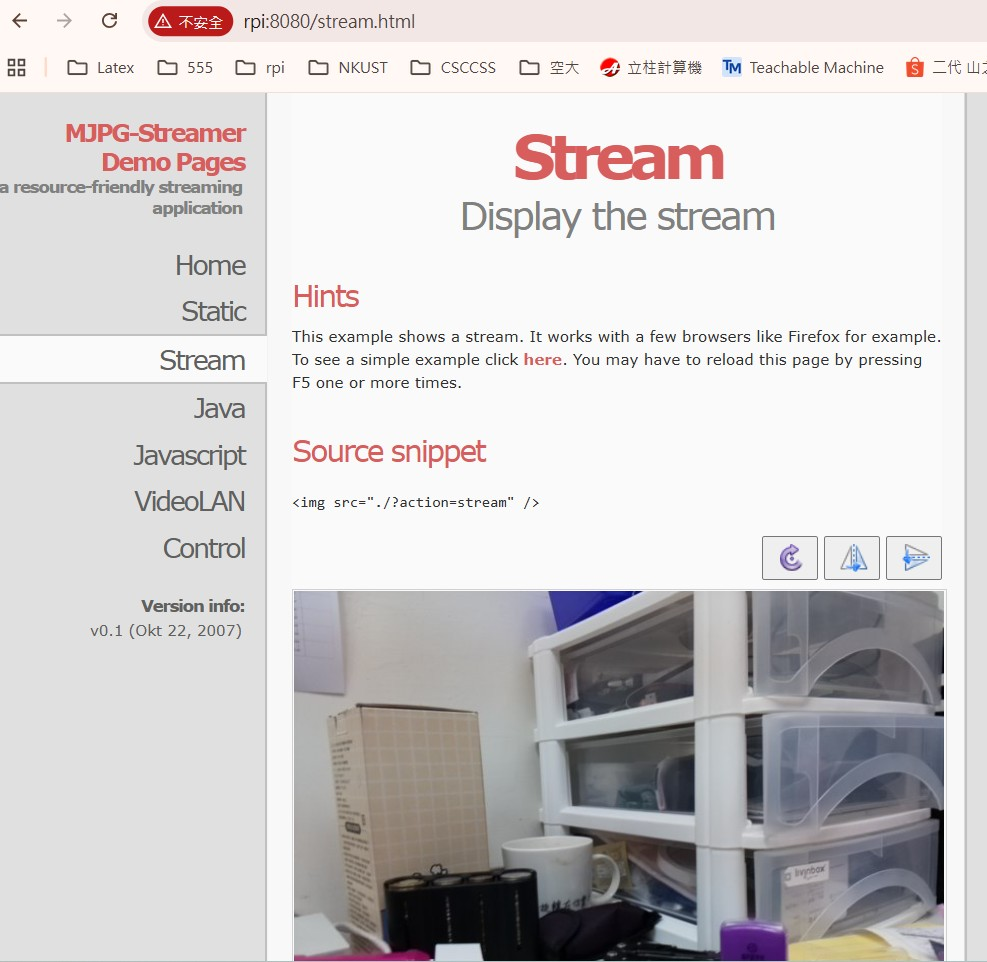
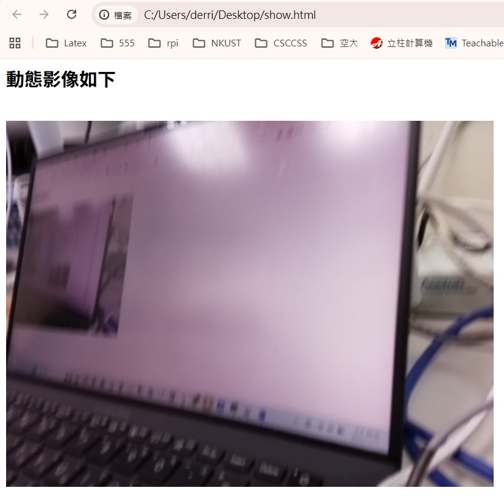
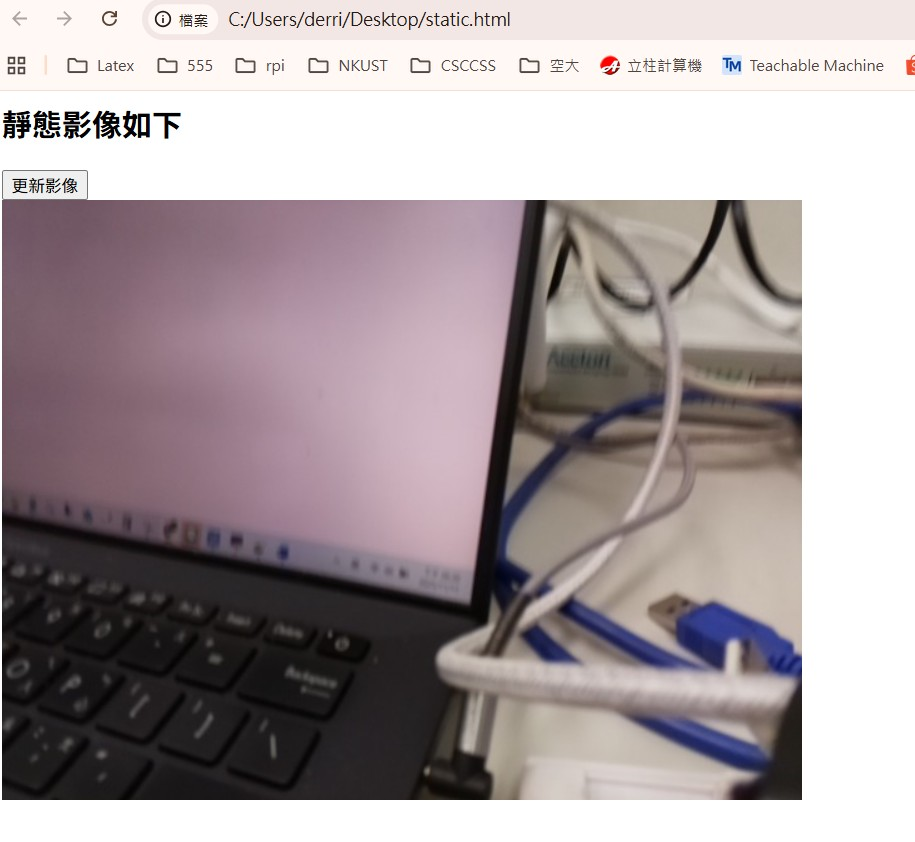
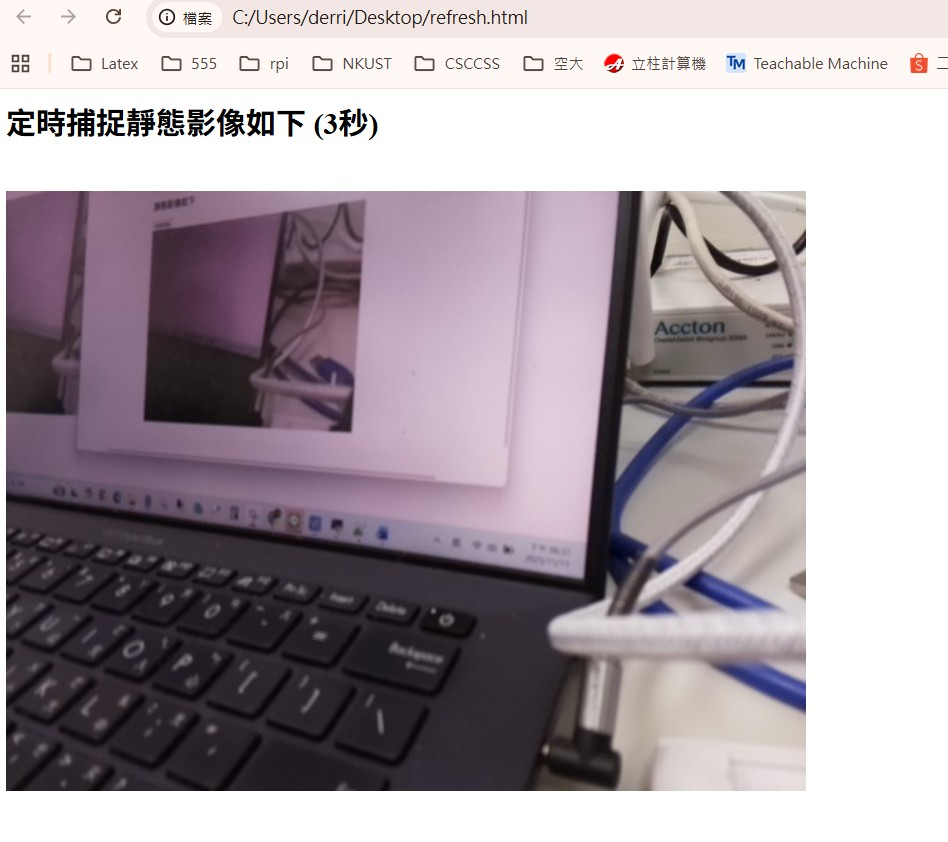

## MJPG-STREAMER 影像函式

#### MJPG-Streamer 介紹與應用
MJPG-Streamer 是一個輕量級的應用程式，主要用於從 V4L2 (Video4Linux2) 相容的攝影機（例如 USB Webcam）擷取圖像，
並將其以 Motion JPEG (MJPG) 串流的形式透過 IP 網路傳輸到網頁瀏覽器或其他支援 MJPG 的播放器 (例如 VLC)。

#### 核心優勢
輕量化與高效能： MJPG-Streamer 的設計非常精簡，對系統資源的佔用極低，這使得它非常適合在資源有限的 Raspberry Pi 這類單板電腦上運行。
即時視訊串流： 能夠將攝影機的畫面即時轉換為 MJPG 串流，供遠端監控使用。
簡單易用： 相對於其他複雜的串流解決方案，MJPG-Streamer 的設定與部署相對簡單。

#### 在 Pi3 + USB Webcam 上的應用
在 Raspberry Pi 3 上，您可以透過安裝和配置 MJPG-Streamer，將連接的 USB Webcam 變成一個 低延遲的網路攝影機，適用於以下情境：

> 即時監控 (Live Monitoring)： 用作簡單的 寵物監視器 或 兒童看護攝影機。

> IOT 視覺整合： 將攝影機串流整合到您的 AIOT 雲端平台 前端介面，實現遠端影像監看。

> 簡易網路攝像頭： 在本地網路內提供影像服務。

## 與其他套件的比較
雖然 MJPG-Streamer 動作輕快，但它通常 不具備動態偵測 (Motion Detection) 等進階功能。

> 如果您需要動態偵測： 建議考慮使用 Motion 這類功能更強大的套件。
> 如果您只需要單純、穩定的即時串流： MJPG-Streamer 則是絕佳選擇。

#### 部署架構（與 AIOT 平台整合考量）
在您的 AIOT 平台中，可以將搭載 MJPG-Streamer 的 Pi3 視為一個特殊的 IOT 設備 (IOT_Dev)：
> Pi3 設備端 (IOT_Dev)： 運行 MJPG-Streamer，將 USB Webcam 影像串流到特定的 IP 與 Port (例如 http://<Pi3-IP>:8080/?action=stream)。<br>
> AIOT Server (Node.js 前端/後端)：<br>
> 前端網頁 (Vue/React)： 在設備監控介面 (例如 IOT_Dev 的詳細頁面)，內嵌一個  標籤，其 src 指向 Pi3 串流的 URL。<br>
> 資料庫 (MySQL/MongoDB)： 在 IOT_Dev 的相關記錄中，可以儲存該設備的串流 IP 地址和 Port 號，方便前端調用。<br>

<hr>

## MJPG-STREAMER 安裝步驟 <br>

### 步驟一：安裝編譯環境與相依套件
由於 MJPG-Streamer 通常需要從原始碼編譯安裝，我們需要先安裝必要的開發工具和函式庫，特別是 libjpeg 和 V4L2 (Video for Linux Two) 相關套件。
這樣您就可以在不增加 AIOT Server 負擔的前提下，將 Pi3 的即時影像整合到您的雲端平台中。

#### 1. 更新系統套件清單
``` bash
sudo apt update
```

#### 2. 安裝必要的開發工具 (git, cmake)
``` bash
sudo apt install -y build-essential cmake git
```

#### 3. 安裝 MJPEG-Streamer 所需的函式庫
#### libjpeg-dev: 處理 JPEG 圖像
#### imagemagick: 可能用於一些圖像處理 (非必須，但有時建議安裝)
#### libv4l-dev: V4L2 函式庫，用於支援 USB Webcam
``` bash
sudo apt install -y libjpeg-dev imagemagick libv4l-dev
```

<hr>

### 步驟二：下載與編譯 MJPG-Streamer
接下來，我們從 GitHub 下載最新的 MJPG-Streamer 原始碼，並進行編譯和安裝。
#### 1. 建立一個工作目錄 (例如 /home/pi/mjpg-streamer)
``` bash
cd ~
mkdir mjpg-streamer
cd mjpg-streamer
```

#### 2. 從 GitHub 複製原始碼
``` bash
git clone https://github.com/jacksonliam/mjpg-streamer.git
cd mjpg-streamer/mjpg-streamer-experimental
```

#### 3. 進行編譯
``` bash
make
```

#### 4. 進行安裝 (將程式複製到系統路徑，方便運行)
``` bash
sudo make install
```

<hr>

## 步驟三：啟動 MJPG-Streamer 串流服務
編譯安裝完成後，您就可以測試啟動服務了。請確保您的 USB Webcam 已插入 Pi3 的 USB 連接埠。

#### 1. 檢查攝影機裝置 (可選)
通常 USB Webcam 會被識別為 /dev/video0。
``` bash
ls /dev/video*
```
如果您看到 /dev/video0，則表示設備被成功識別。

另外檢查一下鏡頭的參數是否有正常，請執行以下指令檢查:

``` bash
vcgencmd get_camera
```

假設出現下圖的參數，代表鏡頭正常啟動，如果沒有請繼續執行下面的設定<br>
 <br><br>

以上如果有誤，請繼續執行以下指令<br>
``` bash
sudo nano /boot/firmware/config.txt
```

找到以下字串前面加 # 符號 <br>
#camera_auto_detect=1 <br>
start_x=1

新增 start_x=1 ，接下來存檔。然後將樹梅派再重新開機，再偵測 vcgencmd get_camera 指令。

## 2. 啟動 MJPG-Streamer
使用以下指令來啟動串流服務：
請確定切換到以下目錄
mjpg-streamer/mjpg-streamer-experimental

然後執行以下指令
``` bash
./start.sh
```

## 步驟四：驗證串流
在您區域網路中的另一台電腦或手機上，開啟網頁瀏覽器，輸入以下網址進行驗證：

> 瀏覽器輸入： http://<您的 Pi3 IP 地址>:8080  ， 比如:  http://rpi.local:8080 <br>
> 即時串流 URL： 點擊頁面上的 "Stream" 連結，或直接輸入： http://<您的 Pi3 IP 地址>:8080/?action=stream，http://rpi.local:8080/?action=stream<br>

執行結果

<hr>


<br>
=============================================<br>
## 動態影像網頁
=============================================<br>
``` html
<html>
<h2>動態影像如下</h2><br>

</html>
```

<br>執行結果

<hr>


<br>

<br>
=============================================<br>
## 靜態網頁
=============================================<br>
``` html
<html>
<h2>靜態影像如下</h2> <input type="button" value="更新影像" onclick="location.reload()" />
<br>

</html>
```

<br>執行結果

<hr>


<br>

<br>
=============================================<br>
## 自動捕捉網頁
=============================================<br>
``` html
<html>
  <head>
    <title>自動刷新頁面</title>
    <script type="text/javascript">
      var refreshInterval = 3000; // 每3秒刷新一次頁面
      function refreshPage() {
        window.location.reload(); // 刷新頁面
      }
      // 在指定的時間間隔內重複調用refreshPage函數
      setInterval(refreshPage, refreshInterval);
    </script>
  </head>

<h2>定時捕捉靜態影像如下 (3秒)</h2>
<br>

</html>
```

<br>執行結果

<hr>


<br>


