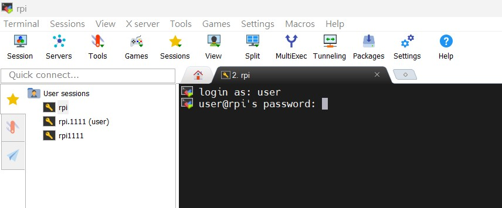
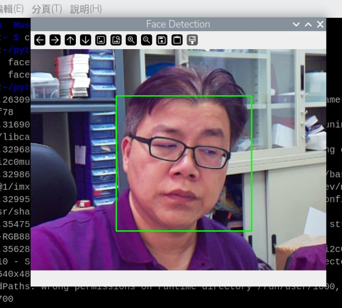

## 樹梅派人臉偵測系統實作

## MobaXterm 軟體下載 <br>
#### 首先要從以下連結下載 MobaXterm 軟體，該軟體可以上傳檔案到樹梅派，以及遠端SSH到樹梅派下指令。<br>

https://download.mobatek.net/2532025092512146/MobaXterm_Portable_v25.3.zip

#### 以上為免安裝版本，下載之後請解壓縮，然後執行 MobaXterm_Personal_25.3.exe 的執行檔案，然後開啟如下圖畫面。<br>
 <br><br><br>

#### 然後請新建一個 session ，設定您樹梅派的 Host Name，以及登入的帳號密碼。就可以開始使用。<br>
 <br><br><br>

#### 點擊建好的 session 名稱，然後進入 SSH 畫面，再輸入帳號密碼。<br>
 <br><br><br>

#### Haar Cascade Classifier 是 OpenCV 中常用的傳統人臉偵測模型，其核心架構由 Haar 特徵（Haar-like Features）、積分影像（Integral Image）、Adaboost 弱分類器訓練與 級聯分類器（Cascade of Classifiers） 所組成。模型首先利用 Haar 特徵描述影像中明暗區域的差異，例如眼睛較暗、鼻樑較亮等局部對比。為了加速大量特徵的計算，模型使用積分影像，使任何矩形區域的像素和可以在常數時間內完成，極大提升偵測速度。

<br><br>

#### 在訓練階段，Adaboost 用來挑選最具區分能力的特徵，並將多個弱分類器加權組合成強分類器。這使模型得以在大量特徵中選出最有效的部分，避免不必要的計算負擔。最重要的結構是級聯架構，所有分類器被組成由「簡單到複雜」的多層檢測流程。前幾層只使用少量特徵快速排除非臉部區域，只有可能是臉的區域才會進入後續更精密的分類器。此設計使 Haar Cascade 在有限硬體環境（例如嵌入式設備）也能達成即時偵測。

#### 整體而言，Haar Cascade 的架構兼具高速與可行性，是早期人臉偵測的代表性模型。

<br><br><br>

## 樹梅派環境設定方式

### 步驟一 : 安裝 OpenCV 函式庫
sudo apt update <br>
sudo apt install -y python3-opencv <br>

### 步驟二 : 安裝 picamera2 模組(選用)
sudo apt install python3-picamera2

### 步驟三 : 下載 haarcascade 模型 ( 原先安裝的 Open CV 函式可能沒有包含這個模型，需要手動下載檔案)
wget https://github.com/opencv/opencv/raw/master/data/haarcascades/haarcascade_frontalface_default.xml

########################################### <br>
使用 Open CV 的人臉偵測練習 ( 將人臉圈起來 )
########################################### <br>
``` Python
from picamera2 import Picamera2
import cv2

picam2 = Picamera2()
preview_config = picam2.create_preview_configuration(main={"format": "RGB888", "size": (640, 480)})
picam2.configure(preview_config)
picam2.start()

face_cascade = cv2.CascadeClassifier("/home/user/python/haarcascades/haarcascade_frontalface_default.xml")

while True:
    frame = picam2.capture_array()
    gray = cv2.cvtColor(frame, cv2.COLOR_BGR2GRAY)
    faces = face_cascade.detectMultiScale(gray, 1.3, 5, minSize=(30, 30))
    for (x, y, w, h) in faces:
        cv2.rectangle(frame, (x, y), (x+w, y+h), (0, 255, 0), 2)
    cv2.imshow("Face Detection", frame)
    if cv2.waitKey(1) == 27:
        break

cv2.destroyAllWindows()
picam2.close()

```
<br>

<hr><hr>
===============================================<br>
## 執行結果<br>
===============================================<br>
 <br>

<br><br>

<hr>

########################################### <br>
使用 Open CV 的人臉偵測練習 ( 除了人臉以外，再加上語音播放)
########################################### <br>
``` Python
from picamera2 import Picamera2
import cv2
import time
import threading
from pygame import mixer  

mixer.init()
ALERT_SOUND = "/home/user/python/voice.mp3" 

def play_alert():
    mixer.music.load(ALERT_SOUND)
    mixer.music.play()

face_cascade = cv2.CascadeClassifier("/home/user/python/haarcascades/haarcascade_frontalface_default.xml")


picam2 = Picamera2()
preview_config = picam2.create_preview_configuration(main={"format": "RGB888", "size": (640, 480)})
picam2.configure(preview_config)
picam2.start()

ALERT_COOLDOWN = 6
last_alert_time = 0

print("press ESC to exit")

while True:
    frame = picam2.capture_array()
    gray = cv2.cvtColor(frame, cv2.COLOR_BGR2GRAY)
    faces = face_cascade.detectMultiScale(gray, 1.3, 5, minSize=(30, 30))

    for (x, y, w, h) in faces:
        cv2.rectangle(frame, (x, y), (x + w, y + h), (0, 255, 0), 2)

    if len(faces) > 0 and (time.time() - last_alert_time) > ALERT_COOLDOWN:
        threading.Thread(target=play_alert).start()
        last_alert_time = time.time()


    cv2.imshow("Face Detection", frame)

    if cv2.waitKey(1) == 27:
        break

cv2.destroyAllWindows()
picam2.close()

```

<br>

<hr><hr>
===============================================<br>
## 執行結果<br>
===============================================<br>
### 人臉偵測 加上 語音提示
<a href="http://www.youtube.com/watch?feature=player_embedded&v=Mn7o-7HTkxg" target="_blank"></a>
<br>影片取自 youtube

<br><br>

<hr>

########################################### <br>
使用 Open CV 的人臉偵測練習 ( 將人臉打成馬賽克 )
########################################### <br>
``` Python
from picamera2 import Picamera2
import cv2

picam2 = Picamera2()
preview_config = picam2.create_preview_configuration(main={"format": "RGB888", "size": (640, 480)})
picam2.configure(preview_config)
picam2.start()

face_cascade = cv2.CascadeClassifier("/home/user/python/haarcascades/haarcascade_frontalface_default.xml")

while True:
    frame = picam2.capture_array()
    gray = cv2.cvtColor(frame, cv2.COLOR_BGR2GRAY)
    faces = face_cascade.detectMultiScale(gray, 1.3, 5, minSize=(30, 30))
    for (x, y, w, h) in faces:
        mosaic = frame[y:y+h, x:x+w]
        level = 15   # 數值越高 會越模糊
        mh = int(h/level)
        mw = int(w/level)
        mosaic = cv2.resize(mosaic, (mw,mh), interpolation=cv2.INTER_LINEAR)
        mosaic = cv2.resize(mosaic, (w,h), interpolation=cv2.INTER_NEAREST)
        frame[y:y+h, x:x+w] = mosaic

    cv2.imshow("Face Detection", frame)
    if cv2.waitKey(1) == 27:
        break

cv2.destroyAllWindows()
picam2.close()

```

<br>

<hr><hr>
===============================================<br>
## 執行結果<br>
===============================================<br>
### 人臉偵測 加上 語音提示
<a href="http://www.youtube.com/watch?feature=player_embedded&v=Lz8Omp94_Ps" target="_blank"></a>
<br>影片取自 youtube

<br><br>

<hr>

