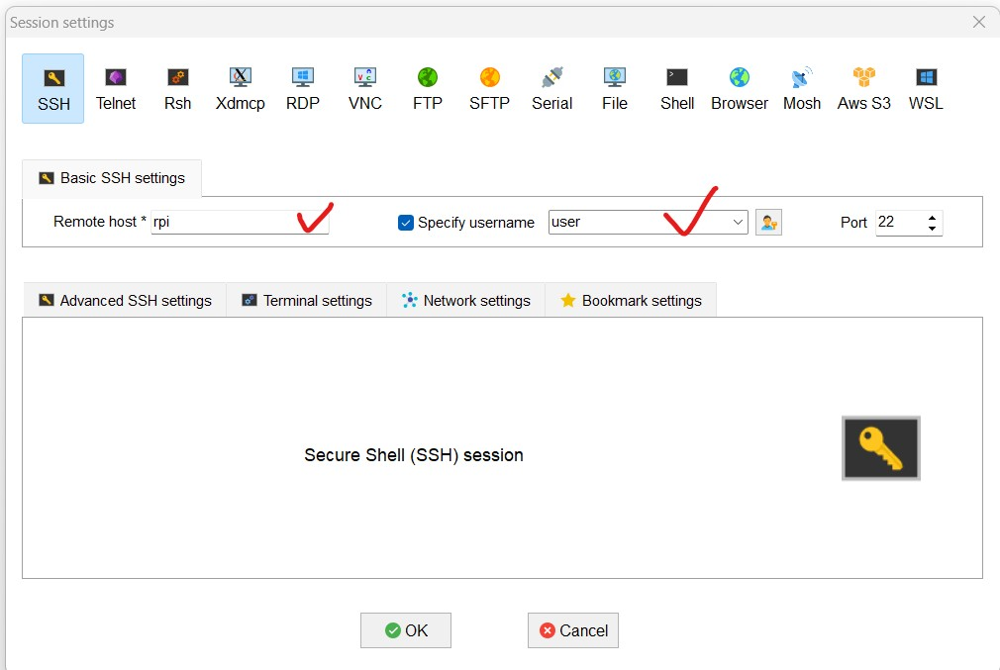

## 樹梅派人臉偵測系統實作

## MobaXterm 軟體下載  
#### 首先要從以下連結下載 MobaXterm 軟體，該軟體可以上傳檔案到樹梅派，以及遠端SSH到樹梅派下指令。 

https://download.mobatek.net/2532025092512146/MobaXterm_Portable_v25.3.zip

#### 以上為免安裝版本，下載之後請解壓縮，然後執行 MobaXterm_Personal_25.3.exe 的執行檔案，然後開啟如下圖畫面。 
  

#### 然後請新建一個 session ，設定您樹梅派的 Host Name，以及登入的帳號密碼。就可以開始使用。 
  

#### Haar Cascade Classifier 是 OpenCV 中常用的傳統人臉偵測模型，其核心架構由 Haar 特徵（Haar-like Features）、積分影像（Integral Image）、Adaboost 弱分類器訓練與 級聯分類器（Cascade of Classifiers） 所組成。模型首先利用 Haar 特徵描述影像中明暗區域的差異，例如眼睛較暗、鼻樑較亮等局部對比。為了加速大量特徵的計算，模型使用積分影像，使任何矩形區域的像素和可以在常數時間內完成，極大提升偵測速度。

#### 在訓練階段，Adaboost 用來挑選最具區分能力的特徵，並將多個弱分類器加權組合成強分類器。這使模型得以在大量特徵中選出最有效的部分，避免不必要的計算負擔。最重要的結構是級聯架構，所有分類器被組成由「簡單到複雜」的多層檢測流程。前幾層只使用少量特徵快速排除非臉部區域，只有可能是臉的區域才會進入後續更精密的分類器。此設計使 Haar Cascade 在有限硬體環境（例如嵌入式設備）也能達成即時偵測。

#### 整體而言，Haar Cascade 的架構兼具高速與可行性，是早期人臉偵測的代表性模型。

sudo apt update
sudo apt install -y python3-opencv

sudo apt update
sudo apt install python3-picamera2

wget https://github.com/opencv/opencv/raw/master/data/haarcascades/haarcascade_frontalface_default.xml
