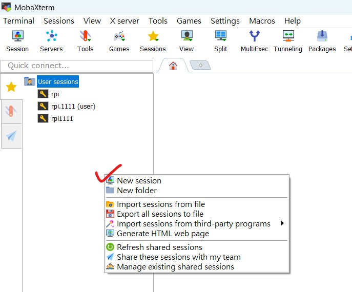

## 樹梅派人臉偵測系統實作

## MobaXterm 軟體下載  
#### 首先要從以下連結下載 MobaXterm 軟體，該軟體可以上傳檔案到樹梅派，以及遠端SSH到樹梅派下指令。 

https://download.mobatek.net/2532025092512146/MobaXterm_Portable_v25.3.zip

以上為免安裝版本，下載之後請解壓縮，然後執行 MobaXterm_Personal_25.3.exe 的執行檔案，然後開啟如下圖畫面。 
  

然後請新建一個 session ，設定您樹梅派的 Host Name，以及登入的帳號密碼。就可以開始使用。 
  

sudo apt update
sudo apt install -y python3-opencv

sudo apt update
sudo apt install python3-picamera2

wget https://github.com/opencv/opencv/raw/master/data/haarcascades/haarcascade_frontalface_default.xml
