說明網頁位置，請掃描以下 QRCode 

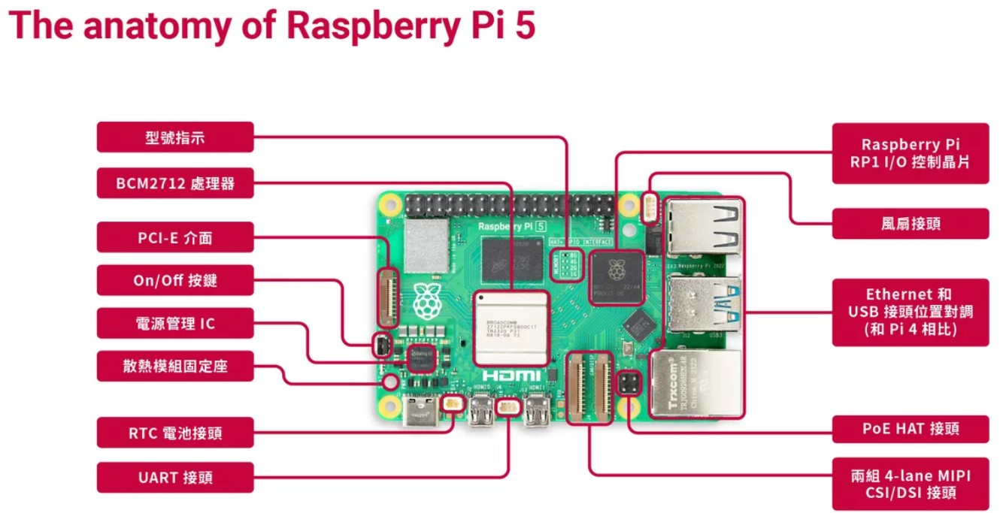

Raspberry Pi 3 vs 4 vs 5 規格比較表

| 項目 |	Raspberry Pi 3 Model B+	| Raspberry Pi 4 Model B | Raspberry Pi 5|
|------|--------------------------|------------------------|---------------|
|推出年份 | 2018	| 2019 | 2023 |
|處理器(CPU) |	Broadcom BCM2837B0 1.4GHz 四核心 ARM Cortex-A53 (64-bit) | Broadcom BCM2711 1.5GHz 四核心 ARM Cortex-A72 (64-bit)	| Broadcom BCM2712 2.4GHz 四核心 ARM Cortex-A76 (64-bit) |
|記憶體 (RAM)	| 1GB LPDDR2	| 2GB / 4GB / 8GB LPDDR4-3200	| 4GB / 8GB LPDDR4X-4267 |
|GPU	| Broadcom VideoCore IV	| Broadcom VideoCore VI |	Broadcom VideoCore VII |
| 影像輸出	| 1 × HDMI (全尺寸，1080p) |	2 × micro-HDMI (最高 4K@60fps ×2)	| 2 × micro-HDMI (最高 4K@60fps ×2) |
| 網路	| 10/100Mbps 乙太網路	| Gigabit 乙太網路 (實測約 900Mbps)	| 真實 Gigabit 乙太網路 |
|無線功能 |	2.4GHz Wi-Fi (802.11n)，Bluetooth 4.2	| 雙頻 Wi-Fi (802.11ac)，Bluetooth 5.0 | 	Wi-Fi 6 (802.11ax)，Bluetooth 5.0 |
|USB 接口	| 4 × USB 2.0	 | 2 × USB 3.0 2 × USB 2.0	 | 2 × USB 3.0 2 × USB 2.0 |
|儲存	| microSD	 | microSD |	microSD (支援更快速度) |
|電源	| 5V/2.5A micro-USB	| 5V/3A USB-C	| 5V/5A USB-C (支援 PD) |
|其他特色	| GPIO 40-pin、CSI、DSI	| USB 3.0、高效能多螢幕	| PCIe 2.0 x1 (外接擴充)、更快 I/O、RTC 支援 |

# 重點比較
#### 效能：Pi 5 的 Cortex-A76 CPU 比 Pi 4 快約 2~3 倍，相對 Pi 3 更是大幅提升。
#### 記憶體：Pi 3 僅 1GB，Pi 4/5 提供更高容量，適合桌機或 AI 應用。
#### 顯示能力：Pi 5 與 Pi 4 一樣支援雙 4K 輸出，而 Pi 3 僅 1080p。
#### 連線能力：Pi 5 支援 Wi-Fi 6 與真實千兆網路，最適合高頻寬應用。
#### 擴充性：Pi 5 新增 PCIe，可外接 SSD、網卡等，大幅提升靈活性。

<h1>樹梅派基本安裝</h1>

1) 使用檔案總管格式化功能格式化SD卡，請注意要挑選格視為 FAT32。
  

   
3) 下載 寫入SD卡的專屬軟體 (Raspberry Pi Imager)，建置安裝用的 SD 卡。
   請輸入網址 https://www.raspberrypi.com/software/ 並下載並安裝 Raspberry Pi Imager。
   請注意要挑選使用的作業系統。(大多數為 Windows 系統)
   

   完成之後，請以讀卡機(SD卡)插入電腦，然後執行下載程式，
   如下圖所示，
   A: 選取要安裝的設備 (例: Raspberry Pi3)
   B: 選取要安裝的OS版本 (例: Raspberry OS 32-bit Desktop)
   C: 選取要安裝的SD卡槽
   然後按下確定。
   

4) 以上步驟完成之後，請將 SD卡放置在樹梅派內，然後開機一步一步完成。
 安裝過程需要設定如下圖的欄位資料，請務必記錄起來
 
 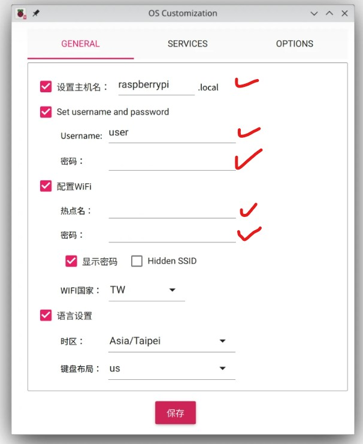

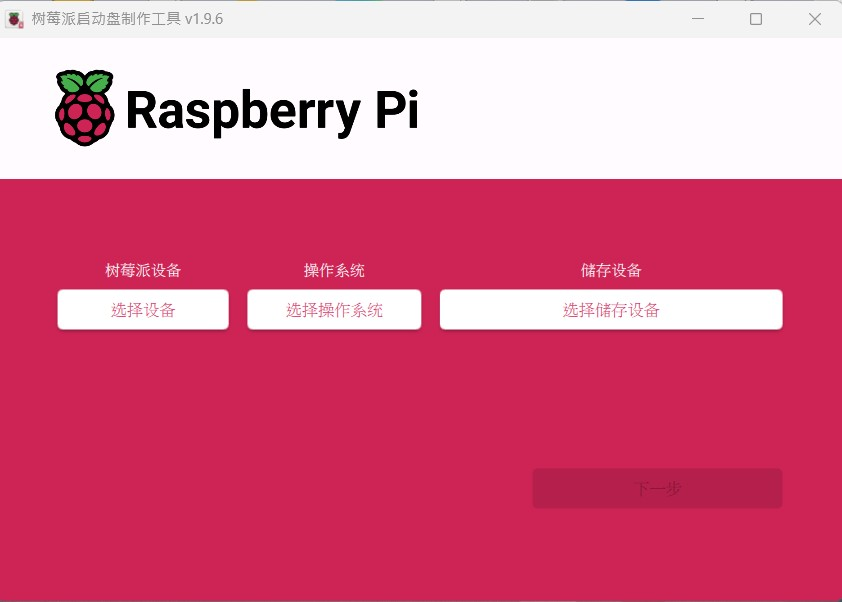
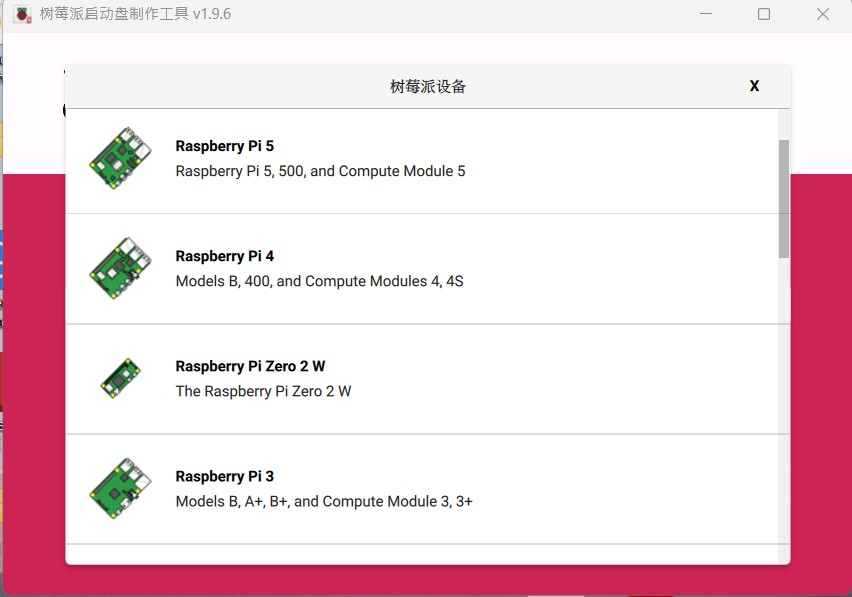
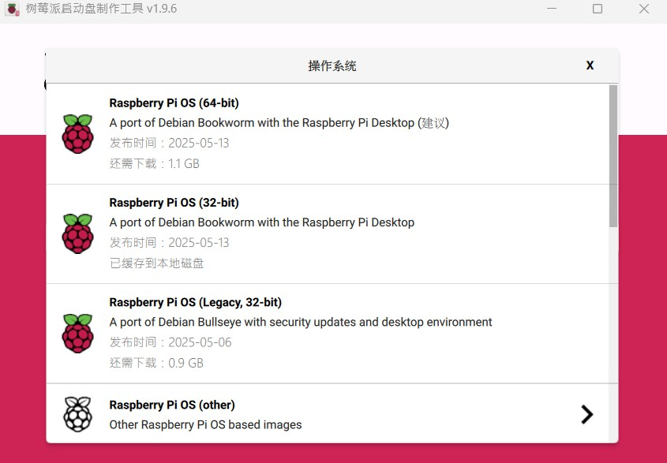 
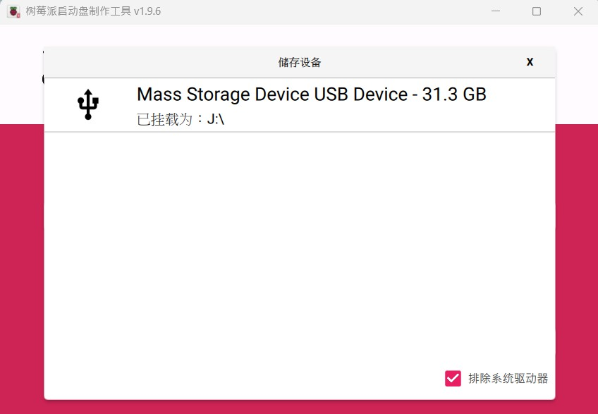
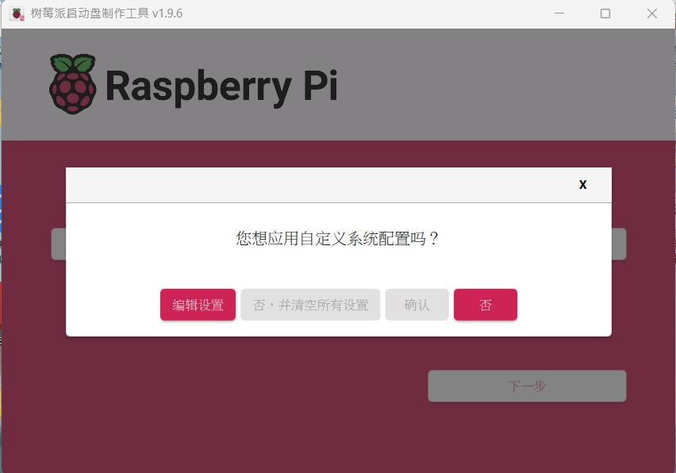
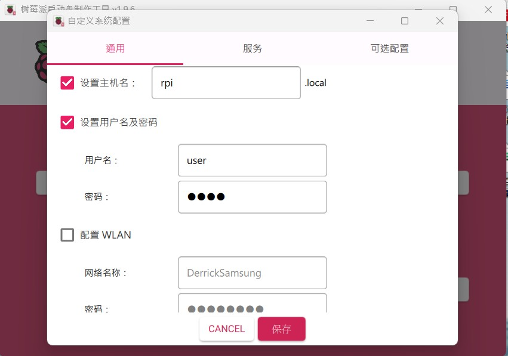 
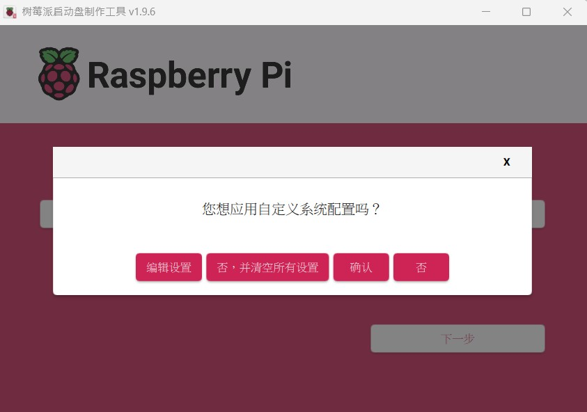
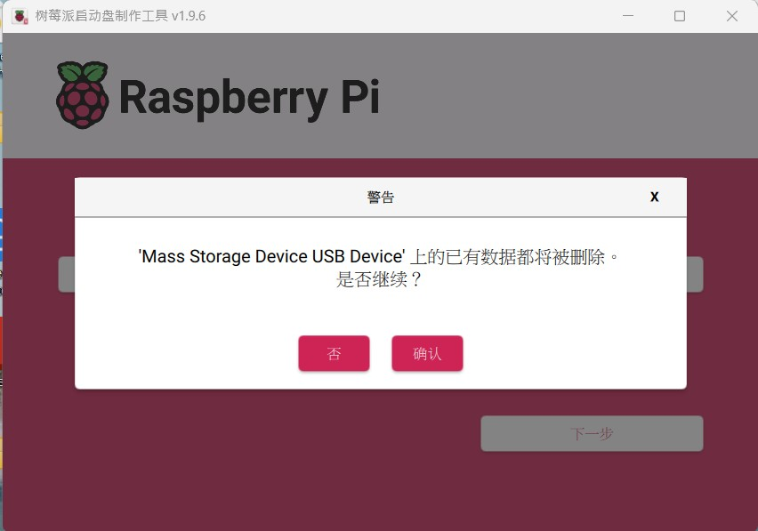
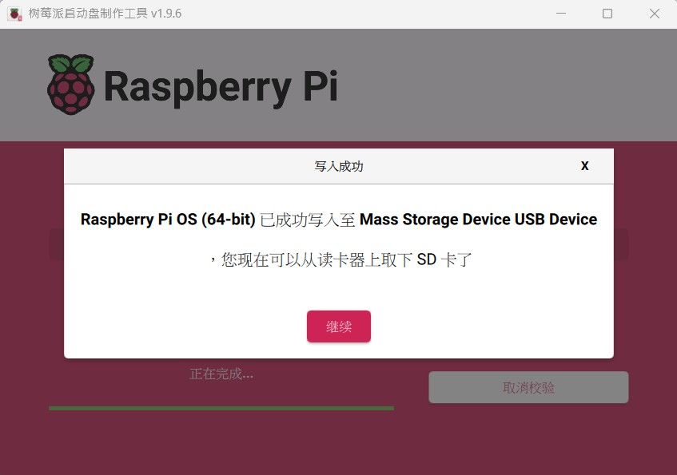 
 

https://www.realvnc.com/en/connect/download/viewer/windows/
