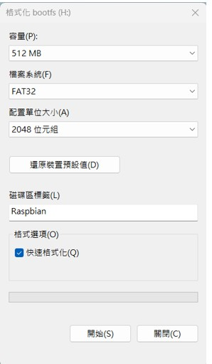
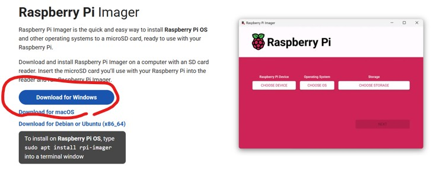
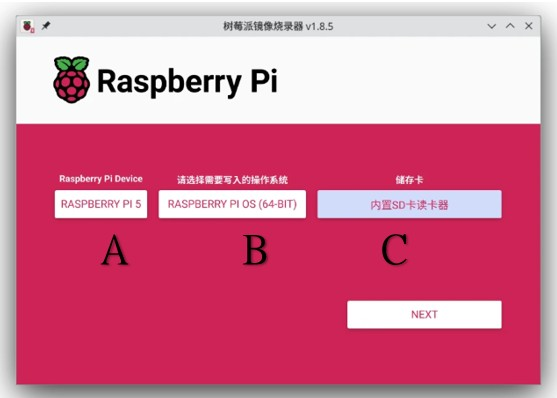

<h1>樹梅派基本安裝</h1>

1) 使用檔案總管格式化功能格式化SD卡，請注意要挑選格視為 FAT32。
  

   
3) 下載 寫入SD卡的專屬軟體 (Raspberry Pi Imager)，建置安裝用的 SD 卡。
   請輸入網址 https://www.raspberrypi.com/software/ 並下載並安裝 Raspberry Pi Imager。
   請注意要挑選使用的作業系統。(大多數為 Windows 系統)
   

   完成之後，請以讀卡機(SD卡)插入電腦，然後執行下載程式，
   如下圖所示，
   A: 選取要安裝的設備 (例: Raspberry Pi3)
   B: 選取要安裝的OS版本 (例: Raspberry OS 32-bit Desktop)
   C: 選取要安裝的SD卡槽
   然後按下確定。
   

4) 以上步驟完成之後，請將 SD卡放置在樹梅派內，然後開機一步一步完成。

 <img src="install"

https://www.realvnc.com/en/connect/download/viewer/windows/
